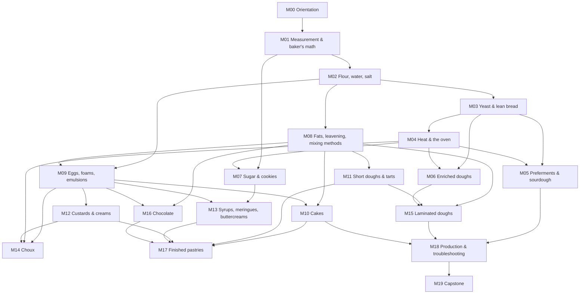
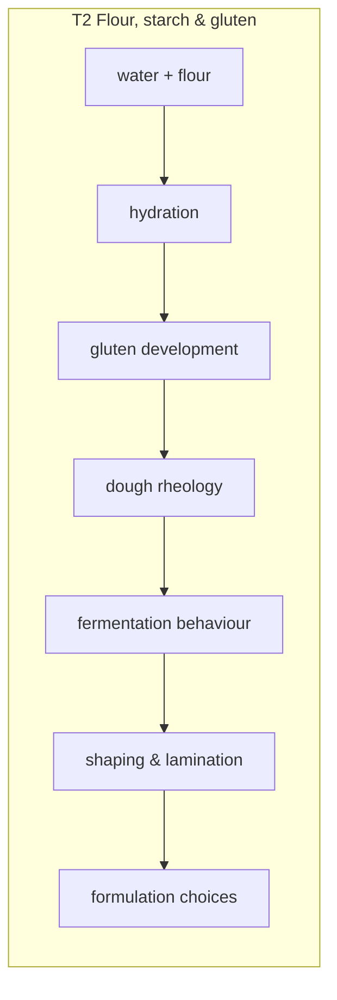

# Curriculum map and dependency graph

Stage 1 is built on explicit prerequisites so that Stage 2 and Stage 3 can be appended
without moving anything. This page shows the structure three ways: the module graph, the
concept threads, and a topic-by-topic dependency table. Lesson-level prerequisites are in the
[course outline](curriculum/course-outline.md) and at the top of every lesson (a ✓ appears
next to each prerequisite you have completed).

## 1. Module dependency graph

An arrow means "the later module uses concepts or skills from the earlier one". Only direct,
load-bearing dependencies are drawn.

### Reading the graph

- **The bread spine** (M02 → M03 → M04 → M05/M06) comes first because flour, water, gluten,
  fermentation and heat are the concepts everything else modifies. A cake is, structurally,
  "flour and eggs with the gluten deliberately suppressed" — you cannot understand the
  suppression before you have seen the network.
- **Fats (M08) and eggs (M09) are hubs.** Cakes, short doughs, custards, meringues, choux,
  lamination and chocolate all depend on one or both. They are taught as systems before the
  products that use them.
- **Laminated doughs come late** (M15) because they combine yeast dough (M03/M06), fat
  plasticity (M08) and short-dough handling (M11). This matches professional programs, which
  put viennoiserie in the intermediate level.
- **Assembly (M17) and production (M18) are integrative**: they have many parents and no new
  core science.

## 2. Concept threads

Each thread is a chain of ideas that runs through several modules. Threads are the
attachment points for Stage 2 and Stage 3 (see the
[extension architecture](extension/stage-2-3-architecture.md)).

| Thread | Chain in Stage 1 (module.lesson) |
|---|---|
| **T1** Measurement & formulation math | grams (01.1) → baker's % (01.2) → DDT (01.3) → scaling & yield (01.4) → true hydration of enriched dough (06.1) → leavening balance (08.2) → cake formula balance (10.1) → layer arithmetic (15.1) → costing & QC (18.2) |
| **T2** Flour, starch & gluten | flour (02.1) → gluten (02.2) → hydration (02.3) → rheology & mixing (02.4) → shaping (03.4) → gluten under sugar/fat (06.1, 06.4) → gluten suppression in cakes/short dough (10.1, 11.1) |
| **T3** Fermentation & microbiology | yeast (03.1) → process (03.2) → time/temperature control (03.3) → preferments & enzymes (05.1) → sourdough (05.3, 05.4) → osmotic stress (06.1) → laminated yeast dough (15.3) |
| **T4** Heat, baking & staling | kitchen heat (00.2) → oven heat transfer (04.1) → oven spring, set, crust (04.2) → staling (04.3) → cake doneness (10.4) → steam leavening (14.1) |
| **T5** Sugars & browning | sugar functions (07.1) → Maillard & caramel (07.2) → cookies (07.3) → syrups & crystallization (13.1) → meringues (13.2) |
| **T6** Fats & shortening | enrichment (06.1) → fat science (08.1) → creaming (10.2) → short dough (11.1) → whipped cream (12.3) → buttercreams (13.3) → lamination (15.1) |
| **T7** Eggs, foams & emulsions | coagulation (09.1) → foams (09.2) → emulsions (09.3) → foam cakes (10.3) → custards (12.1) → meringues (13.2) → ganache (16.2) |
| **T8** Starch thickening & gels | gelatinization (04.2) → tangzhong (06.2) → fruit fillings (11.3) → pastry cream (12.2) → assembled components (17.2) |
| **T9** Structured doughs | biscuits (08.4) → short dough (11.1–11.3) → choux (14.1–14.2) → puff (15.2) → croissant/danish (15.3–15.4) |
| **T10** Chocolate & crystallization | composition (16.1) → ganache (16.2) → tempering (16.3) → chocolate tart (17.2) |
| **T11** Workflow, safety & QA | orientation (00.1–00.3) → formula sheet (01.4) → bread process (03.2) → component timelines (17.1) → production planning (18.1) → standardization & QC (18.2) |
| **T12** Experimental method & R&D | lab notebook (00.1) → first experiments (X1-01…) → controlled series (M02–M16 experiments) → diagnostic clinics (05.4, 10.4, 14.2, 15.4) → diagnostic method (18.3) → experimental design (19.1) → capstone (19.2) |

## 3. Topic dependency table

For each major topic: what it needs, what it introduces, and what later depends on it
(including Stage 2/3 attachment points).

| Topic | Prerequisites | Concepts introduced | Later topics that depend on it |
|---|---|---|---|
| Measurement & baker's % | — | grams, %, hydration, total formula | everything; Stage 3 formula optimization |
| Temperature control (DDT) | baker's % | friction factor, dough temperature as a control variable | fermentation, lamination, chocolate; Stage 2 multi-stage preferment DDT |
| Flour | measurement | protein, ash, extraction, absorption | gluten, all doughs; Stage 2 flour specs & alternative grains |
| Gluten | flour, water | network, elasticity/extensibility | rheology, shaping, lamination, cake/short-dough suppression; Stage 2 gluten chemistry |
| Hydration | gluten | absorption, handling vs crumb trade-off | high-hydration bread, enriched dough; Stage 3 formula optimization |
| Rheology (intuitive) | gluten, hydration | elastic vs viscous, relaxation | shaping, lamination; Stage 2 instrumental rheology |
| Yeast & fermentation | salt, DDT | rate levers, bulk/proof endpoints | preferments, enriched, croissant; Stage 2 fermentation science |
| Heat transfer & oven spring | fermentation | conduction/convection/radiation, steam, set | every baked product; Stage 2 deck/combi ovens |
| Starch gelatinization & staling | heat, water | gelatinization, retrogradation | tangzhong, pastry cream, fillings, shelf life; Stage 3 shelf-life extension |
| Preferments & enzymes | fermentation | poolish/biga/levain, amylase/protease | sourdough; Stage 2 levain management, rye |
| Acids & pH | preferments | pH, acidity, buffering | sourdough, chemical leavening, browning, cocoa; Stage 2 TTA |
| Enrichment | fermentation, fats (intro) | osmotic stress, tenderizing | brioche, laminated yeast dough; Stage 2 panettone & sweet-dough systems |
| Sugar functions | measurement | hygroscopicity, aw, tenderizing | cookies, cakes, syrups; Stage 3 sugar reduction |
| Browning | sugars, heat | Maillard vs caramelization | crust, caramel, cookie colour; Stage 3 flavour development |
| Fats | gluten | plasticity, crystals, creaming | cakes, short dough, lamination, buttercream, chocolate; Stage 2 fat specs |
| Chemical leavening | acids & pH, fats | neutralization, timing | quick breads, cakes; Stage 3 leavening systems |
| Eggs & coagulation | proteins | denaturation, coagulation temps | custards, cakes, choux; Stage 2 egg-free/alternative systems |
| Foams | eggs | stabilizing air | sponge cakes, meringues, mousses; Stage 2 entremets |
| Emulsions | eggs, fats | O/W vs W/O, emulsifiers | ganache, buttercream, custards; Stage 2 glazes, Stage 3 emulsifier choice |
| Short doughs | fats, gluten | sablage vs crémage | tarts, lamination; Stage 2 advanced tart systems |
| Custards & creams | eggs, starch | endpoint temps, starch set | tarts, choux, danish, entremets; Stage 2 mousses & bavarois |
| Syrups & crystallization | sugars | concentration, boiling point, seeding | meringues, fondant, tempering; Stage 2 confectionery |
| Choux | eggs, starch, steam | panade, steam leavening | Stage 2 advanced choux (Paris-Brest, croquembouche) |
| Lamination | fats, yeast dough, short dough | layer math, plasticity windows | Stage 2 advanced viennoiserie; Stage 3 laminated-product R&D |
| Chocolate | fats, emulsions, crystallization | composition, polymorphism, ganache | Stage 2 tempering & bonbons; Stage 3 confectionery formulation |
| Assembly | tarts, cakes, creams | component thinking, moisture migration | Stage 2 entremets & plated desserts; Stage 3 product design |
| Production & QA | all of the above | planning, standardization, diagnosis | Stage 2 bakery production; Stage 3 scale-up |
| Experimental method | lab notebook | controlled variables, hypotheses | capstone; Stage 3 DOE & sensory science |

## 4. Where you can stop

| After | You can reliably make |
|---|---|
| M05 | lean bread, rolls, pita, poolish bread, sourdough |
| M06 | + milk bread, challah, brioche |
| M08 | + cookies, caramel, muffins, quick breads, scones |
| M10 | + pound cake, génoise, chiffon |
| M13 | + tarts, pies, custards, pastry cream, meringues, buttercreams |
| M16 | + choux, puff pastry, croissant, danish, ganache, tempered chocolate |
| M19 | + assembled pastries, production planning, and a documented product of your own |
