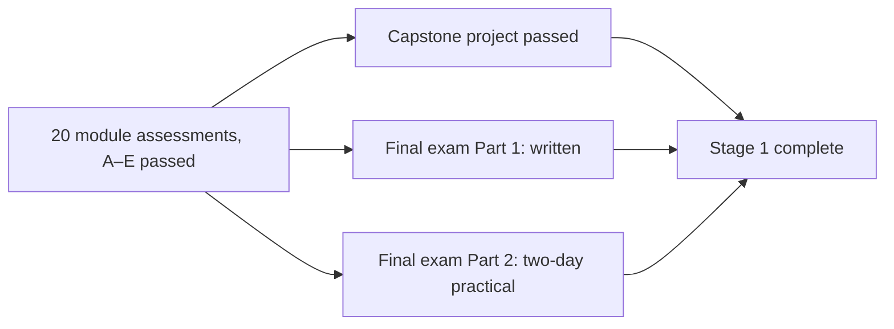

# Stage 1 assessment system

This page explains how Stage 1 checks what you can actually do. It covers the five kinds of assessment, how each module assessment is built, how to grade yourself honestly, the rubric used for every practical, the pass rules, and how the module assessments, the [capstone](stage-1/capstone/README.md) and the [final exam](stage-1/assessments/final-exam.md) combine into Stage 1 completion.

The design principle is the same one the course uses everywhere: **measure, don't guess**. A pass means you produced evidence, such as a number, a photo with a ruler, a temperature log or a written prediction, that someone else could check.

## The five assessment types

| Type | What you do | What it proves | Why it exists |
|---|---|---|---|
| **Knowledge check** | Answer short conceptual and predictive questions | You hold a correct mechanism and can predict what happens when one variable changes | A baker who can only repeat a recipe cannot adapt it. Every later skill (diagnosis, formulation, R&D) rests on a correct model of what is happening in the dough or batter |
| **Practical assessment** | Produce a product to a written specification, with a log | Your hands and your process control match your understanding | Knowing that DDT should be 25 °C is not the same as hitting it. The practical is the only assessment that tests execution |
| **Troubleshooting assessment** | Diagnose a failed product from its symptoms and its production record | You can reason from symptom to root cause and choose a test that tells causes apart | Most professional time is spent on products that are almost right. Diagnosis is the daily skill of a production baker and the entry skill of an R&D technologist |
| **Formulation exercise** | Calculate: convert, scale, balance, predict | You can change a formula on paper before you change it on the bench | Arithmetic errors are the cheapest failures to prevent and the most expensive to find after a batch is mixed. Formulation math is also the language of Stage 3 |
| **Experimental design** | Design a fair test of a stated hypothesis | You can isolate a variable, control the rest, replicate, and decide in advance what result would change your mind | This is the bridge from baking to R&D. The [capstone](stage-1/capstone/README.md) is one long experimental-design assessment |

These five types come from the course brief and match how professional programmes combine written and practical examination. The emphasis on diagnosis and experimental design is specific to this course, because its goal is pastry R&D, not only production.

## How a module assessment is built

Every module has one assessment file, `stage-1/assessments/module-XX-quiz.md`, with five sections. All answers are hidden in collapsible **Answer** boxes.

| Section | Content | Typical size | What a good answer looks like |
|---|---|---|---|
| **A. Knowledge check** | Conceptual and predictive questions on the module's lessons and science units | 6–10 questions | Names the mechanism and a bench observation or number, not just a word |
| **B. Formulation exercises** | Numeric problems: baker's %, true hydration, DDT, scaling with losses, substitution, balance | 2–4 exercises | Shows the working in steps; totals checked; rounding stated; a sentence on what the change does on the bench |
| **C. Troubleshooting case** | One or two failed products described by symptoms (and often a log) | 1–2 cases | Separates independent faults, links each symptom to a cause, ranks causes by evidence, gives a correction in priority order |
| **D. Experimental design** | One hypothesis to test | 1 task | Independent variable; controlled variables; batch size; replication; measurements with instruments; a decision rule; the confound you are guarding against |
| **E. Practical assessment** | A product made to a specification, with a rubric | 1 product (sometimes 2) | A log with the measurements the rubric asks for, photos with a scale reference, and an honest rating on every row |

Sections A–D are paper; section E is on the bench. Budget 1–2 h for A–D and the time of the recipe for E.

## Grading yourself honestly

You will grade almost everything yourself. That only works if you follow the protocol below; a self-graded pass without it is worth nothing to you.

1. **Write before you look.** Write every answer in your lab notebook, dated, *before* opening the Answer box. For calculations, write the full working, not only the result. An answer you "had in your head" does not count.
2. **Open one answer at a time**, and mark it immediately:

| Mark | Knowledge (A) | Numeric (B) | Diagnosis (C) / design (D) |
|---|---|---|---|
| **Full** | Mechanism and prediction both correct | Correct method and result within rounding (last reported digit, or ±1 % of the value) | Primary cause identified with evidence; test or design would actually discriminate |
| **Partial** | Correct conclusion, wrong or missing mechanism (or the reverse) | Correct method, arithmetic slip you can find in under a minute | Right family of causes, but ranking unsupported or test not discriminating |
| **None** | Wrong, or right by guess | Wrong method, even if the number happens to match | Symptom-matching without mechanism; design changes two things at once |

3. **Score:** Full = 1, Partial = 0.5, None = 0. Section A percentage = total ÷ number of questions.
4. **Keep an error log.** For every Partial or None, record the question, the error type (*concept*, *arithmetic*, *reading the question*, *units*), and the correct reasoning in one line. Review it before the final exam. Repeated error types are more informative than the score.
5. **When between two levels, take the lower one.** This applies to marks and to rubric ratings.
6. **Practicals: judge on evidence, not memory.** Rate from the photos and measurements, at the evaluation time the rubric states (for example, bread cooled ≥ 1 h), not from how the bake felt. If someone else can taste or rate blind, use them, and record both ratings.
7. **Retakes.** Wait at least 48 h, then redo only the failed section. For a failed practical, change *one* variable based on your diagnosis and record the prediction before the rebake. A retake with no written diagnosis does not count.

## The practical assessment rubric

Every practical in Stage 1, from the M01 rolls to the final exam, is rated on the same seven dimensions. Module rubrics phrase them for their product, but the dimensions and levels are the same, so your results are comparable across the course and into Stage 2.

### Dimensions

| # | Dimension | What is measured | Instruments and evidence | Critical? |
|---|---|---|---|---|
| 1 | **Specification compliance** | Weight of pieces and finished product; dimensions (height, width, diameter, wall height); yield; count | 0.1 g or 1 g scale; ruler or calipers; photos with a ruler in frame | **Yes** |
| 2 | **Appearance** | Shape and symmetry, colour and its evenness, surface finish, scoring, neatness of assembly | Photos in consistent light with a neutral background; colour compared across the tray | No |
| 3 | **Structure: crumb, texture, layers** | Cell size and distribution, set vs gummy, flakiness or layering, tenderness, crispness, gel set, emulsion stability | Cut-face photo with ruler; break or snap test; slump test for creams; SG for batters | **Yes** |
| 4 | **Flavour and mouthfeel** | Clean, balanced, characteristic; absence of defects (alcohol, soapy, raw flour, eggy, stale, burnt, greasy) | Tasting at the stated time; a second, blind taster where possible | No |
| 5 | **Process control** | Critical control points hit: DDT, fermentation ended by the stated cue, butter and dough temperatures, endpoint temperatures, boil times, internal temperatures, times vs plan | Probe thermometer log; marked container; timer log | **Yes** |
| 6 | **Documentation** | Formula sheet (baker's %, grams, totals, losses), production log, photos, evaluation and one reasoned change | Your lab notebook and formula sheet ([template](templates/recipe-template.md), [lab notebook](templates/lab-notebook.md)) | **Yes** |
| 7 | **Hygiene, safety and organisation** | Mise en place, clean-as-you-go, cold chain (cooling logs for creams and custards), allergen labelling, raw egg and raw flour handling, safe hot-sugar and oven work | Cooling log; photo of the bench mid-session; labels | **Yes** |

Dimensions 2 and 4 are not critical because appearance and flavour judgements at Stage 1 depend partly on taste and practice. They still must not fall to "Not yet".

### The four-level scale

| Level | Name | Generic descriptor | Default numeric tolerances (unless the rubric sets its own) |
|---|---|---|---|
| 4 | **Proficient** | Meets every specification with margin; consistent across pieces; you could explain and repeat it | Piece weights ±1 % (±1 g on pieces under 100 g); dimensions ±3 %; DDT ±0.5 °C; every endpoint in range and logged |
| 3 | **Competent** | Meets the specification; minor visual or sensory flaws that a customer would not reject; process in control | Piece weights ±2 % (±2 g under 100 g); dimensions ±5 %; DDT ±1 °C; endpoints in range and logged |
| 2 | **Developing** | Recognisably the product and edible, but outside at least one specification; the cause is identified in your log | Piece weights ±5 %; dimensions ±10 %; DDT ±2 °C; one endpoint missed or not logged |
| 1 | **Not yet** | A defect that makes the product unfit (raw, collapsed, split, unsafe) or measurements missing | Outside the Developing band, or not measured |

Module rubrics often use three columns to keep them short. Read them like this:

| Module rubric column | Scale level |
|---|---|
| Pass | Competent (3) |
| Good / Merit | Proficient (4) |
| Fail / Not yet | Developing (2) or Not yet (1) |

## Passing criteria per module

Each module assessment states its pass line at the top. Where it does not, this default applies:

| Section | Default pass line |
|---|---|
| A. Knowledge check | ≥ 80 % (Full = 1, Partial = 0.5) |
| B. Formulation | Every exercise Full, allowing one retake of a failed exercise after reviewing the method. Formulation errors compound, so B is not averaged |
| C. Troubleshooting | The primary cause identified with its evidence, and a correction that addresses it |
| D. Experimental design | One independent variable, the main controls, replication (≥ 2 runs or ≥ 3 units per treatment), a stated measurement and decision rule |
| E. Practical | **Competent or better in every critical dimension** (1, 3, 5, 6, 7) and **no dimension at Not yet** |

A module is complete when all five sections pass. You may start the next module while retaking one section of the previous one, but not while a critical practical dimension is failing in a system the next module builds on (for example, do not start M05 sourdough while M03 fermentation control is still "Not yet").

## How it adds up to Stage 1 completion

Stage 1 completion is **conjunctive**: every component must pass. The components are not averaged, because an average hides a missing competence. A strong cake score does not make up for bread you cannot ferment.

| Component | Requirement | Where |
|---|---|---|
| Module assessments | All 20 passed (table below) | `stage-1/assessments/module-XX-quiz.md` |
| Capstone | Meets the capstone rubric: baseline, controlled experiments, standardized final formula, scientific explanation, documented failures | [Capstone](stage-1/capstone/README.md) · [report template](stage-1/capstone/report-template.md) |
| Final exam, Part 1 (written) | ≥ 80 % overall and ≥ 70 % in each of its four sections | [Final exam](stage-1/assessments/final-exam.md) |
| Final exam, Part 2 (practical) | Every product Competent in all critical dimensions; no Not yet; production plan submitted before Day 1 | [Final exam](stage-1/assessments/final-exam.md) |
| Lab notebook | Complete for every practical and experiment you counted | [Lab notebook](templates/lab-notebook.md) |

**Order.** Take the final exam after M18 and before or alongside the capstone. Part 2 of the exam uses the production planning from [18.1](stage-1/module-18/lesson-01.md); the capstone uses the method from [19.1](stage-1/module-19/lesson-01.md).

**Distinction (optional).** Final exam Part 1 ≥ 90 %, and Part 2 rated Proficient in at least 60 % of all product × dimension cells, with all critical dimensions at least Competent.

## The 20 module assessments

| Module | Title | Assessment | Practical focus (section E) |
|---|---|---|---|
| M00 | Orientation: the kitchen as a laboratory | [module-00-quiz](stage-1/assessments/module-00-quiz.md) | Calibrated kitchen, oven map, lab notebook |
| M01 | Measurement and baker's math | [module-01-quiz](stage-1/assessments/module-01-quiz.md) | Standardized formula sheet; rolls to DDT and piece weight |
| M02 | Flour, water, salt: the dough system | [module-02-quiz](stage-1/assessments/module-02-quiz.md) | Test doughs, gluten development |
| M03 | Yeast and fermentation: lean bread | [module-03-quiz](stage-1/assessments/module-03-quiz.md) | Lean bâtard to specification |
| M04 | Heat and the oven | [module-04-quiz](stage-1/assessments/module-04-quiz.md) | Pita, oven-profiled loaves |
| M05 | Preferments and sourdough | [module-05-quiz](stage-1/assessments/module-05-quiz.md) | Poolish bread, levain, sourdough loaf |
| M06 | Enriched doughs | [module-06-quiz](stage-1/assessments/module-06-quiz.md) | Milk bread, challah, brioche |
| M07 | Sugar, sweeteners and browning; cookies | [module-07-quiz](stage-1/assessments/module-07-quiz.md) | Caramel, cookies |
| M08 | Fats, chemical leavening and mixing methods | [module-08-quiz](stage-1/assessments/module-08-quiz.md) | Muffins and scones |
| M09 | Eggs: coagulation, foams and emulsions | [module-09-quiz](stage-1/assessments/module-09-quiz.md) | Mayonnaise, sabayon |
| M10 | Cakes: batter and foam systems | [module-10-quiz](stage-1/assessments/module-10-quiz.md) | Pound cake, génoise, chiffon |
| M11 | Short doughs, pies and tarts | [module-11-quiz](stage-1/assessments/module-11-quiz.md) | Pear and almond tart in a sucrée shell |
| M12 | Custards and creams | [module-12-quiz](stage-1/assessments/module-12-quiz.md) | Anglaise, brûlée, pâtissière, Chantilly |
| M13 | Sugar syrups, meringues and buttercreams | [module-13-quiz](stage-1/assessments/module-13-quiz.md) | Syrups, three meringues, buttercreams |
| M14 | Choux pastry | [module-14-quiz](stage-1/assessments/module-14-quiz.md) | Éclairs, profiteroles |
| M15 | Laminated doughs | [module-15-quiz](stage-1/assessments/module-15-quiz.md) | Puff pastry, croissant, danish |
| M16 | Chocolate fundamentals | [module-16-quiz](stage-1/assessments/module-16-quiz.md) | Ganache, tempered chocolate |
| M17 | Finished pastries: components and assembly | [module-17-quiz](stage-1/assessments/module-17-quiz.md) | Fruit tart, chocolate tart, layer cake |
| M18 | Production, standardization and troubleshooting | [module-18-quiz](stage-1/assessments/module-18-quiz.md) | Production plan, standard recipe, QC |
| M19 | Capstone: formulation development project | [module-19-quiz](stage-1/assessments/module-19-quiz.md) | Experiment and sensory-test design (the product itself is assessed in the capstone) |

## How Stage 2 extends this system

Stage 2 does not replace these assessments; it tightens them. The rubric dimensions above are the anchor that the [Stage 2/3 extension architecture](extension/stage-2-3-architecture.md) says Stage 2 practicals will reuse.

| Stage 1 | Stage 2 extension |
|---|---|
| One product, one bake, judged Competent at ±2 % weight, ±5 % dimensions | **Tolerance bands** per specification (for example ±1 % weight, ±2 mm height, colour within one step on a reference scale), set from your own Stage 1 variation data |
| A single bake per practical | **Consistency**: the same product in three separate batches, judged on mean *and* spread (the method of [X1-44](experiments/X1-44-batch-consistency.md) and [18.2](stage-1/module-18/lesson-02.md)) |
| A two-day home-kitchen exam with a free timeline | **Timed production**: a fixed shift, several products in parallel, a plan that must hold to ±15 min, and costing |
| Self-rating with a second taster where possible | Structured sensory panels (the [SC-14](stage-1/science/sc-14-measurement-sensory.md) methods, [Lawless]) and external assessment |
| Capstone: one product, a few controlled experiments | Stage 2 capstone: a costed professional product line produced to specification; Stage 3 replaces the single capstone with an R&D portfolio and designed experiments |

**Where this goes next:** the rubric's *specification compliance* and *process control* dimensions become the QC sampling and tolerance-band work of Stage 2 production management (S2-M12). The *experimental design* assessment type grows into design of experiments and sensory science in Stage 3 (S3-M01, S3-M02).

## Sources

Assessment structure follows the course brief and standard culinary-school practice of combining written, practical and production examinations ([Gisslen], [CIA-BP]). Sensory evaluation and bias control: [Lawless]. Troubleshooting method: [Cauvain-BPS].
