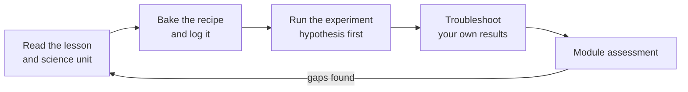

# 00.1 · How this course works: four dimensions, three stages, the lab notebook

**Requires:** nothing — start here
**Science:** none in this lesson
**Practical:** set up your lab notebook from the [lab notebook template](templates/lab-notebook.md)
**Threads:** T11 Workflow · T12 Experimental method  **Time:** 40 min reading + 30 min setup

## Why this lesson exists

Most people learn baking as a list of recipes. That works until something changes — a new flour, a warmer kitchen, a bigger batch — and then the recipe stops working and you have no way to know why. This course is built to give you the model behind the recipe, so that you can predict, diagnose and eventually design. This lesson explains how the course is organised, how to move through it, and the one habit that turns baking into data: the lab notebook.

## You will be able to

1. Name the four dimensions the course trains and say which activity in a module develops each.
2. Explain how Stage 1 is structured (modules, lessons, threads T1–T12, append-only IDs) and how Stages 2 and 3 will attach to it.
3. Use the site: mark pages complete, keep per-page notes, read prerequisite marks, export a backup.
4. Set up a lab notebook and record a bake log with every field this course expects.
5. Follow the study loop for a module: read → bake → experiment → troubleshoot → assess.

## The four dimensions

Every module trains four things at once. A professional needs all four; an R&D pastry chef needs them in balance.

| Dimension | What it means | Where you train it in each module |
|---|---|---|
| **A. Practical skill** | Your hands, eyes and timing: mixing to a windowpane, shaping with tension, reading a crumb, piping evenly. | Recipes (`R1-`), practical assessments |
| **B. Baking science** | The mechanism: why gluten forms, why yeast slows in the cold, why sugar delays coagulation. Taught to the depth needed to *predict what happens when you change a variable*. | Lessons, science units (`SC-`) |
| **C. Experimental thinking** | Changing one variable at a time, controlling the rest, measuring, and explaining the result. | Experiments (`X1-`), experimental-design questions |
| **D. Professional workflow** | Weighing, baker's %, temperature control, mise en place, documentation, sanitation, scaling, costing, standardisation. | Every recipe's critical control points, formula sheets, M18 |

The dimensions reinforce each other. You cannot interpret an experiment (C) without the mechanism (B); you cannot run a clean experiment without consistent technique (A) and a controlled workflow (D). When one dimension lags, the others stall. The most common pattern in self-taught bakers is strong A, weak B and D — good hands, but unable to reproduce a success or explain a failure. The most common pattern in engineers is the reverse: they read the science and underbake. Budget your bench time accordingly: this course expects roughly two hours at the bench for every hour of reading.

**Key idea:** A recipe is one point in a design space. The course teaches you the axes of that space — hydration, fermentation time and temperature, sugar and fat levels, mixing energy, oven profile — so that you can move deliberately from one point to another.

## Three stages, and how Stage 1 is built to be extended

| Stage | Scope | Your end state |
|---|---|---|
| **Stage 1 — Professional Baking Foundation** (this course) | 20 modules (M00–M19): lean and sourdough bread, enriched doughs, cookies, quick breads, cakes, short and laminated pastry, custards, meringues, choux, chocolate, assembled pastries, production and a capstone. | You can bake the core repertoire consistently, explain it, diagnose failures and run a controlled formulation project. |
| **Stage 2 — Advanced Artisan / Professional Pastry** | Deeper technique and science in each system: advanced fermentation, viennoiserie, entremets, confectionery, plated desserts, production at scale. | Professional-level execution and a broader repertoire. |
| **Stage 3 — R&D and Creative Product Development** | Formulation optimisation, ingredient functionality, shelf life, sensory science, design of experiments, product development. | You can design new products and processes from requirements. |

Stage 1 is written so that Stages 2 and 3 can be *appended* without rewriting it. Three mechanisms make that possible:

1. **Concept threads T1–T12.** Every lesson is tagged with the threads it advances (you can see them in the grey prerequisite box at the top of each lesson). A thread is a line of understanding that runs through the whole course: T1 Measurement & formulation math, T2 Flour, starch & gluten, T3 Fermentation & microbiology, T4 Heat, baking & staling, T5 Sugars & browning, T6 Fats & shortening, T7 Eggs, foams & emulsions, T8 Starch thickening & gels, T9 Structured doughs, T10 Chocolate & crystallization, T11 Professional workflow, safety & QA, T12 Experimental method & R&D. Stage 2 and 3 modules extend the same threads — for example T3 runs from "yeast makes gas" (03.1) to fermentation kinetics and process optimisation in Stage 3.
2. **Append-only IDs.** Stage 1 uses `stage-1/` paths and the prefixes `R1-` (recipes), `X1-` (experiments) and `SC-` (science units). Stage 2 will add `stage-2/`, `R2-`, `X2-`, and so on. Nothing in Stage 1 is renamed when that happens, so your notes and completion marks stay valid.
3. **"Where this goes next" callouts.** Every lesson ends with a hook naming the later Stage 1 lesson that uses the idea and the Stage 2/3 extension that deepens it. Those hooks are the plug points listed in the [extension architecture](extension/stage-2-3-architecture.md).

The full plan is in the [course outline](curriculum/course-outline.md); the prerequisite graph is in the [curriculum map](curriculum/curriculum-map.md).

## How the course is organised

| Unit | ID pattern | What it is | Example |
|---|---|---|---|
| Module | `M03` | One *system* and the concept that governs it | M03 Yeast and fermentation: lean bread |
| Lesson | `03.2` | One idea, with bench work attached | 03.2 The twelve steps of bread |
| Recipe | `R1-01` | A standardized formula with critical control points | [R1-01 Lean loaf](recipes/R1-01-lean-loaf.md) |
| Experiment | `X1-07` | One variable, small batches, observation sheet | [X1-07 Fermentation temperature](experiments/X1-07-fermentation-temperature.md) |
| Science unit | `SC-08` | The mechanism, read the first time it appears on the bench | [SC-08 Microbiology](stage-1/science/sc-08-microbiology.md) |
| Troubleshooting | by category | Symptom → causes → test → correction tables | [Lean bread troubleshooting](troubleshooting/bread-lean.md) |
| Assessment | `module-XX-quiz` | Knowledge, formulation math, diagnosis, experiment design, practical rubric | [M01 assessment](stage-1/assessments/module-01-quiz.md) |

Recipes are vehicles for concepts. Most are marked Educational formulation: formulas designed for this course on top of established technique, sized for a home kitchen, and deliberately "central" so that experiments can push them in either direction.

## Using the site

The site keeps your progress **in this browser only** (browser local storage). Nothing is sent anywhere.

| Feature | Where | How to use it |
|---|---|---|
| **Mark complete** | Button at the bottom of every lesson, recipe, experiment and assessment | Click when you have *done* the page, not just read it: for a recipe, when you have baked it and logged it. The date is stored. Click again to undo. |
| **Notes box** | Under the completion button on every page | Autosaves as you type. Use it for questions, quick results and links to your notebook entry. Not a replacement for the notebook. |
| **Prerequisite marks** | Grey box at the top of each lesson | Each linked prerequisite shows ✓ (completed) or ○ (not yet). A ○ is a warning, not a lock — if you skip ahead, expect to hit an idea you have not met. |
| **Sidebar ticks** | Left navigation | Completed pages show a ✓. |
| **My progress** | [My progress](progress.md) | Completion per module, the next unfinished page, all your notes in one place, and **Export/Import JSON**. Export a backup weekly and before clearing browser data or switching devices. |
| **Search** | Top of the sidebar | Searches lessons, recipes and the [glossary](references/glossary.md). |

**Warning:** Clearing browser data or using a private window erases progress and notes. Export from [My progress](progress.md) regularly.

## The lab notebook

The lab notebook is the single most important professional habit in this course. It is how a bake becomes a data point. Without it, you will remember your best loaf and forget what made it good.

Use a bound paper notebook, a spreadsheet, or a digital document — whatever you will actually keep up at the bench with floury hands. Many bakers use a paper log at the bench and transcribe to a spreadsheet afterwards. Start from the [lab notebook template](templates/lab-notebook.md).

### The bake log: fields and why each matters

| Field | Example | Why you record it |
|---|---|---|
| **Date and bake ID** | 2026-10-03 · B-014 | Lets you reference bakes from later notes and experiments. |
| **Formula** | R1-01 at 70 % hydration, 1.0 % instant yeast | The intended recipe, with baker's %. Link or copy the formula sheet. |
| **Actual weights** | Flour 500 g, water 352 g (target 350), salt 10.0 g, yeast 5.1 g | What went in, not what the recipe said. Small deviations explain surprising results. |
| **Ingredient lot / brand** | Brand X bread flour, 12.5 % protein, best-before 2027-03; yeast opened 2026-08-10 | Flour varies between brands and even between lots; old yeast is weaker. |
| **Room temperature** | 23 °C | Drives fermentation rate and dough temperature. |
| **Water temperature** | 21 °C | The variable you use to hit dough temperature (lesson 01.3). |
| **DDT target vs actual** | Target 25 °C, actual 26.5 °C | The most useful single number for explaining a fermentation that ran fast or slow. |
| **Times** | Mix 10:05–10:17; bulk to 12:40; shape 12:50; proof to 13:55; bake 14:00–14:40 | Durations and clock times. Fermentation is judged against time *and* temperature. |
| **Observations** | Dough slack at end of mix; windowpane at 11 min; +80 % volume at end of bulk | Observable endpoints: volume increase, feel, windowpane, colour, oven spring. |
| **Photos** | Crumb cut, top, bottom, side, with a ruler | Crumb and colour are hard to describe in words; a ruler makes photos comparable. |
| **Sensory** | Crust crisp, deep brown; crumb moist, slightly sweet; faint yeasty aroma | Taste, aroma, texture, scored the same way each time (a simple 1–5 scale is enough). |
| **What to change** | Reduce yeast to 0.8 % or water to 22 °C; bake 3 min longer | The decision. This is what makes the next bake better than the last. |

Two rules keep the notebook useful:

- **Record at the bench, in real time.** Reconstructed times are wrong.
- **Record surprises, not only numbers.** "Dough much stickier than last time" is data. Later you will learn to find its cause (new flour lot? warmer water?).

For experiments, the notebook entry is the experiment's observation sheet plus your hypothesis written *before* you start. Writing the hypothesis first is non-negotiable: it is how you find out what your mental model actually predicts.

**Professional practice:** In a professional bakery the equivalent of your bake log is the production sheet and the batch record — date, batch, dough temperature, times, operator, deviations. Consistency in a bakery comes from recording and controlling these, not from talent.

## How to study a module

Every module follows the same loop. Do it in this order.

1. **Read** the lesson, and the linked science unit the first time it appears. Answer the "Check yourself" questions before opening the answers.
2. **Bake** the recipe. Follow it exactly the first time, log everything, and compare your result with the recipe's "Expected result".
3. **Run the experiment.** Write your hypothesis first. Use the small-batch formula. Fill the observation sheet.
4. **Troubleshoot.** Anything that did not match the expected result goes through the troubleshooting tables: symptom → likely causes → how to test → correction. Plan the next bake from that.
5. **Assess.** Do the module assessment, including the practical rubric. If you fail a section, go back to the lesson it covers, not forward.

Repeat a recipe until you can hit its critical control points two times in a row. Consistency, not a single good result, is the standard.

## On the bench

This lesson has no baking. Do these three things:

- Set up your notebook using the [template](templates/lab-notebook.md). Create the bake-log table and an experiment section.
- Open [My progress](progress.md), mark this lesson complete when done, and do a test **Export JSON** so you know where the backup goes.
- Write one page, in your notebook, on what you want from Stage 1 and which product you might develop in the [capstone](stage-1/capstone/README.md). You will revisit it in M19.

## What goes wrong

| Failure | What it looks like | Correction |
|---|---|---|
| Recipe-hopping | Many different recipes, none repeated; no improvement curve | Repeat each course recipe until consistent before moving on. |
| Notebook drift | Log entries stop after the second week, or record only the recipe name | Keep the log on paper next to the scale; fill the DDT and times fields as you go. |
| Reading without baking | Quiz scores high, bakes inconsistent | Keep the 2:1 bench-to-reading ratio; do not mark a recipe complete until you have baked it. |
| Changing several things at once | "It worked better" but you do not know why | One variable per bake when you are learning; keep everything else in the "controlled" column. |

## Lab notebook

For this lesson record: your notebook format; your baseline kitchen conditions (typical room temperature in the morning and evening); the flour, salt and yeast you will use for the first modules (brand, type, protein % from the label, best-before date).

## Check yourself

1. A bake came out much denser than last time. Which three notebook fields would you look at first, and why?

Answer

DDT actual (a cold dough ferments slowly), times (bulk and proof durations), and ingredient lot/brand plus actual weights (a different flour or a yeast weighing error). Room temperature is the fourth candidate. Together these explain most fermentation differences between two bakes of the same formula.

2. Why does Stage 1 use IDs like `R1-01` and `X1-07` instead of plain names?

Answer

Stable, append-only IDs let Stages 2 and 3 add `R2-`, `X2-`… and `stage-2/` pages without renaming anything in Stage 1. Your notes, completion marks and cross-references keep working when the course grows.

3. A lesson's prerequisite box shows ○ next to 01.3. What does that mean and what should you do?

Answer

You have not marked 01.3 complete. It is a warning, not a lock. You can continue, but you will need the DDT method from 01.3 for this lesson; the better move is to complete it first.

4. Which of the four dimensions does an experiment train most directly, and which other dimension does it depend on?

Answer

Experimental thinking (C). It depends on practical skill (A) and workflow (D) because inconsistent technique or uncontrolled temperature adds noise that hides the effect of the variable you changed. It also depends on science (B) to explain the result.

5. Why must the hypothesis be written before running an experiment?

Answer

Afterwards you will unconsciously fit your "prediction" to what you saw. Writing it first reveals what your mental model actually predicts, so a wrong prediction shows you exactly which part of the model to fix.

## Where this goes next

**Next:** The notebook fields become measurable in [01.3 DDT](stage-1/module-01/lesson-03.md) and [01.4 The standardized formula sheet](stage-1/module-01/lesson-04.md); the experimental method is formalised in [18.3 The diagnostic method](stage-1/module-18/lesson-03.md) and [19.1 Designing experiments and sensory tests](stage-1/module-19/lesson-01.md). **Stage 2** turns the bake log into a production batch record with traceability; **Stage 3** turns it into a formulation database and design-of-experiments workflow for product development.

## Sources

- [Gisslen] — professional workflow and the baker's approach to formulas.
- [CIA-BP] — professional kitchen organisation and practice.
- [Hamelman] — record-keeping and dough temperature control in bread production.
