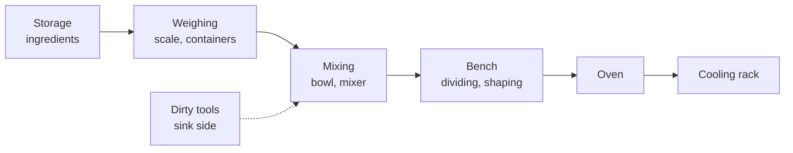

# 00.2 · Setting up the kitchen lab: equipment, oven mapping, workflow and mise en place

**Requires:** [00.1 How this course works](stage-1/module-00/lesson-01.md)
**Science:** [SC-10 Heat transfer](stage-1/science/sc-10-heat-transfer.md)
**Practical:** [X1-02 Calibrating the kitchen](experiments/X1-02-calibration.md) (oven map) · [Essential equipment](equipment/essential.md)
**Threads:** T1 Measurement · T4 Heat · T11 Workflow  **Time:** 50 min reading + 2–3 h setup and oven mapping

## Why this lesson exists

A professional bakery produces the same product every day because its tools are known quantities: the scales are checked, the ovens are profiled, and every station is laid out the same way. A home kitchen is full of unknowns — an oven that runs 15 °C cold at the back, a scale with a tired battery, a counter that is also a dining table. This lesson turns your kitchen into a lab: minimum equipment, an oven you actually understand, a repeatable workstation, and the discipline of mise en place.

## You will be able to

1. List the minimum equipment for Stage 1 and justify each item by the measurement or control it provides.
2. Describe how a home oven actually behaves (thermostat swing, hot spots, preheat and recovery, fan offset) and how to compensate.
3. Lay out a workstation for a bake and prepare full mise en place before mixing.
4. Read a recipe completely and convert it into a timed plan with timers and labels.
5. Clean as you go so the bench is never the limiting factor.

## The minimum kitchen lab

The full lists, with specifications and price ranges, are in [Essential equipment](equipment/essential.md) and [Useful equipment](equipment/useful.md). The short version, organised by what each tool lets you *measure or control*:

| Tool | Specification | What it controls | Stage 1 status |
|---|---|---|---|
| Digital scale | 1 g resolution, ≥ 5 kg capacity, tare | Every ingredient quantity (T1) | Essential |
| Precision scale | 0.01 g or 0.1 g resolution, 100–500 g capacity | Yeast, salt, leaveners, gelatine | Essential |
| Probe thermometer | Instant-read, 0.1 °C display, −10 to 200+ °C | Water, dough, custard, internal bake temperature | Essential |
| Oven thermometer | Dial or probe type that sits in the oven | The oven's real temperature, not the dial | Essential |
| Bowls, dough scraper, bench knife | Several sizes; one straight-sided transparent container for bulk | Handling; fermentation volume can be read on a straight-sided container | Essential |
| Baking stone or steel, or cast-iron pot | Stone ≥ 1 cm thick or steel ≥ 6 mm; pot ~24–26 cm with lid | Bottom heat and oven spring for bread | Essential for M03–M05 |
| Sheet pans, loaf pan, cake pans, tart ring | See equipment page for sizes in cm | Product shape; results depend on pan material and colour | Essential (acquired by module) |
| Timer(s) | At least two independent timers | Parallel processes | Essential |
| Stand mixer | 4.5–6 L bowl, dough hook, paddle, whisk | Mixing energy, especially for brioche and meringue | Useful (recommended from M06) |
| IR thermometer | Surface only | Stone/steel surface temperature, bench temperature | Useful |
| Proofing box or a controlled warm spot | 24–30 °C | Fermentation rate independent of the weather | Useful |
| pH meter, refractometer | — | Sourdough acidity; sugar concentration | Useful (introduced when needed) |

**Key idea:** Buy equipment for the question it answers. A scale answers "how much?", a probe thermometer "how warm is the product?", an oven thermometer "how hot is the oven really?". Do not buy a tool until you have a question it answers.

## Oven realities

Recipes give an oven temperature as if it were a fixed number. It is not. A home oven is a box with a heating element and a thermostat that switches the element on and off, and the temperature at your product depends on where it sits and when you look. [SC-10 Heat transfer](stage-1/science/sc-10-heat-transfer.md) explains the physics; here is what it means in practice.

### Thermostat swing

The thermostat turns the element on until the air sensor reaches the set point, then off until the air cools past a lower threshold. The air temperature therefore oscillates around the set point. In typical home ovens the swing is roughly ±5–15 °C, and the *average* may be offset from the dial by a similar amount in either direction. The only way to know your oven is to measure it (experiment [X1-02](experiments/X1-02-calibration.md)).

### Hot spots

The back of the oven (near a rear fan element), the side walls, and the zones near the top and bottom elements run hotter than the centre. A tray of cookies shows it clearly: one corner browns first. Compensations:

- Bake one tray at a time on the middle shelf when you care about evenness.
- Rotate the tray 180° at the halfway point for products that tolerate the door opening (cookies, most breads after oven spring; **not** soufflé-type or foam cakes in their first two thirds of baking).
- Use your oven map to choose the most even shelf and position.

### Preheat and recovery

The oven's air reaches set point long before its walls and your baking surface do. The light that says "preheated" means the air sensor is hot, nothing more.

| What you are heating | Typical time to full temperature | Why |
|---|---|---|
| Oven air (light goes off) | 10–15 min | Air has little heat capacity |
| Oven walls, stable temperature | 20–30 min | The cavity must soak |
| Baking stone (1–2 cm) | 45–60 min at 230–250 °C (450–480 °F) | Stone is thick and a poor conductor |
| Baking steel (6–10 mm) | 30–45 min | Steel conducts well but has a lot of mass |
| Cast-iron pot, empty with lid | 30–45 min | Heavy mass |

Every time you open the door the oven loses a large fraction of its hot air, and the air temperature can drop 20–50 °C within seconds. It recovers over a few minutes, mostly from the stored heat in the walls — which is why a properly soaked oven recovers faster than one that has just "preheated".

### Fan (convection) versus conventional

A fan does not make the air hotter; it strips away the thin, cooler boundary layer of air around the product, so heat transfers faster at the same air temperature. The standard compensation is to **set a fan oven about 15–20 °C lower** than a conventional-oven temperature, or keep the temperature and expect a shorter bake. Fans also dry surfaces faster (good for crisp choux and meringue, bad for bread in the first minutes when you want steam to keep the crust soft). This course gives oven temperatures for **conventional (top-and-bottom) heat** unless a recipe says otherwise.

**Science:** Heat moves into a product by radiation (from walls and elements), convection (moving air and steam) and conduction (from the stone, pan or tray). A dark pan absorbs more radiant heat than a shiny one and browns the bottom faster; a stone stores a large amount of heat and delivers it by conduction to the base of a loaf. See [SC-10](stage-1/science/sc-10-heat-transfer.md).

### Your oven's profile

By the end of this module you will have an **oven map**: for your chosen shelf position, the real average temperature at dial settings of 180, 200 and 230 °C (350, 390, 450 °F), the swing, the time to stable temperature, and a diagram of hot spots. That map goes on the inside of a cupboard door. Procedure in [X1-02](experiments/X1-02-calibration.md).

## Workstation layout

Lay out a station so that work flows in one direction and nothing crosses back through clean or finished product.

Rules that hold in any kitchen:

| Rule | Why |
|---|---|
| Scale on a flat, rigid, level surface away from the oven door and the mixer | Vibration, heat and slope cause drift and wrong readings. |
| Clear, dry bench area at least 60 × 60 cm for shaping | You cannot shape well in a cramped space. |
| Raw zone (raw flour, raw egg) separate from finished zone (cooling rack, fillings) | Cross-contamination (lesson [00.3](stage-1/module-00/lesson-03.md)). |
| Towel, bench scraper and a bowl of water within reach | Clean hands and scraped surfaces as you go. |
| Rubbish/compost bowl on the bench | Eliminates trips. |
| Thermometer and timers on the bench, not in a drawer | You will measure more if the tool is visible. |

## Mise en place as a professional discipline

*Mise en place* — "everything in its place" — means that before you start the process, every ingredient is weighed into its own labelled container, every tool is out, every pan is prepared, and the oven is heating on the right schedule. It is not a nicety. It is the method by which a professional removes decisions and errors from the critical part of the process.

What it prevents, concretely:

- **Omitted ingredients.** Salt forgotten in bread is the classic. With mise en place you see the salt container still full.
- **Time-critical errors.** Custards, caramels, meringues and choux have seconds-long windows. You cannot go looking for the sieve.
- **Weighing errors under pressure.** Weighing into the mixing bowl while the mixer is running leads to overshooting.

The procedure:

1. Read the recipe completely (below).
2. Prepare pans and trays (line, grease, measure).
3. Set the oven schedule: when to switch on so that it is soaked when needed (a stone needs 45–60 min).
4. Weigh every ingredient into its own container. Group by addition step (for example, "step 1: flour + water"; "step 3: salt + yeast").
5. Bring ingredients to the temperatures the recipe specifies (butter 16–18 °C for creaming, eggs at room temperature for foams, water at the calculated temperature — lesson [01.3](stage-1/module-01/lesson-03.md)).
6. Lay out tools in the order of use.
7. Start the process only when all of the above is done.

## Reading a recipe completely

Before you weigh anything, read the whole recipe and answer on paper:

1. **What is the total time**, and where are the waits (bulk fermentation, chilling, cooling)? Can the product be paused (refrigerator) and where?
2. **What are the critical control points** (dough temperature, custard endpoint, butter temperature)? What tools do they need?
3. **Which steps are parallel**? When must the oven be switched on?
4. **What equipment and pans** are needed, and are they free?
5. **What does done look like** at each step — the observable endpoint?

Then write a timed plan: a column of clock times with each action. Professionals call this back-scheduling; you will do it formally in [18.1](stage-1/module-18/lesson-01.md).

## Timers and labels

- **Timers.** Start a timer for every wait, and name it (many phone timers allow labels; otherwise write "T1 = bulk, T2 = oven preheat" on tape). When a timer goes off, write the time in the log before you act.
- **Labels.** Every container that leaves your hand gets a label: what, weight or batch, date and time, and for experiments the variant code (for example "X1-04 · 70 % · mixed 10:15"). Masking tape and a marker are enough. An unlabelled container in a multi-variant experiment is a lost data point.

## Cleaning as you go

Clean as you go is a workflow rule, not a hygiene rule alone: a cluttered bench slows every subsequent step and hides errors. Wipe the scale after each weighing session, scrape and wipe the bench between stages, put used tools in the sink immediately, and wash while dough ferments. The end state of a professional bake is a clean station, not a sink full of bowls.

**Professional practice:** In a professional kitchen the station is reset between tasks. A useful home standard: when the last product goes into the oven, the bench should already be clean enough to start the next job.

## On the bench

- Assemble the [essential equipment](equipment/essential.md).
- Set up a workstation using the layout above and photograph it for your notebook.
- Start [X1-02 Calibrating the kitchen](experiments/X1-02-calibration.md): the oven-mapping part takes a free afternoon and the oven thermometer. The scale and thermometer checks are covered again in [01.1](stage-1/module-01/lesson-01.md) and [01.3](stage-1/module-01/lesson-03.md).
- Take any recipe you know and write out its mise en place list and timed plan, using the five questions above.

## What goes wrong

| Symptom | Likely cause | Correction |
|---|---|---|
| Products consistently pale or underbaked at the recipe time | Oven runs cold, or it was not soaked | Measure with an oven thermometer; preheat longer; adjust the dial by the measured offset. |
| Bottom of bread pale, top dark | Stone or pot not preheated; loaf on a thin tray | Preheat the stone/pot 45–60 min; bake lower in the oven. |
| One side of the tray browner | Hot spot | Rotate halfway (where the product allows); use your oven map. |
| Ingredient forgotten or doubled | No mise en place | Weigh everything out first; group by addition step. |
| Fan-oven results darker and drier than the recipe describes | Recipe written for conventional heat | Reduce temperature by 15–20 °C or shorten the bake. |

## Lab notebook

Record: your equipment list with scale resolutions and thermometer types; the oven's make and heating modes; your preheat routine; the oven-map results from X1-02 (actual temperature vs dial at each setting, swing, hot-spot diagram); a photo of your workstation layout.

## Check yourself

1. Your oven "preheated" light went off 12 minutes after switching on, and your stone is on the lower shelf. Can you load the bread? Why or why not?

Answer

No. The light tracks air temperature. The stone needs 45–60 minutes to reach and store heat; after 12 minutes its surface is far below the oven set point and the loaf will get weak bottom heat and poor oven spring. Measure the stone with an IR thermometer if you have one.

2. A cookie recipe says 180 °C conventional. You have a fan oven only. What do you set, and what else might you watch?

Answer

About 160–165 °C with the fan (15–20 °C lower), and check colour a few minutes before the stated time. Expect faster surface drying and possibly less spread because the surface sets sooner.

3. Your oven thermometer reads 168 °C when the dial says 180 °C, averaged over 20 minutes. What dial setting do you use for a recipe that needs 200 °C, and what assumption are you making?

Answer

About 212 °C (200 + 12). The assumption is that the offset is constant across the range. It often is not — measure at 200 °C too, which is exactly what the oven map in X1-02 does.

4. Name two failures that mise en place prevents in a time-critical preparation like caramel or custard.

Answer

Overcooking while you search for a tool or ingredient (the cream for caramel, the sieve or ice bath for custard), and weighing errors made in a hurry. Also: burns from improvising with hot sugar.

## Where this goes next

**Next:** The oven map is used for every bake from [03.2 The twelve steps of bread](stage-1/module-03/lesson-02.md) and is extended in [04.1 How heat gets into dough](stage-1/module-04/lesson-01.md) (stones, steels, steam). Mise en place and the timed plan become formal back-scheduling in [18.1 Production planning](stage-1/module-18/lesson-01.md). **Stage 2** moves to deck and rack ovens, steam injection and multi-product production schedules; **Stage 3** uses oven profiling with data loggers and product-core temperature curves to specify a bake process for a new product.

## Sources

- [Gisslen] — mise en place, oven types and professional workflow.
- [CIA-BP] — professional station organisation and equipment.
- [Figoni] — heat transfer in baking and the effect of pan material.
- [Hamelman] — hearth baking, stones and steam in bread production.
- Oven swing, preheat times and fan offset are standard professional practice; measure your own oven.
