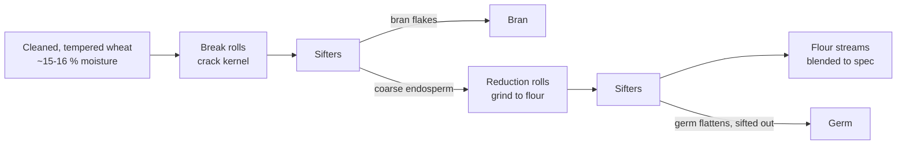

# 02.1 · Wheat and flour: kernel, milling, protein, ash, flour types

**Requires:** [01.2 Baker's percentages](stage-1/module-01/lesson-02.md)
**Science:** [SC-02 Carbohydrates](stage-1/science/sc-02-carbohydrates.md) · [SC-03 Proteins](stage-1/science/sc-03-proteins.md)
**Practical:** gluten balls · **Experiment:** [X1-03 Gluten wash](experiments/X1-03-gluten-wash.md)
**Threads:** T2 Flour, starch & gluten  **Time:** 45 min reading + 2 h bench

## Why this lesson exists

Flour is 100 % of every formula you write, so it is the ingredient with the largest single effect on the result. Two bags both labelled "white flour" can behave like different materials: one gives an open, springy loaf, the other a flat one that tears when shaped. This lesson teaches you to read a flour as a specification — protein, ash, extraction, absorption, age — rather than a name, so you can choose it, substitute it and predict what it will do.

## You will be able to

1. Name the three parts of the wheat kernel, their approximate share of its weight, and what each contributes to flour.
2. Explain extraction rate and ash, and translate between French T-types, German/Italian types and US flour names.
3. Pick a flour for a product from its protein content, using the ranges in this lesson.
4. Read a flour label (including a local Israeli or imported label) and extract the numbers that matter.
5. Store flour so it performs the same next month as today.

## The wheat kernel

A wheat kernel (the botanist says *caryopsis*) is about 6–8 mm long and weighs roughly 30–50 mg. It has three parts that millers separate, and the proportions explain almost everything about white vs whole-grain flour.

| Part | Share of kernel weight | What is in it | What it does in dough |
|---|---|---|---|
| Endosperm | ~80–85 % | Starch granules (≈70–75 % of the endosperm) embedded in a protein matrix; the gluten-forming proteins live here | Provides starch (structure after baking, food for enzymes) and gluten (the dough network). White flour is essentially endosperm. |
| Bran (outer layers incl. aleurone) | ~13–15 % | Fibre (cellulose, arabinoxylans), minerals, pigments, some protein, enzymes | Absorbs a lot of water, cuts gluten strands, adds colour, flavour, bitterness and minerals (ash). |
| Germ (embryo) | ~2–3 % | Oil (≈10 % of the germ), vitamins, enzymes, glutathione | Nutty flavour; its oil goes rancid; its glutathione weakens gluten. |

The endosperm is not uniform. The centre is purer starch and protein; toward the outside, near the bran, protein content and mineral content rise. That gradient is why "flour streams" from different parts of the mill have different properties, and why a higher-extraction white flour is both greyer and slightly higher in protein than a very pure, low-extraction one.

**Science:** Starch (a glucose polymer packed in granules) and protein are covered in [SC-02](stage-1/science/sc-02-carbohydrates.md) and [SC-03](stage-1/science/sc-03-proteins.md). For now you need one model: flour is roughly 70–75 % starch, 7–15 % protein, 12–14 % water, and small amounts of fibre, lipid, minerals and enzymes. The protein is the variable part; the starch is the bulk.

## Classes of wheat: hard vs soft, red vs white

**Hard vs soft** describes how the endosperm breaks. In hard wheat the protein matrix grips the starch granules tightly; when milled, the kernel fractures *through* granules, producing coarser, gritty flour with more *damaged starch* (important in [02.3](stage-1/module-02/lesson-03.md)). Hard wheats are usually higher in protein. Soft wheat breaks cleanly around the granules into fine, soft, low-damage flour that is usually lower in protein. Rub flour between your fingers: bread flour feels slightly sandy and falls apart; cake flour feels silky and holds a fingerprint.

**Red vs white** is bran colour. Red wheat bran contains more pigmented phenolic compounds, which taste slightly bitter and astringent. White wheat has pale bran with a milder taste. This barely matters for white flour (the bran is removed) but matters a lot for whole-wheat flour: "white whole wheat" tastes sweeter and looks lighter than red whole wheat at the same protein.

| US class (reference) | Typical protein | Typical use |
|---|---|---|
| Hard red spring | 12–15 % | Bread and high-gluten flour, blending to strengthen |
| Hard red winter | 10–12.5 % | All-purpose, bread flour, pan bread |
| Hard white | 10–13 % | Bread, whole-wheat bread with mild taste, noodles |
| Soft red winter | 8–10 % | Pastry, cookies, crackers, cake |
| Soft white | 8–10.5 % | Cake, pastry, cookies, Asian noodles |
| Durum (a different species) | 12–15 % | Semolina, pasta; its gluten is strong but not very elastic |

You will rarely see the class on a retail bag outside North America, but the logic transfers everywhere: strong flour comes from hard, high-protein wheat; tender flour from soft, low-protein wheat.

## Milling and extraction rate

Modern roller mills do not grind the kernel in one pass. They crack it open between corrugated "break" rolls, sift, send the coarse endosperm pieces to smooth "reduction" rolls, sift again, and repeat many times. Each pass produces a *stream* of flour; the miller blends streams to a target specification.

**Extraction rate** is the weight of flour obtained per 100 kg of wheat. A pure white flour extracts about 70–75 %; whole-wheat flour is 95–100 % (everything goes back in). Between them sit "high-extraction" flours (80–90 %) that keep some bran and germ. Higher extraction means:

- more minerals, fibre, flavour and colour;
- more water absorption;
- weaker gluten per gram of protein (bran and germ interfere);
- shorter shelf life (germ oil).

Stone-milled flour is ground in one pass between stones and then sifted to the desired extraction. It tends to carry fine bran and germ even when sifted "white", so it is often darker, more flavourful and more perishable than roller-milled flour of the same name.

## Ash and the T-type system

If you burn flour at ~900 °C, the organic matter disappears and a small residue of minerals remains: the **ash**. Because minerals are concentrated in the bran and outer endosperm, ash is a direct measure of how much of the outer kernel is in the flour — in other words, of extraction and refinement.

France classifies flour by ash. The **T-number is the ash content in milligrams per 10 g of dry flour**, which is the same as the ash percentage × 100: T55 ≈ 0.55 % ash. Germany uses mg per 100 g (Type 550 ≈ 0.55 % ash). Italy uses 00 / 0 / 1 / 2 / integrale.

| France | Ash (dry basis) | Approx. extraction | Germany | Italy | Nearest US / general name | Typical use |
|---|---|---|---|---|---|---|
| T45 | < 0.50 % | ~67–70 % | 405 | 00 | pastry / cake flour *by refinement* (protein varies) | Pastry, viennoiserie ("gruau" T45 is strong) |
| T55 | 0.50–0.60 % | ~75 % | 550 | 0 / 00 | all-purpose, "white flour" | Baguette, general bread, pastry |
| T65 | 0.62–0.75 % | ~78 % | between 550 and 812 | 1 | no direct match; "high-extraction white" | Pain de campagne, traditional bread |
| T80 | 0.75–0.90 % | ~82–85 % | 812 | 2 | "light whole wheat", high-extraction | Rustic bread |
| T110 | 1.00–1.20 % | ~90 % | 1050 | — | no direct match | Semi-whole bread |
| T150 | > 1.40 % | ~98–100 % | 1600 | integrale | whole wheat | Whole-wheat bread |

**Key point:** Ash-based names (T55, 00, Type 550) tell you **how refined** the flour is, not **how strong** it is. An Italian 00 can be 9 % protein (for fresh pasta or cakes) or 13 %+ ("00 per pizza", "Manitoba"). A French T45 can be a soft pastry flour or a strong *gruau* for croissants. US names (cake, pastry, all-purpose, bread, high-gluten) are the opposite: they tell you mostly about protein and say little about ash. Always look for the protein number.

## Protein content and what it means for products

Protein content is the single most useful number on a flour bag, because gluten-forming proteins make up roughly 75–85 % of wheat-flour protein. More protein means, to a first approximation, more gluten, more water absorption, a stronger and more elastic dough, more volume in bread and more toughness in cake.

| Flour category | Protein (as sold) | Behaviour | Products |
|---|---|---|---|
| Cake flour | ~7–9 % | Fine, low absorption, very weak gluten; US cake flour is often chlorinated (not permitted in the EU/UK) | High-ratio cakes, chiffon, génoise (see [X1-28](experiments/X1-28-cake-flour.md) later) |
| Pastry flour | ~8.5–10 % | Tender, low absorption | Pie and tart dough, cookies, biscuits |
| All-purpose / "white flour" | ~9–11.5 % | Medium; a compromise | Cookies, quick breads, many pastries, softer breads |
| Bread flour | ~11.5–13.5 % | Strong, absorbs more water, tolerates long fermentation | Lean bread, rolls, pan loaves, croissant |
| High-gluten flour | ~13.5–14.5 % | Very strong and elastic, high absorption | Bagels, pizza that needs chew, blending to strengthen whole-grain or rye doughs |
| Vital wheat gluten (not a flour) | ~70–80 % | Concentrated gluten | Add 1–3 % of flour weight to strengthen weak flour |

What moves you within a range: long fermentations, high hydration and doughs carrying heavy additions (seeds, whole grains, fat, sugar) need the upper part; tender products and short mixing want the lower part. For your first lean loaf in [R1-01](recipes/R1-01-lean-loaf.md) you will use a bread flour in the 11.5–13 % band.

**Protein is necessary, not sufficient.** Two flours at 12.5 % protein can differ in gluten *quality* — how elastic vs extensible the network is — because of wheat variety, growing season and milling. The gluten wash in [X1-03](experiments/X1-03-gluten-wash.md) and the doughs in [X1-04](experiments/X1-04-hydration-series.md) are how you find out what your specific flour does.

## Reading a flour label

Wherever you buy flour, use this checklist. It matters in Israel in particular, where you will find local flours labelled by use ("bread flour", "white flour", "whole-wheat flour", "flour for challah", "00"), imported Italian and French flours with ash codes, and occasionally US-style names — and these naming systems do not line up.

1. **Protein per 100 g** in the nutrition panel. Per 100 g, grams = percent. This is your main number.
2. **Resolution.** Labels round. A panel that says "12 g" may be 11.5–12.5 %. A US panel that gives protein per 30 g serving ("4 g") is useless for fine distinctions: 3.5–4.49 g per 30 g covers about 11.7–15 %.
3. **Basis.** Label protein is usually on the flour *as sold* (about 12–14 % moisture). Mill specifications are often on a fixed 14 % moisture basis. The protein calculation factor can also differ between labelling systems (nitrogen × 6.25 is used for EU nutrition labels; cereal chemists often use × 5.7), which can make the same flour look about 1 percentage point different. **Compare flours on the same kind of label, and trust your own gluten wash over a number from a different system.**
4. **Ingredients.** Look for additives that change behaviour: ascorbic acid (E300, a dough strengthener; common in European and Israeli flours), enzymes (amylase, xylanase), malted barley or wheat flour (adds amylase), and — in some US flours — potassium bromate (a strong oxidizer, banned in the EU, UK, Canada and elsewhere). Self-raising flour contains baking powder and salt: never substitute it for plain flour.
5. **Name codes.** T-type, Type, 00/0 → refinement (ash). "Manitoba", "strong", "gruau", "for pizza" → usually high protein. "Cake", "pastry", "biscuit" → usually low protein.
6. **Date.** Use the best-before date to estimate age (see storage below).

## Whole wheat flour

Whole-wheat flour contains all three parts of the kernel, so at 13 % protein it behaves nothing like a 13 % white flour:

- It **absorbs more water** — typically 5–10 percentage points more than white flour — because bran fibre and arabinoxylans hold water and hydrate slowly. A whole-wheat dough that feels right at mixing often stiffens after 30 minutes.
- It makes **weaker, less extensible gluten** per gram of protein: bran particles physically cut the network, and germ glutathione loosens it (see [02.2](stage-1/module-02/lesson-02.md)).
- It **ferments faster**: more minerals, more enzymes and more available nutrients for yeast.
- It gives **less volume** and a denser, darker crumb with more flavour.
- Particle size matters: finely milled whole wheat interferes less with gluten than coarse bran flakes.

Common fixes, all tested later in the course: higher hydration, a soak or autolyse ([02.3](stage-1/module-02/lesson-03.md)), blending with bread flour, and a preferment ([M05](stage-1/module-05/README.md)).

## Falling number (briefly)

Wheat contains the enzyme **alpha-amylase**, which cuts starch into sugars. Sound wheat has little; wheat that sprouted in the field during a wet harvest has a lot. Too much amylase liquefies starch during baking and gives a **sticky, gummy crumb** and a dark crust; too little gives pale crust and slow fermentation in long, lean processes.

The **falling number** test measures this: flour and water are heated to a gel in a tube and the time (seconds) for a plunger to fall through it is recorded. More amylase → thinner gel → lower number.

| Falling number | Meaning |
|---|---|
| < 200 s | High amylase (sprouted wheat): risk of sticky crumb |
| ~250–350 s | Typical target for bread flour |
| > 400 s | Low amylase: millers often add malted flour to correct |

You will never measure this at home, but you should recognise the symptom (gummy crumb that is fully baked by temperature) and the vocabulary on a mill spec sheet. Enzymes return in depth in [SC-09](stage-1/science/sc-09-enzymes.md) and [05.1](stage-1/module-05/lesson-01.md).

## Storage and freshness

- **Freshly milled white flour** often makes slack, sticky dough ("green" flour). A few weeks of exposure to air oxidizes it and improves baking performance. Commercial flour you buy has usually had time to age or has been treated with ascorbic acid.
- **White flour** keeps 6–12 months in a closed container at cool room temperature (below ~25 °C), dry, away from odours (flour absorbs them).
- **Whole-grain and stone-ground flour** keeps about 1–3 months at room temperature before the germ oil tastes stale or bitter; in the freezer, 6–12 months. Let frozen flour warm to room temperature in a closed bag before opening so it does not condense water, and account for its temperature in DDT ([01.3](stage-1/module-01/lesson-03.md)).
- **Pests:** pantry moths and weevils. Airtight containers; freeze new bags for 48 h if you have had an infestation.
- **Label** every container with the flour name, protein, and date opened. That is your batch record when a bake behaves differently.

**Safety:** Raw flour is a raw agricultural product and has been linked to outbreaks of *E. coli* and *Salmonella*. Do not taste raw dough or batter, wash hands and surfaces after handling flour, and keep flour away from ready-to-eat food ([FDA-flour]). This applies to the gluten wash in X1-03.

## Other grains: a preview

Rye and spelt appear on shelves next to wheat and will be tempting. Treat them as different systems:

- **Spelt** is a wheat relative whose gluten is more extensible and more fragile; it absorbs water faster and overmixes easily. Use shorter mixing and slightly lower hydration than you would expect for its protein number.
- **Rye** forms very little functional gluten. Its structure comes from pentosans (gummy fibres) and starch, and it has high amylase activity, so rye bread depends on acidification (sourdough) to avoid a gummy crumb.

Both are Stage 2 subjects. For Stage 1, keep them to at most 10–20 % of a wheat dough if you want to experiment.

## On the bench

1. Collect three flours: a cake or pastry flour (lowest protein you can find), an all-purpose / "white" flour, and a bread flour. Record brand, name, protein per 100 g, ingredients, best-before date.
2. Do the touch test: squeeze a handful of each. Which holds a clump and fingerprint (soft, fine), which falls apart (hard, granular)?
3. Run [X1-03 Gluten wash](experiments/X1-03-gluten-wash.md) on all three. You will wash out the starch, weigh the gluten, and bake the gluten balls. This turns a label number into something you have held.
4. Keep the bread flour you choose as your "house flour" for M02 and M03 — the hydration, mixing and salt experiments ([X1-04](experiments/X1-04-hydration-series.md), [X1-05](experiments/X1-05-mixing-time.md), [X1-06](experiments/X1-06-salt.md)) and [R1-01](recipes/R1-01-lean-loaf.md) all assume one flour held constant.

## What goes wrong

| Problem | Likely flour cause | Where to look |
|---|---|---|
| Dough slack, spreads, will not hold shape | Protein too low for the hydration/fermentation; freshly milled flour; high-protease or high-amylase flour | [Weak, slack dough](troubleshooting/bread-lean.md?id=weak-slack-dough) |
| Dough tight, tears, loaf small and dense | Flour too strong for the process or too dry at the chosen hydration (absorbs more than you assumed) | [02.3](stage-1/module-02/lesson-03.md) · [bread-lean troubleshooting](troubleshooting/bread-lean.md) |
| Gummy crumb although internal temperature reached 96–98 °C | Excess amylase (low falling number), or cut while hot | [Troubleshooting: lean bread](troubleshooting/bread-lean.md) |
| Whole-wheat bread bitter or stale-tasting | Rancid germ oil in old whole-grain flour | Check dates; freeze whole-grain flour |
| Same recipe, different result after a new bag | Different protein, different additives, different lot | Your flour label record |

## Lab notebook

For every flour you use from now on, record: brand and product name; protein per 100 g and label type; ash code or type if given; ingredients/additives; date bought and opened; storage. For X1-03: wet and dry gluten weights and baked gluten ball size. Start a "flour cards" page — you will refer to it for the rest of the course.

## Check yourself

1. A bag of Italian "00" flour and a bag of US "bread flour" sit side by side. What does each name tell you, and what does it not tell you?

Answer

"00" tells you the flour is very refined (low ash, fine grind); it says nothing reliable about protein, which can range from about 9 % to over 13 %. "Bread flour" tells you it is a higher-protein flour (about 11.5–13.5 %) but says nothing precise about ash. For either, read protein per 100 g on the label.

2. Why does whole-wheat flour at 13 % protein give a smaller loaf than white bread flour at 13 %?

Answer

Part of its protein is in the bran and germ and does not form gluten; bran particles cut the gluten network; germ glutathione weakens it; and the fibre competes for water. Net result: less effective gluten per gram of protein, so less gas retention and less volume.

3. Convert T65 into an ash percentage and describe what you expect from it compared with T55.

Answer

T65 means roughly 0.65 % ash on a dry basis (the official band is about 0.62–0.75 %). Compared with T55 it is a higher-extraction flour: slightly creamier/greyer colour, more flavour and minerals, slightly higher water absorption, a little faster fermentation, and slightly less extensible gluten.

4. You buy a new bread flour with the same protein as your usual one and your usual 68 % hydration dough is noticeably slack. Name two flour-related explanations and one quick test.

Answer

Different gluten quality or lower water absorption (different wheat/lot); freshly milled flour; no ascorbic acid where the old flour had it; higher protease or amylase activity. Quick tests: compare ingredient lists; run a side-by-side gluten wash (X1-03) on old and new flour; mix both at the same hydration and compare handling after 30 min.

5. A US flour label gives 4 g protein per 30 g serving. What range of protein content is consistent with that label?

Answer

If "4 g" means anything from 3.5 to 4.49 g per 30 g, the protein is about 11.7 % to 15 %. The label cannot distinguish an all-purpose flour at the top of its range from a high-gluten flour. Look for the mill specification or run a gluten wash.

## Where this goes next

**Next:** [02.2](stage-1/module-02/lesson-02.md) turns protein into gluten: how the network forms and what strengthens or weakens it. Flour choice returns in [06.4 brioche](stage-1/module-06/lesson-04.md) (strong flour carrying fat), [10.1 cake formula balance](stage-1/module-10/lesson-01.md) and [X1-28 cake flour vs all-purpose](experiments/X1-28-cake-flour.md), and [11.1 short doughs](stage-1/module-11/lesson-01.md) (weak flour on purpose).
**Stage 2:** rye, spelt, einkorn, emmer and heritage wheats; stone milling and home milling; reading mill spec sheets (farinograph, alveograph, falling number) and choosing flour for a bakery.
**Stage 3:** designing flour blends to a target specification, and formulating with enzymes, vital gluten and oxidants to correct a flour.

## Sources

[Figoni] · [Delcour] · [Pyler] · [Cauvain-TB] · [Suas] · [Hamelman] · [Calvel] · [McGee] · [FDA-flour]. Protein bands, T-type ash bands and storage times are standard professional practice; exact regulatory limits vary by country and year.
