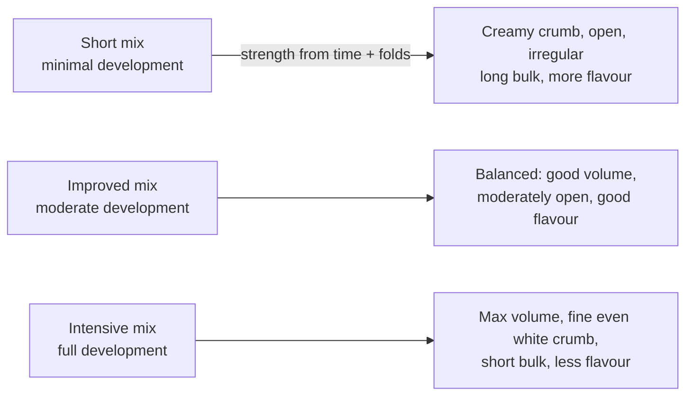

# 02.4 · Salt, mixing methods and dough rheology

**Requires:** [02.3 Water and starch](stage-1/module-02/lesson-03.md)
**Science:** [SC-12 Rheology](stage-1/science/sc-12-rheology.md)
**Practical:** mixing-method test doughs · **Experiment:** [X1-05 Mixing time](experiments/X1-05-mixing-time.md) · [X1-06 Salt](experiments/X1-06-salt.md)
**Threads:** T2 Flour, starch & gluten  **Time:** 50 min reading + 2 × 5 h bench (experiments)

## Why this lesson exists

You now know what flour is, how gluten forms and where the water goes. This lesson closes the dough system: salt, the fourth ingredient of lean bread, and the mixing method, the process variable that decides how much of the gluten potential you actually use. It also gives you an intuitive vocabulary — elastic, viscous, relaxation — for describing what the dough does in your hands, which you will need for every dough from here to croissant.

## You will be able to

1. State the normal salt range for bread and explain its three effects: gluten, fermentation and flavour.
2. Decide when to add salt and justify it.
3. Choose between hand methods (slap-and-fold, Rubaud, stretch-and-fold) and machine methods (short, improved, intensive), with speeds and times.
4. Describe a dough's behaviour in rheological terms and use rest periods to control it.

## Salt: 1.8–2.2 % of flour

Salt in bread is expressed as baker's %: 2 % means 20 g per 1000 g flour. Standard practice sits between **1.8 and 2.2 %**. Below ~1.5 % most people find bread noticeably flat; above ~2.5 % it tastes salty and fermentation slows markedly.

| Effect | Mechanism (intuitive) | What you observe |
|---|---|---|
| **Gluten tightening** | Salt ions screen charges on gluten proteins so chains pack closer and interact more | Dough firms, loses stickiness and becomes more elastic within a minute of adding salt; better gas retention |
| **Fermentation slowing** | Dissolved salt draws water out of yeast cells by osmosis and slows their metabolism | Salt-free dough rises much faster; 3 % dough visibly slower |
| **Flavour** | Salt itself, plus it enhances wheat flavour and suppresses bitterness | Salt-free bread tastes flat, "cardboard"; salt level is perceived strongly |
| Crust colour (secondary) | Slower fermentation leaves more residual sugar for browning | 0 % salt loaves on the same schedule often come out paler |
| Enzyme and keeping effects (secondary) | Moderates enzyme activity; salt is mildly hygroscopic | Minor differences in crumb and crust softening |

Practical notes:

- **Weigh salt**, never measure by volume: a spoon of flaky salt weighs roughly half as much as a spoon of fine salt. Use a 0.1 g scale for small batches ([01.1](stage-1/module-01/lesson-01.md)).
- Use a **fine, non-iodized** salt for dough so it dissolves quickly. Iodized salt works but some bakers detect a taste; coarse salt may leave undissolved crystals in short mixes.
- **Salt and yeast contact:** brief contact in a bowl of flour is harmless. Do not dissolve yeast and salt together in a little water and let it stand — concentrated brine damages yeast.
- **Salt reduction** for health: reduce in steps (e.g. 2.0 → 1.7 %) and compensate with longer fermentation, a preferment, or a little whole grain for flavour. Expect faster fermentation and a slacker dough.

**Key point:** Salt is both a strengthener and a brake. Leaving it out does not just make bread bland — the dough is slacker, stickier and ferments faster, so on a fixed schedule it overproofs. You will measure all three in [X1-06](experiments/X1-06-salt.md).

## When to add salt

| Timing | Effect | Use |
|---|---|---|
| With the flour at the start | Gluten develops slightly more slowly (salt slows protein hydration) but the dough is less sticky from the start | Default for straight doughs; hand mixing; beginners |
| After an autolyse | Allows the flour–water rest to work without salt ([02.3](stage-1/module-02/lesson-03.md)) | Most artisan processes |
| Late in machine mixing ("delayed salt") | Faster development early; more oxidation → whiter crumb, less flavour | Some intensive-mix processes; use with care |
| After the first fold (salt added with a little water) | Very extensible start; common in high-hydration sourdoughs | Advanced; risk of undissolved salt |

Whichever you choose, ensure the salt is fully dissolved and distributed; a late addition needs 2–3 minutes of low-speed mixing or several hand folds.

## Mixing: what you are choosing

Mixing has three jobs: **distribute** ingredients evenly, **hydrate** the flour, and **develop** gluten to a target level. The first two are always required; the third is a choice. The less you develop at the mixer, the more you must develop by time and folds during bulk fermentation — and the more flavour, colour and irregular crumb you keep.

## Machine methods

Professional references (e.g. [Suas], [Hamelman]) describe three families for spiral mixers. Home stand mixers (planetary, with a dough hook) are less efficient: the hook pushes the dough around more than it kneads it, so times are longer and small doughs may just ride on the hook.

| Method | Spiral mixer (reference) | Home stand mixer (approximate) | Development at end of mix | Bulk strategy |
|---|---|---|---|---|
| **Short mix** | 1st speed 4–6 min | Low speed 4–6 min | Low: cohesive, rough, tears | Long bulk (3+ h) with 3–4 folds |
| **Improved mix** | 1st speed 3–4 min + 2nd speed 2–4 min | Low 2–3 min + medium-low 4–6 min | Moderate: smooth, thick cloudy pane | 1.5–3 h with 1–2 folds |
| **Intensive mix** | 1st speed 3–4 min + 2nd speed 6–10 min | Low 2–3 min + medium-low 8–12 min | Full: thin translucent pane | Short bulk (≤1–1.5 h), usually no folds |

Home-mixer rules:

- "Low" = the lowest kneading speed; "medium-low" = the next one or two steps up. **Follow your mixer's manual for the maximum speed with a dough hook** — many planetary mixers specify a low speed for yeast dough, and stiff doughs strain the motor.
- **Minimum batch:** many 4.5–5 L mixers need about 250–300 g flour for the hook to engage. Below that, knead by hand.
- **Friction heat:** machine mixing warms the dough, often around 0.5–1 °C per minute on medium-low speed for a small home batch (measure yours — it is your friction factor, [01.3](stage-1/module-01/lesson-03.md)). Longer mixes need colder water to land at a target dough temperature of 24–26 °C.
- **Watch the dough, not only the clock:** it should clear the sides of the bowl, look smooth, and slap the bowl rhythmically; check windowpane ([02.2](stage-1/module-02/lesson-02.md)).
- **Overmixing** is unusual with a home stand mixer at low speeds, but possible with very small or very soft doughs at higher speeds: the dough turns shiny, wet and stringy and loses elasticity.

## Hand methods

| Method | Suitable hydration | How | Time | Endpoint |
|---|---|---|---|---|
| **Push-and-fold (classic kneading)** | 55–68 % | Push the dough away with the heel of the hand, fold it back, rotate a quarter turn | 8–15 min | Smooth, elastic, moderate-to-good pane |
| **Slap-and-fold (French fold)** | 65–78 % | Lift the dough with both hands, slap the lower part on the bench, stretch the top part toward you and fold it over; rotate and repeat. No flour on the bench | 5–12 min | Dough stops sticking to the bench and hands, holds a smooth surface |
| **Rubaud method** | 72–85 % | Keep the dough in the bowl; with a cupped wet hand, scoop under the dough and lift and pull it rapidly in a rhythmic motion, rotating the bowl. Named after the French baker Gérard Rubaud | 5–10 min | Dough goes from shaggy to cohesive and silky, pulls away from the bowl |
| **Stretch-and-fold (during bulk)** | 65–85 % | In the container: lift one side of the dough until it resists, fold over; rotate 90° and repeat on all four sides | 1 min per set; 2–4 sets at 30–45 min intervals in the first half of bulk | After each set the dough is tighter and domed; later sets need fewer folds |
| **Coil fold (during bulk)** | 72–85 % | Lift the dough from the middle with both hands until it releases from the container, let the ends fold under; rotate 90°, repeat | as above | As above; gentler, keeps gas |

Stretch-and-fold is not an alternative to mixing — it follows a short or improved mix. Each set realigns the already hydrated network; between sets, time does the development ([02.2](stage-1/module-02/lesson-02.md)).

**Professional practice:** Choose the method from the product and the schedule, then set hydration and mixing time together: short-mix + folds for open-crumb artisan bread; improved mix for most lean breads, rolls and baguettes; intensive mix for pan bread, burger buns and enriched doughs that must carry sugar and fat. [R1-01](recipes/R1-01-lean-loaf.md) uses an improved mix (or its hand equivalent) with one or two folds.

## Dough rheology at an intuitive level

Rheology is the science of how materials deform and flow. Dough is **viscoelastic**: it behaves partly like a solid spring and partly like a thick liquid. [SC-12](stage-1/science/sc-12-rheology.md) goes further; here is the working model.

| Term | Everyday picture | In dough |
|---|---|---|
| **Elastic** | A rubber band: stretch it, it springs back | Gluten network (glutenin); a fresh-mixed or freshly shaped dough springs back |
| **Viscous** | Honey: it flows, slowly, and does not come back | Dough slowly sags and spreads; gliadin, water, starch |
| **Viscoelastic** | Silly putty: bounces if hit fast, flows if left | Pull dough fast → it tears or snaps back; pull slowly → it stretches far |
| **Stress relaxation** | A stretched rubber strap slowly loses tension if held | After shaping, a dough rested 10–30 min loses tension and becomes easier to stretch |
| **Strength / tolerance** | How much abuse a structure takes before failing | A strong dough keeps its shape in proof and holds gas as bubbles grow |
| **Strain hardening** | A material that resists more the more it is stretched | Well-developed gluten films around gas cells stiffen as they expand, so bubbles grow evenly instead of bursting into each other |

Three practical consequences:

1. **Rate matters.** Stretch dough slowly for pizza or windowpanes; fast pulls tear it.
2. **Rest is a tool.** Pre-shape, then rest 15–30 min before final shaping so the viscous part relaxes stress. Same dough, much easier to shape.
3. **Temperature changes rheology.** Cold dough (4–10 °C) is stiffer and more elastic; warm dough (28 °C+) is slacker and stickier. Retarded doughs shape differently from room-temperature ones ([03.3](stage-1/module-03/lesson-03.md)).

## On the bench

1. **Hand-method trial:** make two 200 g flour doughs at 72 % hydration with 2 % salt. Knead one by push-and-fold, the other by slap-and-fold, 8 minutes each. Record which reaches a smooth surface first, and the windowpane of each.
2. **Relaxation demo:** shape a 150 g piece into a tight ball, immediately try to roll it into a 30 cm strand; then shape another, rest it 20 minutes covered, and try again. Record the length you reach before it shrinks back.
3. **Run [X1-05 Mixing time](experiments/X1-05-mixing-time.md)** (0 / 3 / 6 / 10 min at medium-low speed or hand equivalents) and **[X1-06 Salt](experiments/X1-06-salt.md)** (0 / 1 / 2 / 3 %).
4. Take the combination that gave you the best result — flour, hydration from X1-04, mixing from X1-05, 2 % salt — into [R1-01](recipes/R1-01-lean-loaf.md) in M03.

## What goes wrong

| Symptom | Likely cause (salt / mixing) | See |
|---|---|---|
| Slack, sticky dough that overproofs on schedule and bakes pale and bland | Salt forgotten | [Weak, slack dough](troubleshooting/bread-lean.md?id=weak-slack-dough) |
| Very slow rise, dense, salty | Salt doubled or measured by volume with fine salt | Weigh salt; check formula arithmetic |
| Dough will not come together in the mixer; rides on the hook | Batch too small for the mixer or hydration very high | Scale up (×1.5) or knead by hand; use bassinage ([02.3](stage-1/module-02/lesson-03.md)) |
| Dough too warm after mixing (> 27 °C) | Long mix without adjusting water temperature | Colder water; measure friction factor ([01.3](stage-1/module-01/lesson-03.md)) |
| Dough tears when shaping | Not rested after pre-shape; too elastic | Rest 15–30 min |
| Wet dough spreads in proof despite folds | Too few folds / too little development for the hydration | Add a set of folds; improved rather than short mix; see [troubleshooting: lean bread](troubleshooting/bread-lean.md) |

## Lab notebook

For every dough: salt % and type; when salt was added; mixing method; minutes at each speed or hand minutes; dough temperature before and after mixing (friction rise); windowpane; number and timing of folds; bench rest minutes; observations of elastic spring-back and viscous sag.

## Check yourself

1. You forgot the salt in a 1000 g flour dough and notice after 20 minutes of bulk. What do you do?

Answer

Add 20 g fine salt (2 %) dissolved in the minimum water possible (10–15 g) or sprinkled over the dough, and work it in with several folds or 2–3 min of low-speed mixing until no grit remains. Expect the dough to tighten noticeably; note the added water. Shorten the remaining bulk expectation slightly, since the salt-free period fermented faster.

2. Your stand-mixer dough needs 12 minutes on medium-low to reach full development and comes out at 29 °C when you wanted 25 °C. Your friction rise was 9 °C. What should the water temperature change be, roughly?

Answer

In the DDT method of [01.3](stage-1/module-01/lesson-03.md) (water = 3 × DDT − flour − room − friction), water temperature enters with a weight of one-third: each 1 °C change in water moves the dough by about 0.33 °C. To lower the dough by 4 °C, the water must be about 3 × 4 = 12 °C colder, with the same mixing time. Alternatively shorten the mix (improved mix plus folds).

3. Which hand method would you choose for a 80 % hydration dough, and why not push-and-fold?

Answer

Rubaud (in the bowl) or slap-and-fold, followed by coil folds during bulk. Push-and-fold at 80 % sticks to the bench and hands; the baker adds flour, which changes the hydration and still does not develop the dough.

4. Explain in rheological terms why a pre-shaped dough should rest before final shaping.

Answer

Pre-shaping stretches the network and stores elastic stress; the dough springs back. Resting allows stress relaxation — the viscous component flows and weak bonds rearrange — so the dough becomes extensible again without losing strength. Final shaping then works without tearing.

5. Short mix, improved mix, intensive mix: which gives the whitest crumb and why?

Answer

Intensive mix: long high-energy mixing incorporates more oxygen, which oxidizes flour pigments (carotenoids) and bleaches the crumb, while also reducing some flavour compounds.

## Where this goes next

**Next:** M03 puts the dough system to work: [03.1 Yeast](stage-1/module-03/lesson-01.md), then [03.2 your first lean loaf](stage-1/module-03/lesson-02.md) with [R1-01](recipes/R1-01-lean-loaf.md), and [03.4 shaping](stage-1/module-03/lesson-04.md), where relaxation and tension become your main tools. Mixing methods return for enriched dough in [06.4 brioche](stage-1/module-06/lesson-04.md) and for croissant dough in [15.3](stage-1/module-15/lesson-03.md).
**Stage 2:** mixer mechanics and energy input (spiral, oblique, fork mixers), mixing for high-hydration and whole-grain artisan breads, salt reduction strategies, and reading farinograph/extensograph curves.
**Stage 3:** process design — specifying mixing energy and dough temperature for a production line, and formulating reduced-sodium products that keep strength and flavour.

## Sources

[Suas] · [Hamelman] · [Calvel] · [Figoni] · [Gisslen] · [CIA-BP] · [Cauvain-TB] · [Delcour]. Salt range, mixer times and hand-method parameters are standard professional practice; home-mixer times are approximate and must be calibrated to your machine.
