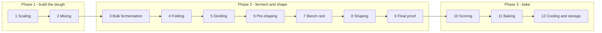

# 03.2 · The twelve steps of bread: your first lean loaf

**Requires:** [03.1 Yeast](stage-1/module-03/lesson-01.md) · [01.3 DDT](stage-1/module-01/lesson-03.md)
**Science:** — (uses [SC-08](stage-1/science/sc-08-microbiology.md) and [SC-12](stage-1/science/sc-12-rheology.md) from earlier lessons)
**Practical:** [R1-01 Lean loaf](recipes/R1-01-lean-loaf.md) · **Experiment:** [X1-07](experiments/X1-07-fermentation-temperature.md)
**Threads:** T3 Fermentation · T11 Workflow  **Time:** 45 min reading + 5 h bench

## Why this lesson exists

Every yeasted product in this course follows the same sequence of twelve steps, from a baguette to a croissant. The formula and the time spent in each step change from product to product. The steps and their order do not. If you learn the sequence once, with a product simple enough that you can see each step clearly, then every later bread is only a set of changes to parameters you already know. This lesson walks you through the sequence and puts it to work immediately in your first loaf, [R1-01](recipes/R1-01-lean-loaf.md).

## You will be able to

1. List the twelve steps in order and state the purpose and a measurable endpoint for each.
2. Produce a written timeline for R1-01 before you start, with checkpoints you can verify.
3. Mix a lean dough to a DDT of 24–25 °C and record the actual temperature.
4. Bake a lean loaf to ≥96 °C internal and cool it correctly.
5. Keep a bake log detailed enough that a later bake can be compared with this one.

## The twelve steps

The twelve steps are standard in professional bread education (see [Suas], [Hamelman], [Gisslen]; sources group and name them slightly differently). They fall into three phases.

Folding (step 4) happens *during* bulk fermentation. It is a separate step because it is a separate decision: how many folds, and when.

| # | Step | Purpose | Endpoint you measure or observe | R1-01 value |
|---|---|---|---|---|
| 1 | **Scaling** | Weigh every ingredient. Set the water temperature | Weights within ±1 g (yeast ±0.2 g). Water temperature calculated from DDT | 500 / 350 / 10 / 4 g. Water ~25–30 °C depending on the kitchen |
| 2 | **Mixing** | Hydrate, distribute ingredients, build gluten to the chosen level, incorporate air cells | Dough temperature; development level (membrane test) | 24–25 °C. Moderate development: a thick membrane that tears before it turns translucent |
| 3 | **Bulk fermentation** | Gas production, flavour, acidity, and gluten maturing in one mass | Volume increase in a marked container, plus dome, bubbles, jiggle | +50–75 %, ~1.5–2.5 h |
| 4 | **Folding** | Add strength, even out temperature, redistribute gas and subdivide cells | The dough feels tighter after each set and holds a taller shape | 3 sets at 30/60/90 min |
| 5 | **Dividing** | Portion by weight | Piece weight ±2 % | Skipped (one loaf) |
| 6 | **Pre-shaping** | Make the pieces uniform and give them a first light tension | A loose round with a smooth top | 1 round |
| 7 | **Bench rest** | Let the gluten relax so the final shape doesn't tear | The round relaxes and flattens slightly | 20–30 min |
| 8 | **Shaping** | Final form and surface tension | Taut skin, sealed seam, no tears | Boule or bâtard |
| 9 | **Final proof** | Inflate to the right point for oven spring | Poke test (slow, partial spring-back), volume +50–75 % | 45–75 min at 24–25 °C, or 8–16 h retarded |
| 10 | **Scoring** | Choose where and how the loaf expands | Cut angle and depth | 30–45°, 5–8 mm |
| 11 | **Baking** | Spring, set, colour | Internal temperature and crust colour | 250 → 230 °C (480 → 445 °F), ~40–45 min. ≥96 °C internal |
| 12 | **Cooling and storage** | Finish setting the crumb, release steam, preserve the bread | Time on the rack; the crumb is not gummy when cut | ≥1 h, better 2 h |

**Key point:** Only three steps have endpoints you can't read off a clock: **end of mixing**, **end of bulk**, and **end of final proof**. These are the three decisions that make bread. Everything else is execution. [03.3](stage-1/module-03/lesson-03.md) is about the second decision and [03.4](stage-1/module-03/lesson-04.md) about the third.

## Step by step: what is happening and what to watch

### 1. Scaling
You calculated the water temperature in [01.3](stage-1/module-01/lesson-03.md). Here is why it matters in bread. The dough temperature at the end of mixing sets the fermentation rate for the next two hours, and changing a dough's temperature *after* mixing is slow: a 900 g dough in a 22 °C room changes by only a degree or so per hour. Get the temperature right at the start by setting the water. Weigh the yeast on a 0.1 g scale if you have one. At 4 g, a 1 g error is 25 % of the dose.

### 2. Mixing
R1-01 uses a short rest (autolyse-style) followed by moderate mixing. The reasoning comes from [02.4](stage-1/module-02/lesson-04.md): gluten forms partly by itself once the flour is hydrated, and the folds during bulk add further strength. You need a dough that is cohesive and slightly elastic, not one fully developed to a thin windowpane. Too little development gives a dough that spreads. Too much, combined with folds, gives a tight dough that tears at shaping.

Measure the dough temperature as soon as mixing ends and write it down. **This is the most important number on your bake sheet.**

### 3–4. Bulk fermentation and folding
Put the dough in a **straight-sided container** and mark the starting level. In a bowl, a 50 % volume increase looks like "a bit bigger", because the walls flare and the eye underestimates volume. In a straight-sided container, 50 % is 50 % more height. This is the single most useful piece of equipment for learning bread.

During bulk:

- The dough goes from dense and shiny to domed, softer and airy.
- It gains strength. It goes from slumping flat after being tipped out to holding its shape. Folding speeds this up.
- The smell changes from flour paste to mildly sweet-fruity-wheaty.

Folds are done at 30, 60 and 90 min, and the dough is left alone for the rest of bulk. Each fold briefly degasses the dough a little, and this is deliberate: it subdivides large gas cells into more small ones, which gives a more even crumb. Stop folding when the dough holds a rounded shape by itself. Over-folding makes it tight and hard to shape.

### 5–7. Dividing, pre-shaping and bench rest
For one loaf there is nothing to divide. In [R1-02](recipes/R1-02-rolls-pan-loaf.md) you divide by weight. A pre-shape is a *loose* round. It organizes the dough so the final shape is even, and gives it a first bit of tension. Then leave it for 20–30 min. You are waiting for the gluten to *relax* (stress relaxation, [SC-12](stage-1/science/sc-12-rheology.md)): immediately after pre-shaping, the dough fights back and tears if you try to shape it.

### 8. Shaping
Shaping builds a **skin**: the outer gluten layer is stretched taut over the inner mass and sealed underneath at the seam. The skin holds the loaf up during proof and determines whether it springs *up* in the oven or spreads *out*. Details and hand movements are in [03.4](stage-1/module-03/lesson-04.md). For your first loaf, a boule is the simplest.

### 9. Final proof
The shaped loaf proofs seam-up in a floured banneton, which supports its sides. Proof has a narrow window. Under-proofed dough still has so much elasticity and unfermented potential that it bursts at weak points in the oven. Over-proofed dough is stretched so thin that the gas cells coalesce and the loaf spreads, then collapses when scored. Use the poke test, and read about its limits in [03.3](stage-1/module-03/lesson-03.md). On your first bakes, **start checking at 35 min** and every 10 min after that.

### 10. Scoring
Scoring is a controlled weak point. Without a score, the loaf splits wherever its skin is thinnest. [03.4](stage-1/module-03/lesson-04.md) covers the angle and depth. On the first loaf, make one confident cut with a new blade. A hesitant, sawing cut drags the dough.

### 11. Baking
There are three stages, covered in depth in [04.1](stage-1/module-04/lesson-01.md) and [04.2](stage-1/module-04/lesson-02.md):

1. **Spring (0–12 min).** Gas expands and water and ethanol vaporize. The surface must stay moist and extensible, so you need steam or a lid. The covered pot traps the loaf's own steam.
2. **Set (roughly 10–25 min).** Starch gelatinizes and proteins set, and the loaf stops growing.
3. **Colour and dry (the rest).** The lid comes off, the crust dries and browns, and the centre climbs to ≥96 °C.

Probe the loaf through the base. A lean loaf is done at **≥96 °C**. Most bakers go to 97–99 °C for a well-baked, drier crumb and a crisper crust.

### 12. Cooling and storage
The loaf keeps cooking on the rack. Steam leaves the crumb, and the starch firms as it cools. Cut it at 1 h and the crumb looks gummy. Cut at 2 h and it looks set. The difference is not raw dough. It is the moisture and starch state (see [04.3](stage-1/module-04/lesson-03.md)). Store the loaf cut-side down on a board for day 1. Don't put a crusty loaf in a plastic bag, because the crust goes leathery.

## Planning the day

Write a timeline before you start. In production this is called back-scheduling, and you will formalize it in [18.1](stage-1/module-18/lesson-01.md). A typical same-day plan for R1-01 at 24–25 °C:

| Clock | Step | Check |
|---|---|---|
| 09:00 | Scale, calculate the water temperature | Flour and room temperatures logged |
| 09:10 | Mix to shaggy. Rest | — |
| 09:30 | Salt + finish mixing | Dough temperature 24–25 °C? |
| 09:40 | Bulk starts (mark container) | — |
| 10:10 / 10:40 / 11:10 | Folds 1 / 2 / 3 | Strength increasing? |
| ~11:25–12:10 | End of bulk | +50–75 %, dome, jiggle |
| +0:05 | Pre-shape | — |
| +0:30 | Shape → banneton | Taut skin |
| +0:30 into proof | Preheat oven + pot, 250 °C (480 °F) | — |
| +0:45 to 1:15 into proof | Score and bake | Poke test |
| +40–45 min | Out | ≥96 °C internal |
| +1–2 h | Cut | — |

The whole sequence takes about 5–5.5 h, of which about 45 min is hands-on work.

**Professional practice:** Bakers rarely proof at home-kitchen temperatures. A bakery dough is mixed to a DDT, bulk-fermented in a room or tub kept at a known temperature, and very often retarded overnight in a controlled retarder at 3–5 °C. The home equivalent is your fridge (see [03.3](stage-1/module-03/lesson-03.md)). Once R1-01 works same-day, try the retarded-proof option in the recipe: shape in the evening, bake the next morning.

## On the bench

1. Make [R1-01](recipes/R1-01-lean-loaf.md) as a **boule**, exactly as written, at 70 % hydration (68 % if your flour is below 11.5 % protein).
2. Keep a bake log (see Lab notebook) with the actual times, not the planned ones.
3. Photograph the dough at the end of bulk (top and side through the container), the shaped loaf, the loaf just before scoring, the baked loaf, and the crumb, cut down the middle.
4. Repeat within a week. The second bake is where you learn the most: change nothing deliberately, and see how close you come to the first.
5. If your kitchen allows it, start [X1-07 Fermentation temperature](experiments/X1-07-fermentation-temperature.md) on a separate day to see how far the timeline moves with temperature.

## What goes wrong

- **Dough temperature off target**, so the whole timeline shifts. Measure it, then adjust the *time* instead of reheating the dough. See [bulk too slow or too fast](troubleshooting/bread-lean.md?id=bulk-fermentation-too-slow-or-too-fast).
- **Bulk judged by the clock**, which gives under-fermented dense bread or over-fermented slack dough. See [dense, tight crumb](troubleshooting/bread-lean.md?id=dense-tight-crumb) and [weak, slack dough](troubleshooting/bread-lean.md?id=weak-slack-dough).
- **Pot not hot enough, or lid off too early**, which gives poor oven spring and a dull crust. See [poor oven spring](troubleshooting/bread-lean.md?id=poor-oven-spring).
- **Cutting too early**, which gives a gummy crumb that looks underbaked. Check the internal temperature before you blame the bake time.

## Lab notebook

Use a one-page bake sheet for every bread from now on:

| Field | Record |
|---|---|
| Formula | Flour brand and protein, hydration %, yeast type/brand/g |
| Temperatures | Flour, room, water (calculated vs actual), dough after mix, friction factor (calculated) |
| Times | Actual clock time for each of the twelve steps |
| Bulk | Start mark, % rise at each fold, final % rise, observations |
| Proof | Duration, temperature, poke-test result |
| Bake | Vessel, temperatures, lid-off time, total time, internal temperature |
| Result | Weight cooled, height and width, crust colour, crumb photo, taste notes |
| Next time | One change only |

## Check yourself

1. Which three steps have endpoints that must be judged rather than timed?

Answer

End of mixing (development level), end of bulk fermentation (volume and dough cues), and end of final proof (poke test and volume).

2. Your dough came off the mixer at 27 °C instead of 24 °C. What do you change, and how?

Answer

Nothing in the dough itself. Expect bulk to run about 25–35 % faster and start checking the volume earlier, around 1 h 15 min. Consider putting the container somewhere cooler (~22 °C) so the dough drifts down. Next time, lower the water temperature by 9 °C (three factors × 3 °C) or measure the friction factor again.

3. Why is the bench rest needed between pre-shape and shape?

Answer

Pre-shaping stresses the gluten, and the dough becomes elastic and resists stretching. During the rest the stress relaxes (viscoelastic relaxation), so the final shaping can build a taut skin without tearing.

4. You cut a loaf 20 min out of the oven and the crumb is gummy. The probe read 97 °C. Is it underbaked?

Answer

Almost certainly not. 97 °C at the centre means the starch is set. The gumminess comes from cutting too early: steam is still escaping and the gelatinized starch hasn't firmed. Cool for 1–2 h before judging.

5. Why use a straight-sided container for bulk?

Answer

Volume is then proportional to height, so a 50–75 % increase can be read directly from a mark. In a flared bowl the eye misjudges volume badly.

## Where this goes next

**Next:** [03.3](stage-1/module-03/lesson-03.md) explains how to move the timeline on purpose with yeast, temperature and cold. [03.4](stage-1/module-03/lesson-04.md) goes deeper into steps 5–10. [04.1](stage-1/module-04/lesson-01.md) takes step 11 apart. [18.1](stage-1/module-18/lesson-01.md) turns the day plan into a production schedule.
**Stage 2:** the same twelve steps run on spiral mixers, divider-rounders, retarder-proofers and deck ovens, and the multi-product bake schedule.
**Stage 3:** treating the twelve steps as a process specification with tolerances for each CCP, so a formula can be transferred to another bakery or scaled up.

## Sources

[Suas] · [Hamelman] · [Gisslen] · [CIA-BP] · [Calvel] · [Figoni]
