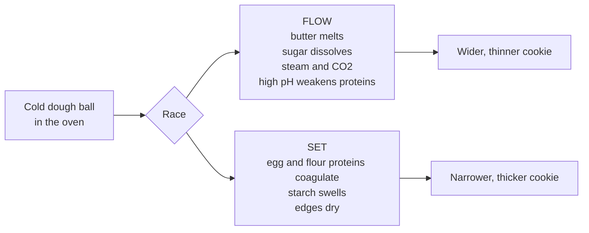

# 07.3 · The cookie as a system: spread, texture and colour

**Requires:** [07.1 Sugar is not just sweet](stage-1/module-07/lesson-01.md)
**Science:** [SC-04 Lipids](stage-1/science/sc-04-lipids.md)
**Practical:** [R1-11 Baseline chocolate chip cookie](recipes/R1-11-chocolate-chip-cookie.md) · **Experiments:** [X1-19 Sugar type](experiments/X1-19-sugar-type.md) · [X1-20 Butter state and dough rest vs spread](experiments/X1-20-cookie-spread.md)
**Threads:** T5 Sugars & browning · T6 Fats & shortening · T12 Experimental method  **Time:** 60 min reading + 3 bench sessions (baseline bake, X1-19, X1-20 over two days)

## Why this lesson exists

A drop cookie has five or six ingredients and a ten-minute bake, yet it is one of the most sensitive products in a pastry kitchen: the same formula can give a thin crisp wafer or a thick soft mound depending on butter temperature, how long the dough rested, and which tray you used. That sensitivity makes it the ideal first system for deliberate variable control. This lesson gives you one model, spread as a race between flow and set, that explains almost every cookie result, and it teaches you to separate chewy from crisp in terms of water and the physical state of sugar. You then bake a documented baseline that the experiments of this module, and your own later formulations, are measured against.

## You will be able to

1. Explain cookie spread as a race between the dough flowing and the structure setting, and name what speeds up each side.
2. Predict the direction of change in spread, thickness, colour and texture for changes in fat state, sugar amount and type, flour protein, egg, leavening, dough rest, portion size, oven temperature and pan.
3. Explain chewy versus crisp in terms of moisture and amorphous versus crystalline sugar, and why cookies change texture in storage.
4. Bake R1-11 to a specification (weight, diameter, thickness, colour) and measure spread ratio.
5. Design a small factorial experiment and interpret an interaction between two factors.

## Spread is a race

When a portion of cold cookie dough goes into the oven, two things start at the same time:

- **The dough starts to flow.** Butter melts (from ~20 °C it softens; it is fully liquid by ~35 °C). Sugar crystals dissolve in the hot water phase and the syrup grows ([07.1](stage-1/module-07/lesson-01.md)). Water turns to steam and CO₂ is released, loosening the dough. Gravity pulls the now-fluid mass outward.
- **The structure starts to set.** Egg proteins coagulate (from ~62 °C, later in sugar), flour proteins firm up, starch swells where it has enough water, and the edges dry. Once the edge has set and dried, it acts like a dam: the cookie stops getting wider.

**Final diameter depends on how long the dough flows before it sets.** Anything that makes the dough more fluid, or more fluid sooner, or that delays setting, gives more spread. Anything that keeps the dough stiff longer, or sets it sooner, gives less.

The **spread ratio** is how you measure the outcome: diameter ÷ thickness, both in millimetres. A thick bakery-style cookie might be 5–6; the R1-11 baseline about 6–8; a thin crisp cookie 10 or more. Measure diameter twice at right angles and average; measure thickness at the centre with a calliper, or with a ruler across a card laid on top.

## The variables

The table is the core of this lesson. For each variable, the mechanism tells you which side of the race it helps.

| Variable | Change | Spread | Other effects | Mechanism |
|---|---|---|---|---|
| **Fat state** | Melted and cooled | More | Denser, chewier, glossy crackled top | No air cells, fat already liquid, sugar partly dissolved in warm dough; gluten develops more easily in the fluid dough |
| | Softened and creamed (18–20 °C) | Baseline | Lighter, more even | Air cells from creaming; plastic fat melts gradually |
| | Cold, cubed, briefly mixed | Less | Thicker, bumpier, more tender, sometimes uneven | Solid fat takes longer to melt; less sugar dissolved; dough stiff |
| **Fat type** | Shortening or high-melting fat instead of butter | Less | Paler, less flavour, softer | Melts at a higher temperature (~40–45 °C) and has no water ([SC-04](stage-1/science/sc-04-lipids.md)) |
| **Sugar amount** | More | More | Darker, crisper edges, sweeter | More syrup phase; structure sets later ([X1-18](experiments/X1-18-cookie-sugar-level.md)) |
| **Sugar type** | More white (granulated) | More, flatter | Crisper, paler, snaps when cool | Sucrose recrystallizes as the cookie dries and cools; no acid for the soda |
| | More brown | Less, puffier | Chewier, moister, darker, caramel/molasses flavour | Invert and molasses hold water; molasses acid reacts with soda for lift; more reducing sugar ([X1-19](experiments/X1-19-sugar-type.md)) |
| | Part honey/invert | More | Much darker, softer, stays soft longer | Liquid, hygroscopic, reducing sugars; extra water |
| | Caster or icing sugar | More (caster) / less (icing) | Icing sugar gives a fine, sandy, compact texture | Fine crystals dissolve faster; icing sugar also carries starch that absorbs water |
| **Flour protein** | Higher (bread flour) | Less | Thicker, chewier, darker | Absorbs more water; more gluten; more protein for Maillard |
| | Lower (pastry or cake flour) | More | More tender, more fragile | Less water absorbed, more free water to dissolve sugar |
| **Egg** | More egg | Early spread then puffs; overall cakier | Paler inside, cake-like | More water (flow) but more protein (set), and steam lift |
| | Extra yolk, less white | Similar or slightly more | Richer, chewier, fudgier | Yolk fat and emulsifiers, less water and less setting protein |
| **Leavening** | Baking soda (0.5–1 %) | More | Darker, cracked top, coarser | Raises pH: weakens proteins and delays setting; speeds Maillard; CO₂ puffs then collapses |
| | Baking powder instead | Less | Paler, puffier, cakier | Near-neutral pH; more sustained lift ([08.2](stage-1/module-08/lesson-02.md)) |
| **Dough rest** | 24–72 h at 3–5 °C | Less | More even golden-brown, toffee/butterscotch flavour, better texture | Flour fully hydrates (less free water), dough firms; enzymes release sugars and amino acids for browning; surface dries slightly |
| **Dough temperature** | Colder at oven entry | Less | Thicker, softer centre | Fat takes longer to melt; edges set before the centre flows |
| **Portion size** | Larger | Proportionally less | Thicker, softer centre, crisp edge | Longer for heat to reach the centre; more mass per edge |
| **Oven temperature** | Hotter (190–200 °C) | Less | Thicker, softer centre, risk of raw middle | Edges set fast |
| | Cooler (160–170 °C) | More | Thinner, crisper, more even colour | Long flow before set |
| **Pan** | Dark or non-stick | Less, darker bottom | Risk of burnt bottoms | Absorbs radiant heat, sets the base sooner |
| | Light aluminium + parchment | Baseline | Even colour | Reflects radiant heat; parchment gives moderate grip |
| | Greased bare pan | More | Thin edges | Fat lubricates the base |
| | Silicone mat | Less | Paler bottom, softer | Insulates the base and grips the dough |

Two things to notice. First, many variables act on **both** sides of the race (egg adds water and protein; soda adds gas and weakens protein), so their effect depends on dose. Second, several are really the **same variable in disguise**: fat state, dough temperature and rest all change how solid the fat is and how much sugar is dissolved when the cookie goes in.

**Professional practice:** Bakeries that sell cookies fix every process variable that is cheap to fix: butter temperature on arrival, mixing times, portion weight by scale or scoop, a minimum 12–24 h rest, frozen or chilled dough balls baked from a known temperature, one type of tray, one oven setting. Cookie inconsistency almost always comes from an uncontrolled process variable, not the formula.

## Chewy and crisp

"Chewy" and "crisp" are not just "wet" and "dry". They are two physical states of the same materials.

- **Crisp:** low moisture (roughly 2–4 %) and low aw (~0.2–0.4). The sugar is either **crystalline** (it recrystallized as the cookie dried and cooled) or a hard, **glassy** amorphous solid together with starch and protein. A glass is rigid and fractures: the cookie snaps.
- **Chewy:** more moisture (roughly 6–10 %) and higher aw (~0.5–0.7). The sugar is **amorphous** (not crystalline) and plasticized by water: a concentrated, rubbery syrup binding starch and protein. It bends and stretches before it breaks.

**Brown sugar, honey, invert and glucose make chewy cookies** because they bring water, hold it (hygroscopic), and their glucose and fructose molecules interfere with sucrose crystallization, so the sugar stays amorphous. **White sugar makes crisp cookies** because sucrose crystallizes readily as the cookie dries. Underbaking keeps more water in the centre, which is why the classic chewy cookie is pulled when the centre still looks soft.

**Why cookies change in storage.** Water moves toward equilibrium with the air and with anything stored nearby ([SC-01](stage-1/science/sc-01-water.md)):

| Change | Cause | Prevention |
|---|---|---|
| Soft cookie hardens overnight | Loses water to dry air; amorphous sucrose recrystallizes; starch retrogrades | Airtight container; more brown sugar or invert; bake slightly less |
| Crisp cookie goes soft | Absorbs water from humid air or from soft cookies stored with it; the glassy matrix is plasticized | Store crisp and soft cookies separately, airtight; re-crisp 3–5 min at 150 °C |
| Cookies stored with a slice of bread stay soft | Water moves from bread (aw ~0.95) to cookies | Works, but it softens crisp edges too, and the bread can mould |

## The baseline: R1-11

[R1-11](recipes/R1-11-chocolate-chip-cookie.md) is an educational formulation designed to sit in the middle of the table above so that every variable can move it in both directions.

| Ingredient | Baker's % | Role in the system |
|---|---|---|
| Flour (all-purpose, 10–11.5 % protein) | 100 | Structure; absorbs water |
| Butter | 76 | Tenderness, flavour, flow |
| Light brown sugar | 56 | Chew, moisture, colour, acid for the soda |
| White sugar | 44 | Spread, crisp edge |
| Whole egg | 38 | Water, setting protein, emulsifier |
| Baking soda | 0.8 | Spread, colour, cracked top |
| Salt | 1.6 | Flavour |
| Chocolate | 100 | Flavour; interrupts spread |

The process decisions are just as much part of the baseline: butter creamed at 18–20 °C for 2–3 min, 48 g portions, a 24 h rest at 3–5 °C, and a bake at 180 °C (355 °F) on a light tray with parchment for 10–12 min. Expected result: about 8.5–9.5 cm diameter and 12–15 mm thick (spread ratio ~6–8), golden-brown edges 5–10 mm wide, a pale, soft centre that sets as the cookie cools.

**Endpoint cues.** Pull the tray when the edges are set and golden brown, the top has lost its gloss at the edges, and the centre is puffed, pale and looks slightly underdone. The cookie finishes setting from residual heat in 5 minutes on the tray (carry-over). If you wait until the centre looks done in the oven, the cookie will be crisp throughout when cool.

## Designing cookie experiments

With so many interacting variables, a cookie is where you learn two design ideas you will use through Stage 3.

1. **Block the noise.** Oven position and bake order are the largest sources of noise in a home kitchen. Put one cookie of every variant on every tray, rotate positions from tray to tray, and bake all trays in the same session. That way, oven effects spread evenly across variants instead of being mistaken for a treatment effect.
2. **Factorial designs.** When you suspect two variables interact, change both in a **2×2 design**: four combinations, not two separate one-variable tests. [X1-20](experiments/X1-20-cookie-spread.md) does this with butter state × dough rest. A factorial shows whether the effect of resting depends on the butter state (an **interaction**), which two separate experiments cannot show.

## On the bench

1. Bake [R1-11](recipes/R1-11-chocolate-chip-cookie.md) exactly as written. Measure the diameter and thickness of every cookie on one tray, calculate the spread ratio, weigh the tray before and after baking (bake loss), and photograph the cookies next to a ruler and a white card. This is your baseline.
2. Run [X1-19 Sugar type](experiments/X1-19-sugar-type.md): all white, all brown, 50/50 and a honey or invert variant.
3. Run [X1-20 Butter state and dough rest](experiments/X1-20-cookie-spread.md): the 2×2 of melted vs creamed butter, baked at once vs after 24 h.
4. Store two baseline cookies in an airtight tin and two uncovered on a plate. Compare texture and weight on day 2.

## What goes wrong

- **Cookies spread into thin, lacy, greasy sheets.** Butter too warm or melted, dough not rested, oven cool, greased tray, too much sugar or soda. See [excessive spreading](troubleshooting/cookies.md?id=excessive-spreading).
- **Cookies stay as domes.** Dough too cold or too dry, too much flour (volume measuring), high oven, silicone mat, powder instead of soda. See [cookies do not spread](troubleshooting/cookies.md?id=cookies-do-not-spread).
- **Bottoms burn before the tops colour.** Dark tray, rack too low, oven hot spot. See [burnt bottoms](troubleshooting/cookies.md?id=burnt-bottoms).
- **Soft cookies turn hard, or crisp ones go soft.** Storage moisture. See [cookies harden overnight](troubleshooting/cookies.md?id=cookies-harden-overnight) and [crisp cookies go soft](troubleshooting/cookies.md?id=crisp-cookies-go-soft).

## Lab notebook

For every cookie bake: butter temperature at mixing; creaming time and speed; dough temperature at the end of mixing; rest time and temperature; dough temperature at oven entry; portion weight; tray type and lining; oven setting and measured temperature; rack position; bake time; diameter (two readings), thickness, spread ratio; bake loss %; edge colour and centre colour (use your photo scale); texture on day 0 and day 2. After X1-19 and X1-20, update the variable table above with your own measured effects.

## Check yourself

1. A customer wants the R1-11 cookie thicker and softer but not cakey. Give three process changes and one formula change, and predict one side effect of each.

Answer

Process: rest the dough 24–48 h and bake from the refrigerator (thicker, also darker and more toffee flavour); portion larger, 60–70 g (thicker, softer centre; needs 1–2 min more and may stay raw in the middle); bake at 190 °C instead of 180 °C and pull earlier (edges set faster, less spread; risk of underbaked centre). Formula: shift part of the white sugar to brown (chewier and moister; slightly darker), or replace 10–20 % of the flour with bread flour (less spread, chewier). Avoid adding egg or baking powder, which would make it cakey.

2. Explain in terms of the race why melted butter gives more spread than creamed butter.

Answer

With melted butter the fat is already liquid and the dough is warm, so more sugar has dissolved before baking. The dough is fluid from the start and has no network of plastic fat or air cells holding it up. The flow side of the race starts at time zero, while setting still needs the same heating time.

3. Why do cookies made with all white sugar snap when cool, while all-brown-sugar cookies bend?

Answer

All-white cookies lose more water and the sucrose recrystallizes or forms a dry glass as they cool: a rigid structure that fractures. Brown sugar brings molasses with invert sugar and water; these hold water, keep the aw higher and interfere with sucrose crystallization, so the sugar stays as an amorphous, water-plasticized syrup that bends.

4. In X1-20, resting reduces spread by 25 % for the melted-butter dough but only by 10 % for the creamed dough. What is this called, and what does it tell you?

Answer

An interaction between butter state and rest. The effect of resting depends on the butter state: resting matters more when the butter was melted (it lets the liquid fat solidify again and the flour absorb the free water). Two one-variable experiments would have given one "effect of rest" and missed this.

5. A dark non-stick tray gives darker bottoms and slightly less spread than a light aluminium tray with parchment. Explain both effects.

Answer

A dark surface absorbs more of the oven's radiant heat, so the tray and the cookie base get hotter faster. The base browns sooner (more Maillard and caramelization), and it sets sooner, which stops the cookie spreading earlier.

## Where this goes next

**Next:** [08.1](stage-1/module-08/lesson-01.md) explains fat crystals and plasticity, the reason butter temperature matters so much here, and [08.2](stage-1/module-08/lesson-02.md) explains soda vs powder chemistry ([X1-21](experiments/X1-21-leaveners.md)). [10.1](stage-1/module-10/lesson-01.md) generalizes the flow-vs-set balance to cake formulas. [11.1](stage-1/module-11/lesson-01.md) moves to sablé and sucrée, short doughs where you want no spread at all. [R1-38 Brownies](recipes/R1-38-brownies.md) uses the same sugar and fat logic with chocolate as a structural ingredient. The 2×2 design returns in [19.1](stage-1/module-19/lesson-01.md) for your capstone.
**Stage 2:** the full cookie and petit-four family (sablés, diamants, tuiles, florentines, biscotti, macarons), piped and rolled cookies, and production: freezing portioned dough, bake-off schedules and packaging for shelf life.
**Stage 3:** cookie R&D. You measure spread with standardized cookie-bake tests (the method cereal chemists use to rate soft-wheat flours), texture with a texture analyser (break force, bend distance), aw and moisture over shelf life, and you reformulate for reduced sugar or fat while holding spread and texture to specification.

## Sources

[Figoni] (cookie functions and spread) · [Corriher] (cookie texture and spread cause-and-effect) · [Gisslen] and [CIA-BP] (cookie methods and mixing) · [McGee] · [Delcour] (soft wheat flour and cookie quality) · [Cauvain-BPS] (cookie faults). Temperatures, percentages and spread-ratio targets are standard professional practice and educational estimates; your own baseline measurements define your reference.
