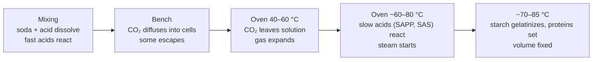

# 08.2 · Chemical leavening: acids, bases and gas on a schedule

**Requires:** [08.1 Fats](stage-1/module-08/lesson-01.md)
**Science:** [SC-05 Acids, bases and pH](stage-1/science/sc-05-acids-bases-ph.md) · [SC-11 Phase changes and gases](stage-1/science/sc-11-phase-changes-gases.md)
**Practical:** fizz demonstrations in this lesson · **Experiment:** [X1-21 Baking soda vs baking powder vs both](experiments/X1-21-leaveners.md)
**Threads:** T1 Measurement & formulation math · T6 Fats & shortening  **Time:** 50 min reading + 2 h experiment session

## Why this lesson exists

Yeast gives you hours of gas and forgives an error of a few percent. Chemical leaveners give you minutes of gas and punish an error of half a gram: too little and the product is dense, too much and it collapses, tastes soapy and turns an odd colour. They are also the only leaveners that let you make a batter in five minutes and bake it immediately, which is why every muffin, quick bread, scone, biscuit and most cakes use them. This lesson treats chemical leavening as what it is — a small chemical reactor with a timing schedule — so that you can read a formula, calculate whether its acid and base are balanced, and predict when its gas will appear.

## You will be able to

1. Write the reaction between sodium bicarbonate and an acid, and explain what happens to soda that finds no acid.
2. Calculate the soda needed to neutralize the lactic acid in a given weight of buttermilk, and state the uncertainty in that number.
3. Explain what is inside baking powder, what "single-acting" and "double-acting" mean, and which acids are fast and which are slow — including the aluminium-free powders sold in Europe and Israel.
4. Choose a starting leavener level for a muffin, a quick loaf and a scone, and convert between soda and baking powder.
5. Predict how long a batter can wait before baking, and when baker's ammonia is appropriate.

## The job: gas, at the right time, in the right cells

Chemical leaveners do not make bubbles. They produce carbon dioxide, which dissolves in the batter's water and then diffuses into air cells that already exist — cells beaten in by mixing, creaming or rubbing-in ([08.1](stage-1/module-08/lesson-01.md)). In the oven those cells grow three ways ([SC-11](stage-1/science/sc-11-phase-changes-gases.md)):

1. **More CO₂** from the leavener, and CO₂ coming out of solution as the batter warms (gases are less soluble in hot water).
2. **Thermal expansion:** gas heated from 20 °C to 100 °C expands by 373 ÷ 293 ≈ 1.27, or 27 %.
3. **Steam:** water evaporating into the cells as the batter nears 100 °C, often the largest contributor.

All of that has to happen while the batter is still fluid enough to stretch. Once starch gelatinizes and egg and flour proteins set — roughly 70–85 °C in most batters — the structure is fixed. Gas produced before then makes volume. Gas produced too early escapes from the bowl or the top of the batter. Gas produced after the set has nowhere to go and splits the crust or forms large holes. The whole art is matching the gas schedule to the setting schedule.

## Baking soda: a base that needs an acid

Baking soda is sodium bicarbonate, NaHCO₃ (molar mass 84 g/mol). With any acid (written as H⁺) it reacts immediately once both are dissolved:

NaHCO₃ + H⁺ → Na⁺ + H₂O + CO₂

With lactic acid (C₃H₆O₃, 90 g/mol), the main acid of buttermilk and yogurt, the ratio is one molecule to one molecule:

NaHCO₃ + CH₃CH(OH)COOH → CH₃CH(OH)COONa + H₂O + CO₂
84 g + 90 g → 112 g sodium lactate + 18 g + 44 g

So **1 g of lactic acid neutralizes 84 ÷ 90 ≈ 0.93 g of soda**, and **1 g of soda fully reacted releases 44 ÷ 84 ≈ 0.52 g of CO₂**. At 20 °C that is about 0.29 L of gas (1 ÷ 84 = 0.0119 mol × 24 L/mol); at 100 °C, about 0.36 L.

### Worked example: soda for buttermilk

Cultured buttermilk's acidity is usually expressed as titratable acidity calculated as lactic acid. It is roughly **0.7–0.9 %**, and varies by brand, age and temperature of storage ([SC-05](stage-1/science/sc-05-acids-bases-ph.md)).

For 250 g buttermilk:

| Buttermilk acidity | Lactic acid (g) | Soda to neutralize (g) |
|---|---|---|
| 0.7 % | 250 × 0.007 = 1.75 | 1.75 × 0.93 = **1.6** |
| 0.8 % | 2.00 | **1.9** |
| 0.9 % | 2.25 | **2.1** |

So the rule of thumb **"about 1 g soda per 125 g buttermilk"** (about 2 g per 250 g) is chemically sound, with ±15 % built-in uncertainty from the buttermilk alone. Other ingredients shift it further: brown sugar, honey, natural cocoa, fruit and yogurt add acid; flour, milk and egg proteins act as buffers that hold some acid back ([SC-05](stage-1/science/sc-05-acids-bases-ph.md)). Treat the calculation as a starting point, then adjust by taste and colour. Most formulas deliberately use a little less soda than the calculated neutral point (a slightly acidic, tangier, paler product) or add baking powder for extra lift rather than more soda.

The same arithmetic for other acids, using the ratios in [SC-05](stage-1/science/sc-05-acids-bases-ph.md): 1 g acetic acid (vinegar at ~5 % contains 5 g per 100 g) neutralizes ~1.4 g soda; 1 g citric acid neutralizes ~1.3 g soda.

### Soda without enough acid

Heat decomposes leftover soda slowly, starting from about 50–60 °C in a batter:

2 NaHCO₃ → Na₂CO₃ + H₂O + CO₂

Only half the CO₂ is released, and the residue is **sodium carbonate** (washing soda), a strong base. An excess of soda therefore gives:

| Symptom | Mechanism |
|---|---|
| Soapy, metallic or bitter aftertaste | Sodium carbonate and high pH on the tongue |
| Yellowish crumb | Flour flavonoid pigments turn yellow at high pH |
| Extra browning, dark crust and crumb | Maillard reactions run faster at high pH ([SC-07](stage-1/science/sc-07-browning.md)) |
| Coarse, open, sometimes crumbly crumb; more spread | High pH weakens gluten and egg proteins; the cells over-expand and tear |
| Blueberries turning green-grey; walnuts or sunflower seeds turning green | Anthocyanins and polyphenols change colour in alkaline conditions |
| Brown or orange specks with a bitter taste | Undissolved lumps of soda; sift it with the flour |

Soda is sometimes used in a small deliberate excess to get more colour and spread (cookies, gingerbread, dark chocolate cakes). In quick breads it is almost always a fault.

## Baking powder: soda with its acid built in

Baking powder is a self-contained leavening system:

| Component | Typical share | Job |
|---|---|---|
| Sodium bicarbonate | ~25–30 % | The base: source of CO₂ |
| One or more **leavening acids** | ~30–45 % | Enough to neutralize the soda, chosen for *when* they react |
| Starch (usually corn or wheat) | Remainder | Keeps the particles apart and absorbs moisture so the powder does not react in the tin |

Commercial powders are formulated to release a set amount of gas; the long-standing industry standard is at least about **12 % of the powder's weight as available CO₂**. That gives a useful conversion:

- 4 g baking powder × 12 % ≈ 0.48 g CO₂ ≈ the CO₂ from 1 g of fully neutralized soda (0.52 g).
- **Rule of thumb: 1 g soda (with enough acid) ≈ 4 g baking powder in gas.** When you replace one with the other, you must also account for the acid: replacing soda with powder in a buttermilk recipe leaves the buttermilk acid unneutralized (tangier, paler, more tender); replacing powder with soda needs an acid source.

### Fast acids, slow acids

Each leavening acid dissolves and reacts at a different rate and temperature. The industry rates them by **neutralizing value (NV)**: grams of soda neutralized by 100 g of the acid ([SC-05](stage-1/science/sc-05-acids-bases-ph.md)).

| Leavening acid | Speed | When it releases gas | Where you meet it |
|---|---|---|---|
| Cream of tartar (potassium hydrogen tartrate) | Fast | Mostly at mixing | Older single-acting powders; home "soda + cream of tartar" mixes |
| Monocalcium phosphate (MCP) | Fast | Most of its share within minutes of mixing | The fast component of most double-acting powders |
| Citric acid, tartaric acid | Very fast | At mixing | Some aluminium-free retail powders |
| Sodium acid pyrophosphate (SAPP; E450, "diphosphates") | Slow to moderate, depending on grade | A small part at mixing; most once the batter warms in the oven | Most aluminium-free powders in Europe and Israel; commercial bakery powders |
| Sodium aluminium sulfate (SAS) | Slow | Almost entirely with heat | North American double-acting powders |

**Single-acting** powder contains only a fast acid: nearly all its gas is released on mixing, so the batter must go straight into the oven. **Double-acting** powder combines a fast acid (typically MCP) with a slow, heat-activated acid (SAS or SAPP). A substantial share of the gas — often roughly a third — forms in the bowl, which lightens the batter and seeds the cells; the rest forms in the oven as the batter warms, right when the cells can use it.

In Europe and Israel most retail baking powders are **aluminium-free**, usually built on SAPP (listed as diphosphates or E450) sometimes with a fast acid, and some use citric acid or cream of tartar. The label tells you the acid. A SAPP powder behaves broadly like a double-acting one, but the split between bench and oven gas differs by brand, and some aluminium-free powders release more gas at mixing. Check yours in the fizz test below and in [X1-21](experiments/X1-21-leaveners.md). SAPP can leave a faint "pyro" aftertaste at high levels; SAS can taste slightly metallic. Neither is noticeable at normal doses.

## How much? Starting levels

Levels are standard professional practice, in baker's percent (on flour weight). They vary with formula: more sugar, fat and liquid (a weaker structure) or a heavy add-in load needs more help; creamed air, whipped eggs or a buttermilk-and-soda system needs less powder.

| Product | Baking powder | Soda | Notes |
|---|---|---|---|
| Muffins (muffin method, milk) | 3–5 % | 0 | [R1-12](recipes/R1-12-muffins.md) uses 4 % |
| Muffins with buttermilk | 2–3 % | ~0.5–0.7 % (sized to the acid) | Soda neutralizes; powder adds lift |
| Quick loaf, creaming method | 2–3 % | 0.5–1 % if acidic ingredients (banana, brown sugar, yogurt) | [R1-13](recipes/R1-13-banana-bread.md) |
| Scones and biscuits | 4–6 % | ~0.5 % with buttermilk | Stiff dough, no creamed air: needs more powder. [R1-14](recipes/R1-14-scones.md) |
| Creamed cakes | 1.5–4 % | As needed for cocoa or buttermilk | [10.1](stage-1/module-10/lesson-01.md) |

Two measuring rules:

- **Weigh leaveners on a 0.1 g scale.** A level teaspoon of baking powder weighs roughly 4–5 g and of soda 5–6 g, but "level" varies by ±20 % between people. At 3 g in a 300 g-flour batch, a 0.5 g error is 17 %.
- **Sift or whisk leaveners into the flour.** Clumps of soda leave bitter, discoloured specks; clumps of powder leave holes.

More is not better. Above the useful level, the cells grow too large, merge and rupture; the product rises fast, then **sinks** as the over-stretched walls collapse, with a coarse crumb and a chemical taste. See [sunken centre in a quick loaf](troubleshooting/quick-breads.md?id=sunken-centre-in-a-quick-loaf).

## Gas on a schedule

What this predicts:

| Situation | Prediction |
|---|---|
| Soda + buttermilk batter left 30 min before baking | Much of the CO₂ has formed and escaped: flatter, denser product. Bake soda-only batters within ~10–15 min of mixing |
| Double-acting powder batter left 30 min at room temperature, or refrigerated overnight | Still rises well: the slow acid is waiting for heat. Often a taller muffin dome, because the rested batter is thicker (flour fully hydrated). Many bakeries hold muffin batter chilled for 24 h |
| Oven too cool | Slow acids react before the structure is close to setting; gas escapes; flat, pale |
| Oven too hot, very thick batter | Crust sets before the centre has finished rising; gas pushes through the weakest point: peak or crack |
| Batter overmixed after the fast acid reacted | Gas beaten out; fewer, larger cells ([08.3](stage-1/module-08/lesson-03.md)) |

**Bench tolerance** — how long a mixed batter can wait — is therefore a property of the leavening system. It matters for production ([18.1](stage-1/module-18/lesson-01.md)): a bakery that fills 200 muffin cups needs a powder that does not give up its gas in the first ten minutes.

## Baker's ammonia

**Ammonium bicarbonate** (NH₄HCO₃, sold as baker's ammonia or *Hirschhornsalz*) needs no acid. Heated, it decomposes completely, starting well below 60 °C and fast above it:

NH₄HCO₃ → NH₃ + CO₂ + H₂O

All three products are gases, so it leaves no residue and gives a very crisp, open, light texture. The catch is the ammonia: it must leave the product during baking. That happens only in **thin, dry, low-moisture products** — crackers, thin crisp cookies, some traditional spice biscuits. In a muffin, cake or anything moist and thick, ammonia stays trapped and the product smells and tastes of it. Use it only when a traditional formula calls for it, weigh it carefully, and keep the container sealed: it slowly releases ammonia at room temperature and the smell when you open the oven door is strong. Do not put your face over the tin.

## On the bench

**Fizz demonstrations (15 min).** Use three glasses and weigh each ingredient:

1. 2 g soda + 50 g water at 20 °C: almost nothing.
2. 2 g soda + 50 g buttermilk (or 50 g water with 5 g lemon juice): immediate, vigorous foam, done in about a minute.
3. 8 g of your baking powder + 50 g water at 20 °C: moderate foam. When it slows (~2 min), stand the glass in a pan of hot water (~60–70 °C) and watch for a second burst. That second burst is the slow acid. Record the relative size of the two bursts; that is your powder's split between bench and oven. Repeat this test on any new brand.

**Freshness test.** 5 g baking powder in 50 g water at ~60 °C should foam immediately and vigorously. Weak foam means the powder has absorbed moisture and pre-reacted; replace it. Powder is typically good for about 6–12 months after opening if kept dry and sealed.

Then run [X1-21](experiments/X1-21-leaveners.md): the same buttermilk muffin batter with no leavener, soda only, powder only, and both.

## What goes wrong

- **Soapy or metallic taste, yellow crumb, dark crust.** Excess soda or missing acid: [soapy or metallic taste](troubleshooting/quick-breads.md?id=soapy-or-metallic-taste), [discoloured crumb or coloured specks](troubleshooting/quick-breads.md?id=discoloured-crumb-or-coloured-specks).
- **Flat, dense product.** Stale powder, a soda batter that waited, or an oven too cool: [flat muffins with no dome](troubleshooting/quick-breads.md?id=flat-muffins-with-no-dome).
- **Rises, then sinks.** Too much leavener, or underbaked: [sunken centre in a quick loaf](troubleshooting/quick-breads.md?id=sunken-centre-in-a-quick-loaf).
- **Measuring by spoon.** Every problem above gets more likely. Weigh.

## Lab notebook

- Leavener brand, type, acid(s) from the label; date opened; result of the fizz test.
- Leavener weights to 0.1 g and as baker's %.
- For soda: the acid source, its weight, and your calculated neutralizing soda.
- Time from mixing to oven for every batch.
- Batter pH if you have strips or a meter (slurry: 10 g batter + 90 g distilled water, [SC-05](stage-1/science/sc-05-acids-bases-ph.md)).

## Check yourself

1. A scone formula uses 300 g buttermilk (assume 0.8 % lactic acid). How much soda neutralizes it? If the formula uses 4 g soda, what do you expect?

Answer

Lactic acid = 300 × 0.008 = 2.4 g; soda = 2.4 × 0.93 ≈ 2.2 g (range ~1.9–2.5 g for 0.7–0.9 % acidity). With 4 g, about 1.8 g soda is unneutralized unless other acids are present: expect a soapy aftertaste, yellowish crumb, extra browning and possibly a coarse crumb.

2. Why does double-acting baking powder let a muffin bakery hold batter overnight, while a soda-and-buttermilk batter must be baked within minutes?

Answer

In the soda–buttermilk system all the gas forms as soon as the soda dissolves; it escapes while the batter waits. Double-acting powder holds back a slow, heat-activated acid (SAPP or SAS) that reacts only in the oven, so a large share of the gas is still available after the wait.

3. You want to replace 2 g soda in a buttermilk quick bread with baking powder only. How much powder gives about the same gas, and what else changes?

Answer

About 8 g powder (1 g soda ≈ 4 g powder). The buttermilk acid is no longer neutralized: the product will be tangier, paler (lower pH slows browning), more tender and possibly slightly less spread. The powder also adds ~3–4 g starch, which is negligible.

4. Why is baker's ammonia fine in a thin, crisp cookie but unacceptable in a muffin?

Answer

It decomposes into ammonia, CO₂ and water, all gases. In a thin, dry product the ammonia escapes during baking. In a thick, moist product it dissolves in the water that remains and is trapped, giving an ammonia smell and taste.

5. Calculate the CO₂ available from 12 g baking powder (12 % available CO₂) and its volume at 100 °C. Compare it with the ~0.8 L of batter it leavens in R1-12. Why doesn't the muffin rise to more than double?

Answer

12 × 0.12 = 1.44 g CO₂ = 1.44 ÷ 44 = 0.033 mol. At 100 °C (≈ 30.6 L/mol): ≈ 1.0 L. A large part escapes: some during mixing and filling, much through the surface in the oven, and CO₂ that is formed after the structure sets cannot expand it. Steam adds volume in the oven, but the set structure limits the final rise.

## Where this goes next

**Next:** [08.3](stage-1/module-08/lesson-03.md) uses these leaveners in the muffin and creaming methods; [08.4](stage-1/module-08/lesson-04.md) in scones. Leavening is balanced against the rest of a cake formula in [10.1](stage-1/module-10/lesson-01.md), and bench tolerance becomes a planning constraint in [18.1](stage-1/module-18/lesson-01.md). **Stage 2** covers leavening in frozen and retarded batters, devil's food and gingerbread (soda as a colour tool), and choosing between retail and bakery-grade powders. **Stage 3** formulates custom leavening systems from individual acids by neutralizing value and reaction-rate grade, and designs clean-label and sodium-reduced alternatives (potassium bicarbonate, encapsulated acids).

## Sources

[Figoni] · [Gisslen] · [CIA-BP] · [Corriher] · [McGee] · [Pyler]. Molar masses and reaction stoichiometry are standard chemistry; buttermilk acidity, the ~12 % available-CO₂ figure and usage levels are standard industry and professional practice and vary by product.
