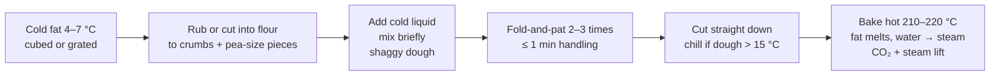

# 08.4 · The rubbing-in (biscuit) method: scones and biscuits

**Requires:** [08.3 Muffin and creaming methods](stage-1/module-08/lesson-03.md) · [08.1 Fats](stage-1/module-08/lesson-01.md)
**Science:** [SC-04 Lipids](stage-1/science/sc-04-lipids.md) (solid fat content, steam from butter's water)
**Practical:** [R1-14 Scones](recipes/R1-14-scones.md) · **Experiment:** [X1-23 Fat temperature and piece size in scones](experiments/X1-23-scone-fat.md)
**Threads:** T6 Fats & shortening · T9 Structured doughs  **Time:** 45 min reading + two bake sessions (about 1 h and 2 h)

## Why this lesson exists

The rubbing-in method is the first **structured dough** in the course: a dough whose texture depends on keeping two phases — cold fat and flour-water dough — separate until the oven. It is the simplest form of the idea behind flaky pie dough, puff pastry and croissant. Scones (British) and biscuits (American) are the vehicle because they are fast, cheap and show every error immediately: warm fat gives a flat, cakey scone; overworking gives a tough one; a twisted cutter gives a lopsided one. Master the variables here, on a 30-minute product, and the expensive doughs later are the same variables with more steps.

## You will be able to

1. Carry out the rubbing-in method with measured fat temperature (4–7 °C), a stated piece size, a target dough temperature, and minimal handling.
2. Explain how solid fat pieces create flakiness (steam and voids) and how fine rubbing creates tenderness, and choose between them.
3. Use fold-and-pat to build layers, and cut scones so they rise straight.
4. Write and check a scone formula in baker's percent and predict the effect of changing fat, liquid, sugar and leavener.
5. Bake scones hot enough (210–220 °C) and judge doneness by colour, side firmness and internal temperature.

## The method in one picture

## What the fat does in a scone

In the muffin and creaming methods, fat is spread through the batter. In the rubbing-in method it is deliberately left in two populations:

| Fat population | How it is made | What it does in the oven |
|---|---|---|
| **Fine coating** — fat rubbed to breadcrumb size | Rubbing between fingertips, pastry cutter, or short pulses in a food processor | Coats flour, limits gluten: **tenderness**, a short, crumbly texture |
| **Discrete pieces** — pea-size lumps and flakes, 3–8 mm | Stopping rubbing early, or grating frozen butter | Stay solid through mixing and shaping; in the oven they melt, leaving voids, and butter's ~16 % water turns to steam and puffs each void: **flakiness** and lift |

The ratio between them is the main texture control:

| Rubbing | Texture | Where it's used |
|---|---|---|
| All fine (sandy crumbs, no visible butter) | Tender, cakey, even, short; less rise | Rich tea-room scones, shortbread-like biscuits |
| Mostly fine with some pea-size pieces | Tender with some flake and good rise | **R1-14** British scone |
| Mostly large flakes (grated frozen, or cut to pea/walnut size) | Flaky, layered, tall; can be slightly less tender | American layered biscuits; flaky pie dough ([11.3](stage-1/module-11/lesson-03.md)) |

### Why the fat must be cold

Butter at 4–7 °C is about half solid ([SC-04](stage-1/science/sc-04-lipids.md)): hard enough to break into pieces rather than smear. At 15–18 °C it becomes plastic and smears over the flour as a film — you get coating (tenderness) but no pieces (no flake). Above ~20 °C it softens and the dough becomes greasy, sticky and spreads in the oven.

Your fingertips are at ~32–34 °C: inside butter's melting range. That is why:

- use **fingertips only**, not palms; lift and let the mixture fall to keep it cool and aerated;
- work in **short bursts**, 1–2 min, then check the temperature;
- a pastry cutter, two knives, or a food processor (3–6 one-second pulses) keeps heat out entirely;
- **grating frozen butter** on a coarse grater gives uniform flakes with almost no hand contact.

**Target dough temperature after mixing: 10–15 °C.** Above ~15 °C, chill the shaped dough 15–30 min before cutting and baking. Measure it with a probe pushed into the middle of the dough.

### Why handling must be minimal

A scone dough has about 55 % liquid on flour: enough water for gluten to form readily. Unlike bread, you want only enough gluten to hold the dough together and trap steam — no more. Every knead, squeeze and reroll develops more gluten and warms the fat.

- Mix the liquid in with a spatula or table knife, using a cutting and lifting motion, for **15–30 s**, until there is no dry flour at the bottom of the bowl. The dough should be **shaggy** and slightly sticky.
- Total handling from liquid to cutting: **about 1 min**.
- Reroll scraps **once** at most, and bake them separately; they will be tougher and less even.

## Fold-and-pat: a first taste of lamination

After mixing, turn the shaggy dough onto a lightly floured bench:

1. Pat it into a rectangle about 2 cm thick.
2. Fold it in half (or in thirds, like a letter).
3. Pat it out again to 2 cm. That is one fold.
4. Do **2–3 folds** in total, then pat to the final thickness: **2.5–3 cm** for tall scones.

Each fold stacks the dough on itself, flattening the fat pieces into flakes and creating horizontal planes of weakness. In the oven, steam separates along those planes and the scone rises in visible layers that you can split with your fingers. This is a crude version of lamination: puff pastry ([15.1](stage-1/module-15/lesson-01.md)) does the same with one sheet of fat folded into hundreds of layers.

Folding also firms the dough slightly. Three folds are useful; six give toughness.

## Cutting and baking

**Cut straight down.** Press a sharp, floured cutter straight down and lift it straight up, **without twisting**. Twisting seals the cut edge by pressing the layers together; the sealed side cannot rise and the scone leans. A knife works too: squares or wedges avoid scraps entirely.

**Place close for height, apart for crust.** Scones placed with sides almost touching (~1 cm apart) support each other and rise taller with soft sides. Scones 4–5 cm apart have crustier sides and rise slightly less.

**Brush only the tops** with egg wash or milk for colour. Wash that runs down the sides glues them and limits rise.

**Bake hot: 210–220 °C (410–425 °F), middle rack, 12–16 min.** The high temperature matters:

- the fat must melt and the water turn to steam **quickly**, while the dough around each piece is still soft enough to expand but close to setting;
- the baking powder's slow acid reacts in the same window ([08.2](stage-1/module-08/lesson-02.md));
- the outside sets and browns before the fat can leak out.

At 180 °C the fat melts slowly and soaks into the surrounding dough instead of flashing to steam: scones spread, rise less and bake up greasy and pale.

**Doneness:** tops and bottoms golden brown; sides that were touching are set and spring back, not doughy; internal temperature **93–97 °C**. Cool on a rack 10 min. Scones are best within a few hours; they stale quickly (low sugar, low fat compared with cake). Freeze unbaked cut scones and bake from frozen at the same temperature, adding 3–5 min.

## Reading a scone formula

R1-14 in baker's percent (standard professional ranges in brackets):

| Ingredient | R1-14 % | Typical range | Job |
|---|---|---|---|
| Plain (all-purpose) flour, ~10–11.5 % protein | 100 | 100 | Structure |
| Unsalted butter, cold | 22.5 | 20–25 (up to ~35 in rich scones) | Tenderness, flake, flavour |
| Sugar | 12.5 | 10–15 (0–5 in savoury) | Sweetness, tenderness, colour |
| Baking powder | 5 | 5–6 | Lift in a stiff dough with little trapped air |
| Salt | 1 | 1–1.5 | Flavour |
| Milk (or buttermilk + soda) | 55 | 50–60 total liquid | Hydration; binds |
| Egg (optional, replaces part of the milk) | 0 | 0–15 | Richness, colour, slightly firmer, taller structure |

Why so much baking powder, compared with 3–4 % in muffins? A scone dough is stiff, has no creamed air, and has a large surface through which gas escapes during its short, hot bake. The powder does most of the lifting; steam from the butter does the rest.

Moving within the ranges:

| Change | Effect |
|---|---|
| Butter 20 → 30 % | Richer, more tender, shorter, spreads a little more; needs colder handling |
| Liquid 50 → 60 % | Softer, stickier dough; lighter, more open scone if handled well; harder to cut cleanly |
| Sugar 10 → 20 % | Sweeter, browner, more tender, flatter; closer to a cake |
| Cream instead of milk and butter ("cream scones") | Fat arrives pre-emulsified in the liquid: very tender, fine, less flaky |
| Bread flour instead of plain | Tougher, chewier, more elastic, shrinks when cut |

### British scones vs American biscuits

The method is the same; the targets differ. British scones are slightly sweet, include sugar and often egg, are cut round and tall, and are eaten split with jam and clotted cream. American biscuits are unsweetened, often made with buttermilk and soda, usually higher in fat (25–35 %), and are made flakier with more folding. Both are rubbing-in products and both follow the same rules of cold fat and minimal handling.

## On the bench

**Session 1 — [R1-14 Scones](recipes/R1-14-scones.md), about 1 h.** Probe the butter before rubbing (4–7 °C) and the dough after mixing (≤15 °C). Time your handling. Measure raw height and baked height of three scones.

**Session 2 — [X1-23](experiments/X1-23-scone-fat.md), about 2 h.** Frozen-grated vs cold-cubed vs soft butter (and optionally melted), same formula, same handling. This experiment is the foundation for [X1-31 pie dough fat size](experiments/X1-31-pie-fat-size.md) and [X1-40 croissant temperature](experiments/X1-40-croissant-temperature.md).

## What goes wrong

- **Scones spread or did not rise:** fat too warm, oven too cool, cutter twisted, dough too wet, stale powder. [Scones spread or did not rise](troubleshooting/quick-breads.md?id=scones-spread-or-did-not-rise).
- **Tough scones:** overmixed, over-folded, rerolled, bread flour. [Tough scones](troubleshooting/quick-breads.md?id=tough-scones).
- **Dry, crumbly scones:** too little liquid, overbaked, too much flour on the bench. [Dry crumbly scones](troubleshooting/quick-breads.md?id=dry-crumbly-scones).
- **Burnt bottoms:** dark tray, low rack, sugar and egg in the dough. [Burnt bottoms](troubleshooting/quick-breads.md?id=burnt-bottoms).

## Lab notebook

- Butter temperature at the start of rubbing and form (cubes, grated); time spent rubbing; final piece size (photograph the crumb mixture next to a ruler).
- Dough temperature after mixing and after shaping; chill time if any.
- Number of folds; final thickness; cutter size; whether scraps were rerolled.
- Oven temperature and rack; tray type; bake time; internal temperature.
- Raw and baked height (mm) → rise ratio; layer count when split by hand; tenderness notes.

## Check yourself

1. Why does rubbing the butter to fine crumbs make a scone more tender but less flaky?

Answer

Fine rubbing spreads the fat as a coating over the flour, which limits gluten formation (tender, short). But it leaves no discrete solid pieces to melt and form steam-filled gaps, so there are no flakes or layers. Pea-size pieces do the opposite.

2. Your kitchen is 27 °C. List four changes to the R1-14 procedure that protect the fat.

Answer

Any four: freeze the butter and grate it; chill the flour and bowl for 20–30 min; use a pastry cutter or food processor pulses instead of fingers; use milk straight from the fridge; work in short bursts and probe the dough; chill the shaped dough 20–30 min before cutting; chill the cut scones on the tray 15 min before baking.

3. A scone rose taller on one side and leans. What happened?

Answer

Most likely the cutter was twisted, sealing the edge on one side so it could not rise; or egg wash ran down one side and glued it; or the oven has a hot side (the side nearer the heat sets first). Cut straight down, wash tops only, and rotate the tray if the oven is uneven.

4. Why bake scones at 210–220 °C rather than 180 °C?

Answer

At high heat the butter pieces melt and their water flashes to steam quickly while the surrounding dough is still soft enough to expand; the leavener's slow acid reacts in the same window; the outside sets before fat leaks out. At 180 °C the fat melts slowly and soaks into the dough: less lift, more spread, a greasy, pale scone.

5. You replace 55 % milk with 55 % buttermilk in R1-14 and keep 5 % baking powder. Predict the result and propose a better leavening.

Answer

The buttermilk acid remains unneutralized: a tangier, paler, slightly more tender scone, possibly a little less spread; rise will be similar. Better: add soda to neutralize the buttermilk (220 g × ~0.8 % = 1.76 g lactic acid → ~1.6 g soda; ~0.4 % on 400 g flour) and reduce the powder to about 3 %, keeping total gas similar (1.6 g soda ≈ 6.5 g powder).

## Where this goes next

**Next:** The cold-fat principle continues in [11.1](stage-1/module-11/lesson-01.md) (short dough), [11.3](stage-1/module-11/lesson-03.md) (flaky pie dough, where piece size is the main variable, tested in [X1-31](experiments/X1-31-pie-fat-size.md)) and [15.1](stage-1/module-15/lesson-01.md) (lamination, where fat is a continuous cold-plastic sheet). **Stage 2** covers laminated biscuits, cream scones, savoury scones with cheese and inclusions, and production freezing of cut, unbaked pieces. **Stage 3** treats piece-size distribution and fat solid content as formulation variables, and designs reduced-fat or butter-alternative flaky products while keeping lift and layering.

## Sources

[Gisslen] · [Figoni] · [CIA-BP] · [Corriher] · [McGee]. Fat and dough temperatures, baker's-percent ranges and oven temperatures are standard professional practice.
