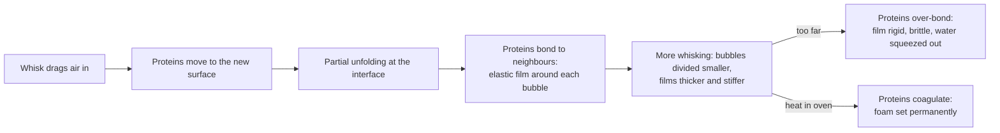

# 09.2 · Foams: trapping air with protein

**Requires:** [09.1 The egg](stage-1/module-09/lesson-01.md)

**Science:** [SC-06 Colloids: foams, emulsions and gels](stage-1/science/sc-06-colloids.md) · review [SC-03 Proteins](stage-1/science/sc-03-proteins.md)

**Practical:** [R1-16 Sabayon](recipes/R1-16-sabayon.md) · **Experiment:** [X1-24 Egg-white foam: sugar timing, acid and a trace of fat](experiments/X1-24-egg-white-foam.md)

**Threads:** T7 Eggs, foams & emulsions  **Time:** 50 min reading + 2 h bench

## Why this lesson exists

A génoise, a chiffon cake, a soufflé, a mousse and a meringue have no yeast and often no baking powder. They rise because you beat air into egg and then kept it there. Whether that air survives the whisk, the folding, the wait and the oven decides whether the product is light or flat, and every one of those steps can be predicted from how proteins behave at a bubble surface. This lesson gives you that model, the stages of whipped whites as measurable endpoints, the effect of sugar, acid and fat, and a folding technique that keeps the air you worked for.

## You will be able to

- Explain how egg proteins build and stabilize a foam, and why a foam fails by drainage, coalescence and coarsening.
- Identify the five stages of whipped egg white by sight and by specific gravity, and choose the right stage for a given product.
- Predict the effect of sugar (and its timing), cream of tartar, a trace of yolk, temperature and bowl material on whipping time, volume and stability.
- Explain how whole-egg and yolk foams (génoise batter, sabayon, pâte à bombe) differ from white foams and why they need heat and sugar.
- Fold a foam into a heavier mixture and measure the air lost with specific gravity.

## What a foam is

A foam is gas dispersed in a liquid (or a solid): many bubbles separated by thin liquid films called **lamellae**, which meet in channels called Plateau borders ([SC-06](stage-1/science/sc-06-colloids.md)). Pure water cannot hold a foam. Its surface tension is high, so any bubble you beat in is pulled back into a sphere, rises and pops in seconds. To make a foam last you need something that:

1. **Lowers surface tension**, so less energy is needed to make new surface and bubbles form easily.
2. **Forms a film** at the surface that resists stretching and thinning, so bubbles do not merge.
3. **Thickens the liquid between bubbles**, so it drains slowly.

Egg white does all three with its proteins.

### How egg-white proteins build the film

When the whisk drags air into egg white, each new bubble surface is an air–water interface. Egg-white proteins have both water-loving (hydrophilic) and water-avoiding (hydrophobic) parts. At the interface they partly **unfold**: hydrophobic parts turn towards the air, hydrophilic parts stay in the water. The unfolded proteins then bond to their neighbours at the surface, forming a thin, elastic, gel-like skin around each bubble. This is **surface denaturation**: the same unfolding that heat causes in 09.1, caused here by the interface and by mechanical stress.

The thick white protein ovomucin and the globular proteins (ovalbumin, ovotransferrin, lysozyme, globulins) all contribute. Globulins lower surface tension and help bubbles form; ovomucin and the other proteins give the film strength; and in the oven, ovalbumin coagulates and fixes the foam permanently.

### Stages of whipped egg white

Specific gravity (SG) is the weight of a level 100 ml cup of foam divided by 100 g (the weight of 100 ml of water). Lower SG means more air. Measuring it turns "soft peaks" into a number you can reproduce ([X1-24](experiments/X1-24-egg-white-foam.md)). The SG values below are typical ranges for unsweetened whites whipped with a hand or stand mixer; your equipment will give its own.

| Stage | What you see | Peak test (lift the whisk, turn it upright) | Typical SG | Used for |
|---|---|---|---|---|
| **Foamy** | Large, clear bubbles; liquid underneath; translucent | No peak | 0.4–0.6 | Adding cream of tartar and (for meringue) starting the sugar soon after |
| **Soft peak** | Opaque white, fine bubbles, moist sheen; bowl track marks fade | Peak folds over and sinks back | ~0.2–0.25 | Folding into dense bases (soufflé, some mousses); starting sugar addition |
| **Firm peak** | Smooth, white, moist; clear whisk tracks | Peak holds, tip curls over | ~0.15–0.2 | Most folded batters (chiffon, separated sponge) |
| **Stiff peak** | Smooth, glossy if sugared; holds a shape | Peak stands straight; bowl can be inverted (sugared foam) | ~0.12–0.17 | Meringue for piping; sweetened stiff whites |
| **Overwhipped** | Dull, dry, grainy, "cotton wool" clumps; liquid starts to seep | Peak breaks rather than bends | Low or erratic; foam falling apart | Nothing: folds in lumps and collapses in the oven |

Unsweetened egg white can increase to about **6–8 times** its volume at firm to stiff peak. A sugared meringue gives less volume per gram of white but is far more stable.

**Key idea:** Stop whipping whites that will be *folded* before they are fully stiff. Folding and oven expansion stretch the bubble films further; a foam that is already at its limit has no stretch left and tears. Firm peak (tip curling over) is the usual target for folded batters.

### Why overwhipping ruins a foam

Whipping keeps unfolding proteins and pushing them together. Past stiff peak, the proteins in the films bond so tightly that the films become rigid and brittle, and the protein network contracts and squeezes out water, the same syneresis you saw from overheating in 09.1. You see clumps of dry foam and a pool of liquid. The foam no longer stretches when folded, so it breaks into lumps, and it cannot expand in the oven. Unsweetened whites overwhip quickly, often within 30–60 seconds of reaching stiff peak in a stand mixer. Sugar and acid both widen that window.

## What changes a white foam

| Factor | Effect on time to foam | Volume | Stability | Why |
|---|---|---|---|---|
| **Sugar added at the start** | Much slower (can double the time or more) | Lower, denser foam | Very high; glossy | Sugar raises viscosity and holds water, slowing protein unfolding at the surface |
| **Sugar added gradually after soft peak** | Normal to reach soft peak; then a few minutes more | High for a sugared foam | High; glossy, fine, stiff | Proteins have built the films first; the sugar then thickens the lamellae and slows drainage |
| **Cream of tartar (~1 % of white weight) or other acid** | Slightly slower | Similar or higher | Higher; wider window before overwhipping; whiter foam | Lower pH moderates protein–protein bonding (fewer disulfide exchanges), so films stay flexible |
| **Trace of yolk or fat** | Slower | Markedly lower; may never reach stiff peak | Lower | Fat competes for the bubble surface and breaks protein films |
| **Salt** | Slightly slower | Similar | Slightly lower | Shields charges on proteins; best added to another component |
| **Warm whites (~18–22 °C) vs cold (~4 °C)** | Faster | Higher | Similar | Lower viscosity; proteins reach the surface and unfold faster |
| **Copper bowl** | Slightly slower | Similar | Higher; creamier, faintly golden foam | Copper ions bind to ovotransferrin and make the film more resistant to overbeating |
| **Older (thinner) whites** | Faster | Similar | Slightly lower | Thin white flows and foams easily but drains faster |
| **Pasteurized whites** | Slower | Often lower | Variable | Heat treatment and additives change the proteins; use acid, allow more time |

### Sugar: the stabilizer that slows everything

Sugar is the main tool for turning a fragile white foam into a stable one. Dissolved in the water of the lamellae, it makes them viscous, so liquid drains more slowly and bubbles merge less. It also holds water, which delays syneresis, and in the oven it helps the foam dry into a crisp, glassy meringue ([SC-02](stage-1/science/sc-02-carbohydrates.md)). The cost is that the same viscosity slows the proteins getting to the bubble surface. Hence the standard technique:

1. Whip the whites (with cream of tartar, if using) on medium speed to **foamy**, then higher speed to **soft peak**.
2. Add the sugar gradually, about a spoonful (10–15 g) every 15–20 seconds, with the mixer running.
3. Continue to **stiff, glossy peak**. Rub a little foam between your fingers: for a French meringue, it should feel smooth, with little or no grit.

French meringues use sugar at 1:1 to 2:1 sugar to white by weight; the higher the sugar, the more stable, dense and glossy the foam, and the longer it takes. Swiss and Italian meringues add heat to dissolve sugar and partly set the proteins; they come in [13.2](stage-1/module-13/lesson-02.md).

### Acid: cream of tartar

Cream of tartar (potassium bitartrate) is a dry acid. At about **1 % of the white weight** (0.3 g per 30 g white, roughly ⅛ teaspoon per white), added at the foamy stage, it gives a finer, whiter, more stable foam that is harder to overwhip. Lemon juice or white vinegar do the same, at about 1 g per white; they add a little flavour and liquid. Acid is especially useful for unsweetened or lightly sweetened whites that will be folded (chiffon, soufflé), where the overwhipping window is short. More acid is not better: well above ~2 %, the taste turns sour and the foam may be slower and less voluminous.

### Fat: the foam killer

Fat and yolk are surface-active too, but they do not form strong films. They occupy the bubble surface, disrupt the protein film and let bubbles coalesce. Even around 0.1 % yolk in the white measurably reduces volume ([SC-06](stage-1/science/sc-06-colloids.md)); a visible speck in a small batch can stop the whites ever reaching stiff peak. Sources of fat: yolk, greasy fingers, a plastic bowl that holds old fat on its surface, a whisk used for butter, and a bowl dried with a used towel. Use glass, stainless steel or copper, and wipe the bowl and whisk with a paper towel moistened with vinegar or lemon juice before you start.

### Temperature

Room-temperature whites (~18–22 °C) whip faster and larger than whites straight from the refrigerator. Separate the eggs cold (09.1), then let the whites stand 20–30 minutes, or stand the bowl in warm water for a few minutes, stirring, until the whites are about 20 °C.

## Whole-egg and yolk foams

Yolks contain fat, which you have just learned suppresses foams. Yet whole eggs and yolks can be whipped into very useful foams, because the yolk's lipoproteins and proteins also stabilize bubbles and the fat is packaged in particles rather than free. They need help: **heat and sugar**.

| Foam | How it is made | Endpoint | Typical expansion | Used in |
|---|---|---|---|---|
| **Whole-egg foam (warm)** | Whole egg + sugar warmed over a bain-marie to ~40–45 °C while whisking, then whipped until cool | **Ribbon stage**: batter falls from the whisk in a thick ribbon that sits on the surface for 3–5 s before sinking | ~3× (SG ~0.25–0.35) | Génoise ([10.3](stage-1/module-10/lesson-03.md), [R1-18](recipes/R1-18-genoise.md)) |
| **Yolk + sugar, cold** | Yolks whisked with sugar | Pale, thick, falls in a ribbon | ~1.5–2× | Separated sponge, custard bases |
| **Sabayon** | Yolks + sugar + wine or juice whisked over a bain-marie to ~72–78 °C | Thick, voluminous foam that holds a ribbon; proteins partly coagulated | ~3–4× | [R1-16](recipes/R1-16-sabayon.md); mousse bases |
| **Pâte à bombe** | Hot sugar syrup (~118–121 °C) poured onto whipping yolks, then whipped until cool | Thick, pale, stable, holds a ribbon | ~2–3× | Mousses, parfaits, buttercream (M13) |

Warming the whole-egg foam lowers its viscosity, dissolves the sugar and lets proteins reach the bubble surfaces faster; the result is more volume and a finer foam. In a sabayon, heat does more: it partly coagulates the yolk proteins, so the bubble walls set into a thickened, cooked structure. That is why a sabayon holds its shape better than a raw yolk foam, and why it scrambles if pushed past about 80 °C.

## How foams fail

| Failure | What you see | Cause | Counter |
|---|---|---|---|
| **Drainage** | Liquid collects under the foam (the "weeping" meringue or mousse) | Gravity pulls liquid down through the channels | Sugar (viscosity), acid, correct stage, bake or set promptly |
| **Coalescence** | Bubbles merge; foam falls; big holes | Films break: fat, overwhipping (brittle films), rough folding | Clean equipment, stop at the right stage, gentle folding |
| **Coarsening (disproportionation)** | Bubbles grow larger and fewer over time | Gas diffuses from small bubbles (higher pressure) into big ones | Use the foam promptly; fine, uniform bubbles; set by heat |

All three are running from the moment the whisk stops. A white foam is at its best for a few minutes; a sugared or cooked foam lasts longer. Plan the work so the foam is made last and used immediately: bases ready, pans lined, oven hot.

## Folding: keeping the air

Folding combines a light foam with a heavier mixture (a batter, a yolk base, melted chocolate) with as little air loss as possible. Stirring or beating would shear the bubbles and push the foam's air out.

1. **Sacrifice a third.** Stir about a third of the foam vigorously into the heavy base. This lightens and loosens the base so that it is closer in density to the foam; you accept losing some of that first third.
2. **Add the rest in one or two additions**, on top of the lightened base.
3. **Fold:** with a large flexible spatula, cut down through the centre to the bottom of the bowl, sweep along the bottom and up the side, and turn the spatula over, bringing base up over the foam. Turn the bowl a quarter turn with your other hand after each stroke.
4. **Stop** as soon as streaks of foam disappear. A few small white flecks are better than an extra ten strokes.
5. **Fold dry ingredients** (flour, cocoa, ground nuts) sieved over the surface in two or three additions, with the same stroke.

The combination speed matters too: the base should not be much colder than the foam (cold, stiff bases need more strokes), and fat-rich bases such as melted butter or chocolate destroy bubbles fastest, so they are folded in last or into a sacrificed portion first ([10.3](stage-1/module-10/lesson-03.md)).

**Measure it.** Take the SG of the foam and of the finished batter. A génoise batter typically loses some air in folding; if the batter SG rises by much more than 0.1–0.15 over the foam's, your folding is costing volume. This is the number you track in M10.

**Professional practice:** Pastry kitchens specify foams and batters by specific gravity, not by "until stiff". A cup of known volume and a scale is enough. The same measurement lets you compare two cooks, two mixers or two days, and it is the first number checked when a cake comes out low.

## On the bench

1. **Run [X1-24 Egg-white foam](experiments/X1-24-egg-white-foam.md).** Five variants of 60 g white: plain, with cream of tartar, sugar at the start, sugar at soft peak, and with 0.5 g yolk. Time each to stiff peak, measure SG and drainage after 30 minutes.
2. **Overwhip on purpose.** With 30 g of plain white, keep whipping past stiff peak and watch the change: dull, grainy, then liquid appearing. Note the time from stiff peak to visible graininess. Fold a spoonful of it into a spoonful of whipped cream or yogurt and see how it lumps.
3. **Make [R1-16 Sabayon](recipes/R1-16-sabayon.md)**, a heated yolk foam. Measure its temperature at the ribbon stage and its SG, and watch how long it holds before draining.
4. **Fold a foam into a base.** Whisk 60 g white with 30 g sugar to firm peak; fold into 100 g of thick yogurt using the sacrifice-a-third method. Measure SG of the foam and the mixture. Repeat, stirring instead of folding, and compare.

## What goes wrong

- **Whites will not whip.** Fat or yolk present, sugar added too early, cold or pasteurized whites. See [Egg whites will not whip](troubleshooting/eggs-foams-emulsions.md?id=egg-whites-will-not-whip).
- **Whites grainy, dry, or collapsing.** Overwhipped, no sugar or acid, or left standing. See [Whipped whites grainy, dry or collapsed](troubleshooting/eggs-foams-emulsions.md?id=whipped-whites-grainy-dry-or-collapsed).
- **Foam weeps liquid.** Drainage from under-dissolved sugar, overwhipping or too long a wait. See [Foam weeps liquid](troubleshooting/eggs-foams-emulsions.md?id=foam-weeps-liquid).
- **Batter deflates after folding.** Overfolding, stirring, heavy base too cold or too fatty. See [Batter deflates after folding](troubleshooting/eggs-foams-emulsions.md?id=batter-deflates-after-folding).

## Lab notebook

- Weight and temperature of the whites; age and whether pasteurized; bowl material; mixer and speed.
- Time to each stage (foamy, soft, firm, stiff); SG at each stage you measured.
- Sugar amount, when it was added and how fast; acid type and grams.
- Drainage (g of liquid after a fixed time).
- For folded mixtures: SG of foam and of the final mixture, number of folding strokes.

## Check yourself

1. You are making a chiffon cake and whip the whites without sugar to stiff, dry peaks "to be safe". The cake is low with large holes. Explain.

Answer

The whites were overwhipped: the protein films were rigid and brittle, so they broke into lumps during folding (leaving holes where lumps stayed intact and dense areas where air was lost) and could not stretch during oven expansion. Whip to firm peak, add some of the sugar after soft peak and a little cream of tartar to widen the window.

2. Two batches of 100 g white: A gets 100 g sugar at the start, B gets 100 g sugar gradually from soft peak. Predict whipping time, volume and gloss.

Answer

A takes much longer and gives a denser foam with lower volume (higher SG), but very stable and glossy. B reaches soft peak quickly, then stiff, glossy peak a few minutes after the sugar is in; it has more volume than A and good stability. B is the standard French meringue method.

3. A 250 ml cup of foam weighs 40 g. What is its specific gravity, and what stage is it likely at if it is unsweetened white?

Answer

SG = 40 ÷ 250 = 0.16. For unsweetened white that is around firm to stiff peak.

4. How much cream of tartar do you add to 180 g of egg white, and at what stage?

Answer

About 1 % of the white weight: 1.8 g (roughly ½ teaspoon), added when the whites are foamy.

5. Why does a génoise foam need warming to ~40–45 °C, while egg whites do not?

Answer

Whole egg contains yolk fat and is more viscous; warming lowers viscosity, dissolves the sugar and lets the proteins reach and unfold at the bubble surfaces faster, giving much more volume and a finer, more stable foam. Whites foam readily at room temperature without it.

## Where this goes next

**Next:** [09.3](stage-1/module-09/lesson-03.md) turns from air in water to oil in water. Foams return as the leavening in [10.3 Foam cakes](stage-1/module-10/lesson-03.md) (génoise, separated sponge, chiffon), in whipped cream ([12.3](stage-1/module-12/lesson-03.md)), and in French, Swiss and Italian meringues and meringue buttercreams ([13.2](stage-1/module-13/lesson-02.md), [13.3](stage-1/module-13/lesson-03.md)). **Stage 2** builds mousses, soufflés, dacquoise and macarons, where foam stability and folding are measured and specified by SG and overrun. **Stage 3** designs foams: replacing egg white with aquafaba or plant proteins, adding hydrocolloids to control drainage, and measuring overrun and stability over time as formulation outcomes.

## Sources

[McGee], [Figoni], [Corriher], [Gisslen], [CIA-BP], [Friberg]. Specific-gravity ranges, cream-of-tartar dosage and stage descriptions are standard professional practice.
