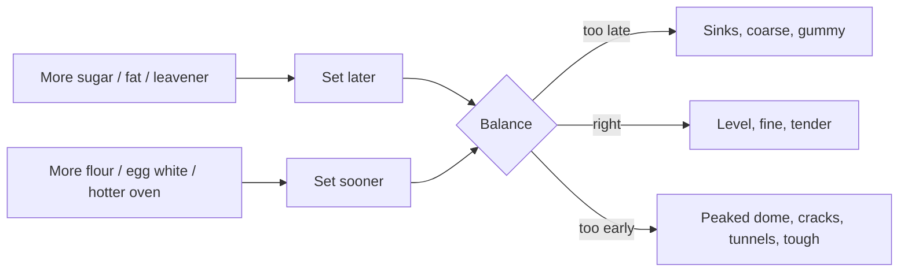

# 10.1 · Cake formula balance: builders, tenderizers, moisteners, driers

**Requires:** [08.2 Chemical leavening](stage-1/module-08/lesson-02.md) · [09.1 The egg](stage-1/module-09/lesson-01.md)

**Science:** [SC-02 Carbohydrates](stage-1/science/sc-02-carbohydrates.md) · [SC-03 Proteins](stage-1/science/sc-03-proteins.md) (review)

**Practical:** [R1-17 Pound cake](recipes/R1-17-pound-cake.md) (as the reference formula) · **Experiments:** [X1-28 Cake flour](experiments/X1-28-cake-flour.md) · [X1-29 Formula balance](experiments/X1-29-cake-formula-balance.md)

**Threads:** T1 Measurement & formulation math · T12 Experimental method & R&D  **Time:** 60 min reading + one bake day (about 3 h)

## Why this lesson exists

A cake recipe looks like a list, but it behaves like a system of opposing forces. Some ingredients build and set structure, others weaken it; some add water, others absorb it. If you change one ingredient (less sugar, more milk, a different flour) without knowing which side of which balance it sits on, the cake sinks, domes, dries or turns gummy, and the recipe gives you no clue why. This lesson gives you the two balances, the classic formula-balance rules that professional bakers use to check a formula before baking it, and the timing model that decides whether a cake rises and holds or rises and falls.

## You will be able to

- Classify every common cake ingredient as a structure builder or tenderizer, and as a moistener or drier, including the ones that sit on both sides (eggs, milk).
- Check a creamed-cake formula against the traditional balance rules in baker's percentages and predict the failure if a rule is broken.
- Explain, with approximate temperatures, why sugar delays both starch gelatinization and egg coagulation, and how that decides rise, set, dome and collapse.
- Explain why the crumb of a cake is decided during mixing, not in the oven, and measure batter aeration by specific gravity.
- Prepare a pan correctly for a butter cake, a sponge and a chiffon, and say why they differ.

## The cake is a set foam

Every cake in this module is the same physical object: a foam of gas cells in a continuous phase of starch, protein, sugar, fat and water, which the oven expands and then sets. Before baking, the batter is a fluid emulsion-foam; after baking, it is a solid sponge. The whole game is:

1. **Put air cells into the batter** (creaming, whipping eggs).
2. **Expand them in the oven** (thermal expansion of air, steam, CO₂ from leaveners).
3. **Set the walls** (starch gelatinization and protein coagulation) **at the right moment**: late enough for the cells to expand fully, early enough that they do not over-stretch and collapse.
4. **Keep the set structure tender and moist** enough to be pleasant, but strong enough to hold its own weight after the steam condenses.

Bread (M03–M06) does step 3 with a gluten network that exists long before the oven. A cake has almost no gluten network: sugar and fat stop it forming ([06.1](stage-1/module-06/lesson-01.md), [08.3](stage-1/module-08/lesson-03.md)). The structure appears only in the oven, from starch and egg protein, which is why timing matters so much.

## Balance 1: structure builders versus tenderizers

| Structure builders (tougheners) | How they build | Tenderizers (weakeners) | How they weaken |
|---|---|---|---|
| **Flour** (protein and starch) | Starch gelatinizes into a gel; gluten proteins add a little elasticity | **Sugar** | Competes for water, so starch swells later and less; raises coagulation temperature; interferes with gluten |
| **Egg whites** (and whole egg proteins) | Coagulate into a firm protein network | **Fat** (butter, oil, shortening) | Coats proteins and starch, lubricates and shortens the network |
| **Milk solids** (casein, whey proteins) | Protein adds firmness; lactose browns | **Egg yolks** (fat and lecithin) | Yolk fat and emulsifiers tenderize, although yolk protein also sets |
| **Cocoa powder** | Starch and fibre absorb water and stiffen | **Chemical leaveners** | Stretch cell walls thinner; excess over-expands and weakens |
| Starches (cornstarch) | Gelatinize and set | Acids in excess, liquid sugars | Weaken protein networks, soften |

Whole egg is on both sides: the white is a builder, the yolk mostly a tenderizer, and the net effect of whole egg in a cake is structure building. That is why a formula can swap some whole egg for yolks to become more tender, or for whites to become firmer and drier.

## Balance 2: moisteners versus driers

| Moisteners | Water content (approximate) | Driers (absorbers) |
|---|---|---|
| Water | 100 % | **Flour** (proteins bind water in the batter; starch takes up much more as it gelatinizes in the oven) |
| Milk | ~87 % | **Starches** (cornstarch, potato starch) |
| Whole egg | ~75 % | **Milk powder** |
| Egg white | ~88 % | **Cocoa powder** (absorbs strongly; cocoa cakes need extra liquid) |
| Egg yolk | ~50 % | |
| Liquid sugars (honey, glucose syrup, invert syrup) | ~17–25 % | |
| Butter | ~16 % | |
| Sugar (dissolved) | 0 %, but it holds water and keeps crumb moist (hygroscopic, [07.1](stage-1/module-07/lesson-01.md)) | |

Sugar is a special case: it adds no water, yet it makes crumb feel moist because it binds water and slows drying. It also dissolves into the liquid, so a high-sugar batter is thinner than the water content alone suggests.

**Key idea:** Every change to a cake formula moves at least one of the two balances. Before you change an ingredient, write down which balance it moves and in which direction, then change something on the other side of the same balance to compensate. More sugar (tenderizer) needs more egg or flour (builder), and usually more liquid, because sugar needs water to dissolve.

## The classic formula-balance rules

Professional baking texts give a small set of rules of thumb for checking a creamed or butter-cake formula, expressed in baker's percentages (flour = 100). They are traditional industry guidelines, derived from generations of production experience, not laws of physics; treat them as a first check, not a guarantee (see [Gisslen] and [Figoni] for the full discussion).

| Rule | Regular ("lean", low-ratio) creamed cakes | High-ratio cakes |
|---|---|---|
| Sugar vs flour | Sugar **≤** flour (≤ 100 %) | Sugar **>** flour, typically **110–140 %** |
| Eggs vs fat | Eggs **≥** fat | Eggs **>** fat |
| Liquids (including eggs) vs sugar | Liquids **≈** sugar | Liquids **>** sugar |
| Flour | Any cake or soft pastry flour | **Chlorinated or heat-treated** cake flour required |
| Fat | Butter or shortening | **Emulsified** (high-ratio) shortening, or oil with emulsifiers |

"Liquids" here means everything wet: milk, water and the eggs (whole weight).

**Worked check.** A pound cake: flour 100, sugar 100, butter 100, eggs 100. Sugar = flour (at the limit, allowed). Eggs = fat (at the limit, allowed). Liquids (eggs) = 100 = sugar. A quatre-quarts sits exactly on all three lines, which is part of why it is the classic teaching cake. Change any one of the four and at least one rule breaks.

**Worked check 2.** A formula reads: flour 100, sugar 120, butter 60, eggs 50, milk 60. Sugar > flour: this is high-ratio territory. Eggs (50) < fat (60): breaks the egg rule. Liquids 110 < sugar 120: breaks the liquid rule. Prediction with ordinary flour and butter: coarse, greasy, sunken centre. To rebalance as a regular cake: sugar 100, eggs 60, milk 45 (liquids 105, close to sugar).

### Why high-ratio cakes need special flour and fat

At sugar levels above flour, the sugar holds so much water and pushes the setting temperature so high that ordinary flour starch cannot set the batter in time; the cake rises and then falls. **Chlorinated cake flour** has been treated with chlorine gas, which lowers its pH (to roughly 4.5–5) and modifies the surfaces of starch granules so they absorb water and swell more readily in a high-sugar batter; it also weakens the gluten proteins and whitens the crumb. **Emulsified shortening** contains mono- and diglycerides that disperse the fat into many small particles and let the batter carry more liquid and sugar without separating.

**Regional note:** Chlorine treatment of flour is not permitted in the EU and the UK, among other places, so "cake flour" there is simply a fine, low-protein soft-wheat flour, and much US cake flour is chlorinated. Industry outside the US uses **heat-treated flour** to get a similar effect on starch. At home, without either, keep sugar at or below flour weight (regular-cake rules), use the lowest-protein flour you can buy (7–9 % protein), or replace 15–20 % of all-purpose flour with cornstarch. [X1-28](experiments/X1-28-cake-flour.md) measures how much difference the flour makes in your kitchen.

## Timing: when the cake sets

The two balances matter because they move the **setting temperature** of the batter relative to the **expansion** of its gas.

| Event | Approximate temperature in the batter | What sugar does to it |
|---|---|---|
| Air and CO₂ expand, leavener releases gas | from loading up to set | — |
| Steam adds pressure inside cells | rises sharply above ~70 °C | — |
| Egg proteins coagulate | whites begin ~62–65 °C, yolks ~65–70 °C in pure egg ([09.1](stage-1/module-09/lesson-01.md)) | Raises it, often by 10 °C or more in a sweet batter |
| Starch gelatinizes | ~55–70 °C in a lean dough | Raises it substantially; in sweet cake batters the main gelatinization is often above 80 °C |
| Structure fixed, rise stops | typically 85–95 °C in cake batter | — |
| Centre done | **93–99 °C** depending on cake | — |

The numbers vary with formula; what you need is the direction. Sugar dissolved in the water phase delays gelatinization because starch granules need free water to swell, and it stabilizes proteins so they unfold later ([SC-02](stage-1/science/sc-02-carbohydrates.md), [SC-03](stage-1/science/sc-03-proteins.md)). Delay has two consequences:

- **The right amount of delay** lets the batter stay fluid while the gas expands, so the cake rises evenly and sets with a flat or gently rounded top and a fine, tender crumb.
- **Too little delay** (too little sugar or fat, too much flour or egg white): the outside sets early and the still-fluid centre pushes up through it. Result: a peaked or cracked dome, tunnels, a tough crumb.
- **Too much delay** (too much sugar, fat or leavener, too little flour or egg): the cells expand beyond what the walls can hold before anything sets. They coalesce and rupture; the centre falls as the steam condenses. Result: a sunken centre, coarse crumb, often a gummy layer.

Oven temperature moves the same balance from the other side: a hotter oven sets the outside sooner (dome), a cooler oven gives the batter longer to expand and can let a marginal formula over-expand and sink. You will see all of these deliberately in [X1-29](experiments/X1-29-cake-formula-balance.md).

## Aeration: the crumb is decided in the mixer

A cake's final crumb is made of cells that already existed in the batter. **Chemical leaveners and steam do not create new cells.** CO₂ released by baking powder dissolves in the batter's water and diffuses into the nearest existing gas cell; steam does the same. Forming a brand-new bubble in a liquid requires far more energy than enlarging an existing one, so in practice leaveners only inflate the nuclei that mixing provided.

Consequences you can use:

- A batter creamed for too short a time has few, large cells; baking powder then inflates those few cells into a coarse, dense crumb, however much powder you add.
- A well-creamed batter has many small cells; the same powder is shared among them and the crumb is fine and even.
- A foam cake (génoise, chiffon) has so many cells from whipping that it needs little or no leavener.
- Overmixing after the flour goes in can knock out cells and, in batters with enough water, develop gluten: both give a tighter, tougher crumb.

### Measuring aeration: batter specific gravity

Professionals check batter aeration by **specific gravity (SG)**: the weight of a fixed volume of batter divided by the weight of the same volume of water. It is dimensionless; lower means more air.

**Method.**
1. Choose a straight-sided cup or ramekin of 100–250 ml. Tare the empty cup.
2. Fill it level with water (at room temperature), weigh: *W_water*. Record this once; it does not change.
3. Dry the cup, tare, fill with batter using a spatula, without pressing, tap once on the bench to remove large voids, level the top with a straight edge, weigh: *W_batter*.
4. SG = *W_batter* ÷ *W_water*.

**Worked example.** Water fills the cup at 118 g. Pound-cake batter fills it at 100 g. SG = 100 ÷ 118 = **0.85**.

| Batter | Indicative SG range |
|---|---|
| Unaerated batter (e.g. muffin batter before leavening acts) | ~1.0–1.1 |
| Pound cake, creamed | ~0.8–0.9 |
| Creamed layer (butter) cake with milk | ~0.8–0.95 |
| Génoise and sponge batters (after flour) | ~0.4–0.5 |
| Chiffon batter | ~0.45–0.55 |

These ranges are indicative, not specifications: they depend on formula, cup shape and your filling technique. Their real value is comparative. Measure your own batter every time you make it, and within a few bakes you will have your own target and your own tolerance. Use the same cup forever.

**Professional practice:** Production bakeries set batter SG as a control point on the standard recipe (for example, target 0.85 ± 0.03) and check it on every batch before depositing, because it predicts cake volume and crumb better than mixing time does. You will use it in [18.2](stage-1/module-18/lesson-02.md).

## Pan preparation

Pan preparation depends on whether the batter needs to **release** or to **cling**.

| Cake | Preparation | Why |
|---|---|---|
| Butter cakes, pound cake | Grease with soft butter or shortening, dust with flour and tap out; or grease and line with parchment (base, or a sling for loaf pans) | Fat-rich batters release easily; the coating prevents crust from bonding to metal |
| Génoise | Parchment disc on the base; sides lightly buttered and floured (or left clean for maximum climb and cut free with a knife) | Foam needs to climb but also to release cleanly |
| Chiffon and angel food | **Nothing**: clean, dry, ungreased aluminium tube pan, not nonstick | The foam must grip the walls to climb and to hang when inverted |
| Cupcakes | Paper liners | Handling, shelf life |

Use a pan spray only where release is the goal. Grease in the corners of a pan with a lot of flour dusting leaves a white, pasty film on the crust: tap out all excess.

## On the bench

1. **Read [R1-17 Pound cake](recipes/R1-17-pound-cake.md)** and write its formula in baker's percentages. Check it against all three balance rules. Then bake it (the process is taught in [10.2](stage-1/module-10/lesson-02.md)); measure and record the batter SG.
2. **Set up your SG cup.** Weigh its water fill three times; the three readings should agree within 1 g.
3. **Run [X1-29](experiments/X1-29-cake-formula-balance.md)** once you have done 10.2: baseline, +25 % sugar, +25 % liquid and both. Write your predictions from this lesson before you bake.
4. **Run [X1-28](experiments/X1-28-cake-flour.md)** to find out what your local flours do.

## What goes wrong

- **Sunken centre:** setting too late (excess sugar, fat or leavener; underbaked; oven too cool). See [Sunken centre](troubleshooting/cakes.md?id=sunken-centre).
- **Peaked, cracked dome and tunnels:** setting too early or too much gluten (low sugar, strong flour, overmixing, oven too hot). See [Cracked or domed top](troubleshooting/cakes.md?id=cracked-or-domed-top) and [Tunnels](troubleshooting/cakes.md?id=tunnels).
- **Dense cake:** too little aeration in mixing, or a formula so rich in tenderizers that the structure fell. See [Dense, heavy cake](troubleshooting/cakes.md?id=dense-heavy-cake).
- **Dry cake:** driers exceed moisteners, or overbaked. See [Dry cake](troubleshooting/cakes.md?id=dry-cake).

## Lab notebook

- Every cake formula in baker's %, with a three-line balance check (sugar/flour, eggs/fat, liquids/sugar) written before baking.
- Batter SG (with your cup's water weight), batter temperature.
- Oven temperature (measured), pan size and material, batter weight in the pan.
- Result: centre and edge height (mm), top shape (flat / rounded / peaked / sunken), crumb (fine / even / coarse / tunnels), internal temperature at removal.

## Check yourself

1. Classify each as builder or tenderizer, and moistener or drier: whole milk, egg yolk, cocoa powder, honey.

Answer

Whole milk: mostly moistener; its proteins make it a mild builder. Egg yolk: tenderizer (fat, lecithin) and moistener (~50 % water), although its protein does set. Cocoa powder: builder (stiffens) and strong drier. Honey: tenderizer (sugar) and moistener (~17–20 % water plus hygroscopic sugars).

2. A formula is flour 100, sugar 90, butter 70, eggs 55, milk 40. Check it against the regular-cake rules and correct it.

Answer

Sugar 90 ≤ 100: fine. Eggs 55 < fat 70: breaks the egg rule; raise eggs to at least 70. Liquids = 55 + 40 = 95 ≈ sugar 90: fine as written, but if you raise eggs to 70, liquids become 110; reduce milk to about 25 to keep liquids near 95, or accept a slightly moister cake. Corrected: flour 100, sugar 90, butter 70, eggs 70, milk 25 (liquids 95).

3. Why does a cake with too much baking powder often end up denser than one with the right amount?

Answer

The powder only inflates existing cells. Too much gas over-expands them before the batter sets; walls thin, cells merge and rupture, gas escapes, and the structure falls back when the steam condenses. The result is a sunken, coarse and often dense cake, sometimes with a soapy or bitter taste.

4. Your SG cup holds 142 g of water. A creamed batter fills it at 135 g. Is this batter well aerated for a pound cake? What would you check?

Answer

SG = 135 ÷ 142 = 0.95, above the indicative 0.8–0.9 for a pound cake: under-aerated. Check butter temperature (too cold or too warm), creaming time, sugar crystal size, egg temperature and whether the batter curdled, and whether it was overmixed after the flour.

5. Explain in two sentences why chiffon pans are left ungreased but pound-cake pans are greased.

Answer

A chiffon foam must grip the walls to climb during baking and to hang from them when the cake is inverted to cool; grease would let it slide down and collapse. A pound cake is heavy, rich in fat and not inverted, so release is the goal, and grease or parchment prevents the crust from bonding to the metal.

## Where this goes next

**Next:** [10.2](stage-1/module-10/lesson-02.md) builds the aeration you just measured by creaming; [10.3](stage-1/module-10/lesson-03.md) builds it by whipping eggs; [10.4](stage-1/module-10/lesson-04.md) uses the setting-time model to diagnose failed cakes. Formula-balance checking returns in [17.3](stage-1/module-17/lesson-03.md) (layer cakes), in the diagnostic method of [18.3](stage-1/module-18/lesson-03.md) and in the capstone ([19.2](stage-1/module-19/lesson-02.md)). **Stage 2** extends the balance to high-ratio cakes, emulsifier systems, and the entremet sponges (joconde, dacquoise, flourless biscuits) that bend these rules. **Stage 3** turns the qualitative balance into quantitative formulation: sugar reduction and replacement in cakes, egg replacement, hydrocolloids, and designed experiments that map the "sets too early / too late" boundary for a new product.

## Sources

[Figoni] · [Gisslen] · [CIA-BP] · [Corriher] · [McGee] · [Pyler] · [Hui]. The balance rules are the traditional industry guidelines presented in professional texts such as [Gisslen] and [Figoni]; the specific-gravity ranges are indicative values from standard professional practice.
