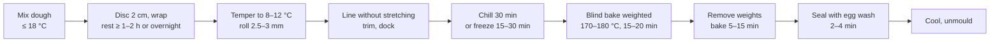

# 11.2 · Rolling, lining, resting and blind baking

**Requires:** [11.1 Short dough science](stage-1/module-11/lesson-01.md)

**Science:** none new; reviews [SC-04 Lipids](stage-1/science/sc-04-lipids.md) (butter melting range) and [SC-12 Rheology](stage-1/science/sc-12-rheology.md) (elastic recovery)

**Practical:** [R1-21 Pâte sucrée](recipes/R1-21-pate-sucree.md) · [R1-20 Pâte brisée](recipes/R1-20-pate-brisee.md) · **Experiment:** [X1-32 Resting and chilling vs tart shrinkage](experiments/X1-32-tart-shrinkage.md)

**Threads:** T9 Structured doughs  **Time:** 45 min reading + one bench session (about 4 h including rests)

## Why this lesson exists

A good short dough can still make a bad tart shell. Most shell faults (shrunken walls, slumped sides, a domed base, a raw or soggy bottom) are process faults: the dough was not rested, was stretched while lining, went into the oven warm, or was blind baked badly. This lesson turns shell-making into a controlled sequence with measurable checkpoints, so that a 22 cm shell comes out 22 cm, with straight walls and an evenly baked base, every time.

## You will be able to

- Explain what resting does to a short dough (hydration, gluten relaxation, butter firmness) and set rest times accordingly.
- Roll dough to an even 2.5–3 mm and line a tart ring and a fluted pan without stretching the dough.
- Explain the mechanism of shrinkage and slumping and use chilling or freezing to prevent them.
- Blind bake a shell to par-baked or fully baked, with a measurable endpoint, and seal it.
- Choose between ring and fluted pan, weights and no weights, and justify the choice.

## Resting: three things happen at once

When a short dough has just been mixed, it is warm (16–20 °C), unevenly hydrated and slightly elastic. A rest in the refrigerator changes all three.

| Process | What happens | Time scale | What you notice |
|---|---|---|---|
| **Hydration evens out** | Water migrates from wetter patches to dry flour; starch and protein finish absorbing | 30 min to several hours | Dough stops feeling patchy; fewer cracks at the edges when rolled |
| **Gluten relaxes** | Stretched protein strands relax (stress relaxation), so stored elastic strain falls | 30–60 min for most of it; continues overnight | A cut strip no longer springs back; shell shrinks less |
| **Butter firms** | Butter cools from ~18 °C to 4–6 °C and becomes firm and less smeary | 60–90 min for a 2 cm disc | Rolls cleanly, does not stick or go greasy |

**Minimum rest: 1–2 hours** for a 2 cm disc at 4 °C. **Overnight (12–24 h) is better** and is standard professional practice for sucrée and brisée. Wrapped dough keeps 3 days refrigerated (sucrée with egg: 2–3 days) or about 3 months frozen; thaw frozen dough overnight in the refrigerator.

A disc 2 cm thick chills far faster than a ball: heat must travel only 1 cm from each face. This is the same heat-transfer geometry as in [04.1](stage-1/module-04/lesson-01.md).

**Warning:** Dough straight from the refrigerator at 4 °C is too hard to roll: butter at that temperature is brittle, and the dough cracks. Let it stand 5–10 minutes, or beat it a few times with the rolling pin to make it pliable. Target **about 8–12 °C** at the core for rolling (probe thermometer). Do not let it warm to room temperature.

## Rolling

### Thickness targets

| Use | Thickness |
|---|---|
| Sucrée tart shells and tartlets | **2.5–3 mm** (2 mm for small tartlets) |
| Brisée for tarts and quiche | **3 mm** (3–4 mm for deep quiche) |
| Pie dough (R1-22) | **3–4 mm** |

Thinner shells bake faster and eat more elegantly but break; thicker shells survive handling but eat heavy and often underbake at the centre. Evenness matters more than the exact figure: a sheet that varies from 2 to 4 mm will be burnt at the thin places and raw at the thick ones.

**Guides.** Rolling guides (pairs of wooden or metal strips, or rings slipped onto the ends of the pin) of 3 mm give an even sheet every time. Two 3 mm strips of wood from a hardware shop work perfectly. Otherwise measure with a ruler at the edge and check the centre by pressing a toothpick marked at 3 mm.

### Technique

1. Roll on a lightly floured bench, or between two sheets of parchment for sticky or very short doughs (sucrée with high butter, sablée).
2. Roll from the centre outward, never over the edge (edges thin out and crack), and **turn the dough a quarter turn** every few strokes so it stays round and does not stick. With parchment, peel and replace the sheet once to release it.
3. Use firm, even pressure. Short strokes on a cold dough; do not stretch it by pulling.
4. Brush off excess flour: it bakes into a raw, dusty layer.
5. **Rolled size:** ring diameter + 2 × ring height + about 2–3 cm. For a 22 cm × 2 cm ring: 22 + 4 + 3 ≈ **29 cm**.
6. If the sheet has softened (it goes limp, shiny or sticky), slide it on its parchment onto a tray and chill 10–15 minutes before lining. Lining a warm sheet is a common cause of shrinkage.

## Lining (fonçage)

### Ring or fluted pan?

| | Tart ring (straight-sided, no base) | Fluted pan with removable bottom |
|---|---|---|
| Result | Sharp, straight, professional walls | Fluted edge, classic home and bistro look |
| Heat | Base sits directly on the tray or mat: fast, even base baking | Base sits on a metal disc: slightly slower base baking |
| Unmoulding | Lift ring off; easy | Push up the base; ease the side ring down |
| Best dough | Sucrée, sablée (hold a wall well) | Brisée, pie-style doughs, sucrée |
| Professional note | Perforated rings plus a perforated mat let steam escape from base and walls, giving even colour and often allowing bakes without weights | — |

### Lining a ring

1. Set the ring on a tray lined with parchment or, better, a perforated silicone mat. Butter the ring lightly if it is not non-stick.
2. Roll the sheet loosely over the pin and unroll it centred over the ring.
3. **Lift, do not push.** Lift the overhanging edge with one hand and let the dough fall into the ring, while the other hand eases it into the inner corner. The dough must reach the corner by gravity and gentle pressure, not by being stretched down the wall.
4. Press the dough into the base–wall angle with the side of a bent finger or a small ball of dough, forming a sharp 90° corner. A rounded corner is thicker, bakes unevenly and leaves a gap between the dough and the ring at the base.
5. Press the dough against the wall, working around the ring, so it is in contact everywhere. A slightly thicker wall (turn the excess inward a little) resists slumping.
6. **Trim.** Either roll the pin across the top of the ring, or cut flush with a small knife held flat along the rim, blade pointing outward. For sucrée, a professional alternative is to leave 2–3 mm above the rim, bake, then rasp it level with a fine grater once cool: any shrinkage is removed with the excess.
7. **Dock** (prick) the base with a fork or docker every 1–2 cm if blind baking. Docking lets trapped steam and air escape from under the base so it does not dome. For a very liquid filling baked in a par-baked shell (quiche), dock lightly and seal the shell with egg wash (below) so the filling cannot leak through.

### Lining a fluted pan

Same principle. Ease the dough into the corner, then press it into each flute with a fingertip so the wall is even. Trim by rolling the pin across the top; the sharp edge of the pan cuts the dough. Push the wall up 1–2 mm above the rim with your thumb to compensate for a little shrinkage.

## Why shells shrink and slump

Understanding the mechanism tells you what each precaution is for.

**Shrinkage** is elastic recovery. Every time you roll or stretch the dough, the gluten strands that exist are stretched and store elastic strain, like a stretched rubber band held in place by cold, firm butter. In the oven the butter softens and melts (butter is largely liquid by about 35 °C, [SC-04](stage-1/science/sc-04-lipids.md)) *before* the egg and starch set the structure (above about 70–80 °C). In that window, the strands pull back. The dough contracts toward where it was before you stretched it: walls drop, the diameter pulls in. Loss of water as the shell bakes adds a small further contraction.

**Slumping** is the other face of the same window: melted butter lubricates a dough that has not yet set, and the walls slide down under their own weight. It is worse with high-butter doughs, warm shells and thin walls.

So there are two strategies, and you use both:

1. **Reduce the stored strain:** less gluten (11.1), rest before rolling, rest again after lining, never stretch while lining.
2. **Shorten the vulnerable window:** put the shell into the oven cold or frozen, so the butter stays solid longer while the surface heats and the structure starts to set. A frozen shell (−18 °C) takes several minutes longer to bring its butter to melting; by then the outer layers have begun to set.

**Key idea:** Rest the dough, never stretch it, then chill the lined shell (at least 30 minutes refrigerated, or 15–30 minutes frozen) before it goes into the oven. [X1-32](experiments/X1-32-tart-shrinkage.md) measures how much each step is worth.

## Blind baking

Blind baking means baking the shell empty, before (or instead of) baking it with a filling. You need it when the filling is not baked at all (fruit on pastry cream, lemon curd set on the stove, ganache) or is baked too briefly or too cool to bake the pastry (quiche custard, frangipane in some tarts).

### Par-bake or full bake?

| | Par-baked | Fully baked |
|---|---|---|
| Endpoint | Walls set and matt, base dry to the touch, pale to very light gold | Evenly golden all over, including the centre of the base; shell lifts cleanly from the mat |
| Used when | The shell goes back into the oven with a filling (quiche, frangipane, baked custard tarts) | The filling is not baked, or bakes only briefly (fruit tart, lemon tart, chocolate tart) |
| Why | The shell will finish baking with the filling; full colour now would overbrown later | The shell must be completely baked now; nothing will bake it later |

### Procedure

1. **Chill.** The lined, docked shell goes into the oven cold: 30 minutes in the refrigerator or 15–30 minutes in the freezer.
2. **Line and weight.** Line the shell with a crumpled and re-flattened sheet of parchment (crumpling lets it fit the corners) or a double layer of foil, with a 3–4 cm overhang. Fill **to the rim** with baking weights: ceramic beads, dried beans or rice reserved for the purpose, or granulated sugar. The weights must support the walls, not just the base: a half-full shell still slumps. Some bakers freeze the shell and then press foil directly onto it.
3. **First bake, weighted.** Preheated oven, **170–180 °C (340–355 °F)** still, or 160–170 °C fan, on a preheated tray or the lower-middle rack. Bake **15–20 minutes**, until the rim is set and just starting to colour and the walls no longer look wet when you lift a corner of the paper.
4. **Remove the weights.** Lift out paper and weights together (they are hot: use the overhang, with mitts). If the paper sticks, the dough is not set yet: give it 3–5 more minutes.
5. **Second bake, empty.** Return the shell to the oven for **5–15 minutes**: about 5–8 for a par-bake, 10–15 for a full bake, until the base reaches the endpoint in the table above. If the base puffs up, press it down gently with a clean cloth or the back of a spoon while it is still soft.
6. **Seal (optional but recommended under wet fillings).** Brush the inside of the hot shell with beaten egg, or yolk with a little cream, and return it to the oven for **2–4 minutes** until the wash is set and glossy. The coagulated egg forms a thin protein film that slows water from a filling soaking into the pastry. A thin layer of melted cocoa butter or chocolate is a stronger moisture barrier for cold fillings; you will use it in [17.2](stage-1/module-17/lesson-02.md), and [X1-43](experiments/X1-43-moisture-migration.md) measures the difference.
7. **Cool** on the tray for 10 minutes, then remove the ring and cool on a rack. A hot shell is fragile; a cold one is crisp.

Sucrée browns faster than brisée because of its sugar: bake it at the lower end of the range (165–170 °C still) and watch the rim, which colours first.

**Professional practice:** Many pastry kitchens bake sucrée in perforated rings on perforated mats at 150–160 °C with fan, often without weights: the perforations vent steam from the walls and base, the shell dries evenly, and a well-rested, frozen shell holds its walls. Brisée and pie doughs, which contain more water and gluten, are more reliably baked with weights. At home, weights are the safe default.

## Workflow for a tart shell

Scrap dough can be gathered, pressed together (not kneaded), flattened and rested again. It is always tougher than first-roll dough; use it for tartlets or test pieces.

## On the bench

1. **Line and blind bake two 22 cm shells** from [R1-21 Pâte sucrée](recipes/R1-21-pate-sucree.md): one fully baked and sealed (for a later fruit tart, or freeze it), one par-baked for the frangipane tart in [11.3](stage-1/module-11/lesson-03.md). Measure the ring and the baked shell.
2. **Line a quiche or savoury tart** with [R1-20 Pâte brisée](recipes/R1-20-pate-brisee.md) and par-bake it with weights.
3. **Run [X1-32](experiments/X1-32-tart-shrinkage.md).** Three identical shells: no rest, rest, rest plus freezing. Measure the walls at four points.

## What goes wrong

- **Shell shrinks down the ring.** Dough not rested, stretched during lining, or baked warm. See [Shrinking tart shell](troubleshooting/short-pastry.md?id=shrinking-tart-shell).
- **Sides slump into the base during blind baking.** Weights not filled to the rim, shell too warm, oven too cool. See [Slumped sides in blind baking](troubleshooting/short-pastry.md?id=slumped-sides-in-blind-baking).
- **Base domes or bubbles.** Not docked, or weights removed too early. See [Puffed or bubbled bottom](troubleshooting/short-pastry.md?id=puffed-or-bubbled-bottom).
- **Raw, pale base under golden walls.** Base underbaked, rack too high, fluted pan without a preheated tray. See [Pale, underbaked base](troubleshooting/short-pastry.md?id=pale-underbaked-base).
- **Cracks when rolling.** Dough too cold or too dry. See [Cracks when rolling](troubleshooting/short-pastry.md?id=cracks-when-rolling).

## Lab notebook

- Rest time and dough core temperature at rolling.
- Rolled thickness (measured at edge and centre).
- Chill or freeze time of the lined shell; oven temperature (measured), weighted and unweighted bake times.
- Ring height and diameter; baked wall height at 4 marked points; baked inner diameter on two axes.
- Base colour at the centre (photo next to a white card), and whether it was par-baked or fully baked.

## Check yourself

1. You need to line a fluted pan 24 cm across and 2.5 cm deep. What diameter should you roll the dough to?

Answer

24 + 2 × 2.5 + 2 to 3 ≈ **31–32 cm**.

2. Explain in one or two sentences why freezing the lined shell before baking reduces shrinkage.

Answer

Shrinkage happens when the butter melts before the egg and starch have set the structure, letting stretched gluten recoil. A frozen shell keeps its butter solid for longer in the oven, so the outer structure starts to set before the strands can pull back.

3. A learner fills the paper liner with beans only to 1 cm depth. The base is fine but the walls have slid down by 5 mm. Why?

Answer

The weights must support the walls until they set. With a shallow layer, the walls had nothing holding them while the butter melted, and they slumped under their own weight. Fill to the rim.

4. Which tart needs a fully baked shell and which a par-baked one: (a) lemon tart with a curd cooked on the stove, (b) quiche lorraine, (c) pear and almond tart with raw crème d'amande?

Answer

(a) Fully baked (the filling is not baked, or only briefly set). (b) Par-baked and sealed (it bakes again with the custard). (c) Par-baked or even raw-lined, depending on the method; in R1-23 it is par-baked so the base is crisp under a moist filling that bakes 40–50 min.

5. Why does sucrée go into a cooler oven than brisée?

Answer

Its 35–40 % sugar browns (caramelization and Maillard) much faster. At brisée temperatures the rim darkens before the base is baked.

## Where this goes next

**Next:** [11.3](stage-1/module-11/lesson-03.md) fills shells and bakes pies. The component-thinking lesson [17.1](stage-1/module-17/lesson-01.md) requires this lesson; fully baked, sealed shells are the base of the fruit tart and chocolate tart in [17.2](stage-1/module-17/lesson-02.md), where [X1-43](experiments/X1-43-moisture-migration.md) measures how well egg wash and cocoa butter seal them. **Stage 2** covers production shell-making: sheeting, perforated rings and mats, lining dozens of tartlets, freezing lined shells as stock, and sizes from petit four to entremet. **Stage 3** uses shrinkage and base colour as quality specifications and tests process windows (rest time, freeze time, bake profile) with designed experiments.

## Sources

[Gisslen], [CIA-BP], [Friberg], [Figoni], [Corriher]. Thicknesses, rest times and blind-baking temperatures are standard professional practice.
