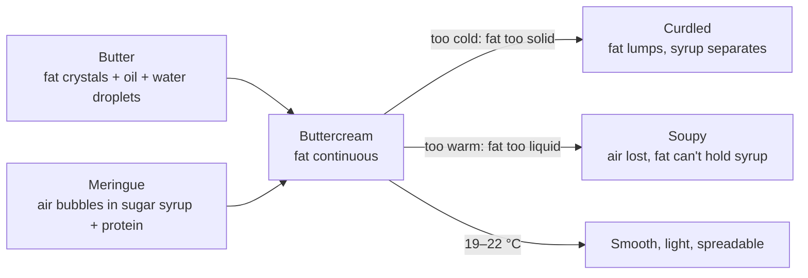

# 13.3 · Buttercreams and meringue-based creams

**Requires:** [13.2 Meringues](stage-1/module-13/lesson-02.md) · [09.3 Emulsions](stage-1/module-09/lesson-03.md) · review [12.2 Crème pâtissière](stage-1/module-12/lesson-02.md) for crème mousseline

**Science:** [SC-06 Colloids: foams, emulsions and gels](stage-1/science/sc-06-colloids.md) · [SC-04 Lipids](stage-1/science/sc-04-lipids.md)

**Practical:** [R1-30 Swiss and Italian meringue buttercreams, crème mousseline](recipes/R1-30-buttercreams.md) · **Experiment:** [X1-35 Meringue method vs stability](experiments/X1-35-meringue-stability.md) (Going further: buttercream from each meringue)

**Threads:** T6 Fats & shortening · T7 Eggs, foams & emulsions  **Time:** 45 min reading + 3 h bench

## Why this lesson exists

Buttercream is where every beginner's confidence breaks: the bowl turns into a soup, or into something that looks like cottage cheese, a few minutes after it looked perfect. Both failures come from one variable, temperature, acting on one ingredient, butter. Once you see buttercream as butter holding an aqueous phase and air, and know the temperature window in which butter can do that, both failures become predictable and both are fixed in five minutes. The same model covers the whole family: Swiss, Italian, French, American and crème mousseline.

## You will be able to

- Describe the structure of a meringue buttercream as a fat-continuous system holding a sugar syrup and air, and explain why butter temperature controls it.
- Make Swiss and Italian meringue buttercream and crème mousseline with measured temperatures at each step: meringue ≤25 °C, butter 18–20 °C, finished cream 19–22 °C.
- Diagnose a curdled or soupy buttercream by temperature and fix it without starting over.
- Compare meringue, pâte à bombe, American and mousseline buttercreams by sugar content, stability, texture and use.
- Flavour a buttercream without breaking it, and finish it smooth for coating a cake.

## What a buttercream is

**Butter** is already a water-in-fat emulsion: about 80–82 % milk fat, 15–17 % water in tiny droplets, and 1–2 % milk solids ([SC-04](stage-1/science/sc-04-lipids.md)). At cool room temperature it is **plastic**: a network of solid fat crystals holding liquid oil, able to be spread and to trap air when beaten, the property you used in creaming ([08.1](stage-1/module-08/lesson-01.md)).

A **meringue buttercream** takes that butter and beats into it roughly half its own weight of meringue. The meringue brings air bubbles and a concentrated sugar syrup (the water of the whites with the sugar dissolved in it). In a good buttercream the **fat is the continuous phase**: a matrix of partly crystalline butterfat surrounds droplets of syrup and bubbles of air ([SC-06](stage-1/science/sc-06-colloids.md)). You can see it in the behaviour: buttercream feels greasy, not wet; it sets firm in the fridge like butter; and it melts in the mouth like butter.

The proportion of solid fat in butter changes steeply with temperature. Very roughly, butterfat is about half solid at 10 °C, about a quarter solid near 20 °C, and nearly all liquid above 30–35 °C. The window in which butter is plastic enough to beat and still firm enough to hold structure is narrow: **about 18–22 °C**.

- **Too cold (below about 16 °C):** the fat is too firm to flow around the syrup and air. It forms separate lumps, and the syrup collects between them. The cream looks **curdled**: grainy, lumpy, wet at the edges, like cottage cheese.
- **Too warm (above about 24–25 °C):** too much fat has melted. The fat phase is too soft to hold air or keep the syrup dispersed. The cream goes **soupy**: glossy, loose, runny, deflated.

**Key idea:** Buttercream has one control variable: temperature. Curdled means too cold, soupy means too warm. Check with a thermometer before you touch the recipe. Almost every "split" buttercream is a correct formula at the wrong temperature.

## The family

| Type | Base | How the butter goes in | Sugar (% of finished cream, approx.) | Character | Stability |
|---|---|---|---|---|---|
| **Swiss meringue (SMBC)** | Swiss meringue | Soft butter beaten into meringue at ≤25 °C | ~28–30 % | Light, smooth, silky, moderately sweet | Good; holds at cool room temperature for several hours |
| **Italian meringue (IMBC)** | Italian meringue | As SMBC | ~28–30 % | Very smooth, lightest, slightly firmer, holds sharp piping | Very good; the most stable of the family |
| **French (pâte à bombe)** | Yolks + 118–121 °C syrup, whipped | Butter into cooled bombe | ~25 % | Rich, yellow, custard-like; softest | Lower; melts sooner, least stable in warmth |
| **American** | None: butter + icing sugar | Sugar beaten into creamed butter | ~55–60 % | Very sweet, dense, forms a dry crust | Firm; crusts, holds shape; can taste gritty |
| **Crème mousseline** | Crème pâtissière | Butter in two stages | ~10–15 % | Rich, creamy, custard flavour; firm when chilled | Needs refrigeration; a filling, not a coating cream |

### Swiss meringue buttercream

A standard educational ratio is **100 g whites : 150–180 g sugar : 250–300 g butter**. More butter makes it richer, firmer when cold and more stable when warm; less butter makes it lighter and sweeter.

1. Make a Swiss meringue: whites and sugar over a bain-marie to **70 °C** (dissolved sugar; see 13.2 for the 71 °C safety point), then whip at high speed until stiff and glossy.
2. **Keep whipping until the meringue is at or below 25 °C**, ideally 22–25 °C. This takes 10–15 minutes and is the step people cut short. Check with a probe. Warm meringue melts the first butter and you go straight to soup.
3. Change to medium speed. Add the butter, at **18–20 °C** (it dents easily but is not shiny or greasy), in pieces of about 20 g, every 10–15 seconds.
4. Around halfway, the cream often looks broken or curdled. This is normal: there is not yet enough fat to take in all the syrup. Keep going.
5. When all the butter is in, beat 2–3 minutes more. It comes together into a smooth, thick, matte-to-satin cream. Add salt (about 0.2 %) and vanilla.
6. Finished temperature: **19–22 °C**.

### Italian meringue buttercream

The same process with an Italian meringue (13.2), cooled to ≤25 °C before the butter. Because the proteins are more cooked and the bubbles finer, IMBC is a little firmer and holds sharper piped edges. It is the default in many professional kitchens because the meringue can be made in larger batches and the result tolerates warm rooms better.

### French buttercream (pâte à bombe)

Yolks (or whole eggs) whipped with a 118–121 °C syrup to a thick, pale, cooled foam, the **pâte à bombe**, then butter beaten in. The yolk lecithin and proteins act as emulsifiers, and the result is rich and custard-flavoured, with less air. It is softer and melts sooner than the meringue types, so it suits fillings more than exposed coatings in a warm room. The syrup heats the yolks only briefly; for vulnerable eaters, whisk the yolks and syrup over a bain-marie to **71 °C or higher** as for a sabayon ([R1-16](recipes/R1-16-sabayon.md)), or use pasteurized yolks.

### American buttercream

Soft butter beaten with **1.5–2 times its weight of icing sugar**, loosened with a little milk or cream. No eggs, no heat, no syrup: it is the easiest and the most forgiving to make. It is also much sweeter (the sugar is more than half the cream), heavier, and forms a dry crust as the surface sugar loses water. The cornstarch in icing sugar (typically about 3 %) helps it hold shape. Use sifted icing sugar and beat long enough (4–6 minutes) or it feels gritty. Salt at 0.2–0.4 % and a little cream reduce the perceived sweetness.

### Crème mousseline

Crème pâtissière enriched with butter, typically **50 % of the pastry cream weight**, in two stages ([R1-26](recipes/R1-26-creme-patissiere.md)):

1. Beat **half the butter** into the pastry cream while it is still hot from cooking (about 60 °C). It melts into the cream and enriches it.
2. Cover the surface and cool quickly to **18–22 °C**. Not colder: a cold pastry cream curdles the butter in the next step.
3. Beat the pastry cream smooth, then beat in the **remaining butter**, soft (18–20 °C), until light and creamy, 3–5 minutes.

Mousseline is firmer than pastry cream when chilled and holds its shape in a cut cake. It is the filling of a fraisier and of many Paris-Brest variants. It contains starch-thickened milk and egg, so it must stay refrigerated and be eaten within 2–3 days ([12.2](stage-1/module-12/lesson-02.md)).

## Rescuing a split buttercream

| State | What you see | Temperature | Fix |
|---|---|---|---|
| **Curdled** | Lumpy, grainy, cottage-cheese look; liquid at the edges | Below ~17 °C | Warm the bowl sides gently for 5–10 s at a time (warm towel, hair dryer, brief contact with a bain-marie, or a kitchen torch held well away) while beating, until it comes together. Or melt 10 % of the cream and pour it back in while beating |
| **Soupy** | Glossy, loose, runny, flat | Above ~25 °C | Refrigerate the bowl 10–15 minutes until the edges firm, then rewhip. Repeat if needed |
| **Curdled after adding cold flavouring** | Sudden split after purée or liqueur | Local chilling | As curdled: warm gently while beating |

Measure before you act: a curdled cream at 24 °C (rare) has a different problem, usually too much liquid flavouring. If the meringue was hot when the butter went in, the whole batch may be soupy for 20–30 minutes of chilling and rewhipping; it will recover.

## Flavouring and finishing

**Flavour additions** must respect the emulsion. Melted chocolate goes in at **30–35 °C** (cooler chocolate sets into specks, hotter melts the butter), typically 15–25 % of the buttercream. Fruit purées and liqueurs add water that the fat phase must hold; up to about **10–15 %** of the buttercream is safe, more tends to split it. Reduce purées first to concentrate them. Pastes (praline, pistachio) and extracts are easy.

**Smooth finish.** Buttercream beaten at high speed holds air in visible bubbles that pock a coated cake. Before coating, beat it at the **lowest speed with the paddle for 5–10 minutes**, or stir it hard by hand with a spatula, pressing it against the bowl. Large bubbles are knocked out and the cream becomes dense and silky.

**Storage.** Meringue buttercreams keep about 1 week refrigerated and 2–3 months frozen, well wrapped. They set firm like butter. Bring to 18–20 °C (several hours at room temperature, or gentle warming) and rewhip; they will pass through a curdled stage on the way back, which is expected. A finished coated cake is best served when the buttercream is at 18–22 °C: cold, it tastes like butter; warm, it slumps.

**Professional practice:** Kitchens record the temperature of the meringue at butter addition and the temperature of the finished cream on every batch. The two numbers explain almost every batch that misbehaved, and they let a new cook reproduce a buttercream on day one.

## On the bench

1. **Make SMBC and IMBC from [R1-30](recipes/R1-30-buttercreams.md).** Probe the meringue before the first butter goes in and the finished cream. Record both.
2. **Break and rescue a portion on purpose.** Take 150 g of finished SMBC. Chill it for 30 minutes and beat it cold: observe the curdle and rescue it with gentle heat. Then warm it to 27–28 °C over a bain-marie and beat: observe the soup and rescue it by chilling. Record the temperatures at which it broke and recovered.
3. **Make crème mousseline** with the two-stage method, from pastry cream made with [R1-26](recipes/R1-26-creme-patissiere.md).
4. **Taste side by side** SMBC, IMBC and a small American buttercream. Rank sweetness, lightness and mouthfeel, and relate them to sugar percentage and air.
5. **Coat a small cake or a board** with SMBC, before and after low-speed beating, and compare the surface.

## What goes wrong

- **Lumpy, grainy, wet at the edges.** Too cold. See [buttercream curdled](troubleshooting/meringues-buttercreams.md?id=buttercream-curdled).
- **Runny, shiny, flat.** Too warm, usually the meringue. See [buttercream soupy](troubleshooting/meringues-buttercreams.md?id=buttercream-soupy).
- **Tastes like sweet butter or like sugar.** Formula balance and serving temperature. See [buttercream too sweet or too buttery](troubleshooting/meringues-buttercreams.md?id=buttercream-too-sweet-or-too-buttery).
- **Pocked, bubbly finish on a cake.** See [air bubbles in the buttercream finish](troubleshooting/meringues-buttercreams.md?id=air-bubbles-in-the-buttercream-finish).
- **Mousseline splits or turns greasy.** See [mousseline split or greasy](troubleshooting/meringues-buttercreams.md?id=mousseline-split-or-greasy).

## Lab notebook

For each buttercream: formula in grams; meringue method and syrup or bain-marie temperature; meringue temperature when butter started; butter temperature; time to add butter; whether and when it looked curdled; finished temperature; SG of the finished cream if you measure it; flavour additions with their temperature and percentage; rescue steps and the temperatures at which they worked; sensory scores for sweetness, richness and lightness.

## Check yourself

1. A student's SMBC went runny as soon as the butter went in, and stayed runny. The butter was at 19 °C. What is the likely cause and the fix?

Answer

The meringue was still warm (well above 25 °C) when the butter started, so it melted the butter. Refrigerate the bowl for 10–15 minutes until the edges firm, then rewhip; repeat until it comes together. Next time, whip the meringue until it reads ≤25 °C first.

2. You made IMBC yesterday and refrigerated it. Today you beat it straight from the fridge and it looks like cottage cheese. Is it ruined?

Answer

No. It is too cold: the butterfat is too solid to hold the syrup. Let it warm towards 18–20 °C, or warm the bowl sides gently while beating, and it comes back smooth. Passing through a curdled stage is normal when rewhipping cold buttercream.

3. Calculate the sugar percentage of an SMBC made from 100 g whites, 160 g sugar, 280 g butter, 1 g salt and 5 g vanilla, and compare it with an American buttercream of 250 g butter, 400 g icing sugar, 30 g cream, 5 g vanilla, 1 g salt.

Answer

SMBC: total 546 g; sugar 160 ÷ 546 = **29 %**. American: total 686 g; sugar 400 ÷ 686 = **58 %** (plus a little starch from the icing sugar). The American buttercream has twice the sugar concentration, which explains its sweetness, density and crust.

4. You want to add 100 g of raspberry purée to 500 g of SMBC. What is the risk, and how would you reduce it?

Answer

100 g is 20 % of the buttercream, above the 10–15 % the fat phase can usually hold; the added water may split it, and cold purée can curdle it. Reduce the purée by about half over low heat to concentrate the flavour, cool it to about 20 °C, and add it gradually while beating. If it curdles, warm the bowl gently.

5. Why is crème mousseline cooled to 18–22 °C and not straight to fridge temperature before the second half of the butter?

Answer

The second butter addition is beaten in to build a light fat-continuous cream. A pastry cream at 4 °C chills the soft butter below its plastic range, so the fat forms hard lumps and the cream curdles; a warm one melts it and makes it greasy. At 18–22 °C both components are at the same temperature and the butter can emulsify and hold air.

## Where this goes next

**Next:** Buttercream is the filling and coating of the layer cakes in [17.3 Layered cakes and simple entremets](stage-1/module-17/lesson-03.md) and [R1-41](recipes/R1-41-layer-cake.md), where you will also plan it on a production timeline. Emulsion temperature control returns with ganache in [16.2](stage-1/module-16/lesson-02.md). **Stage 2** extends the family to crème au beurre flavoured with pralines and nut pastes, mousseline-filled fraisier and Paris-Brest, Opéra (coffee buttercream and syrup-soaked joconde), and piped-flower and sharp-edged cake finishing. **Stage 3** treats buttercream as a formulated fat system: solid fat content curves of butter vs blends, anhydrous milk fat and fat fractions for heat stability, reduced-sugar formulations, water activity and shelf life of filled cakes.

## Sources

[Figoni] · [McGee] · [Gisslen] · [CIA-BP] · [Friberg] · [Corriher] · [FDA-eggs]. Temperature windows, ratios and the two-stage mousseline method are standard professional practice; butterfat solid-fat values are rounded approximations.
