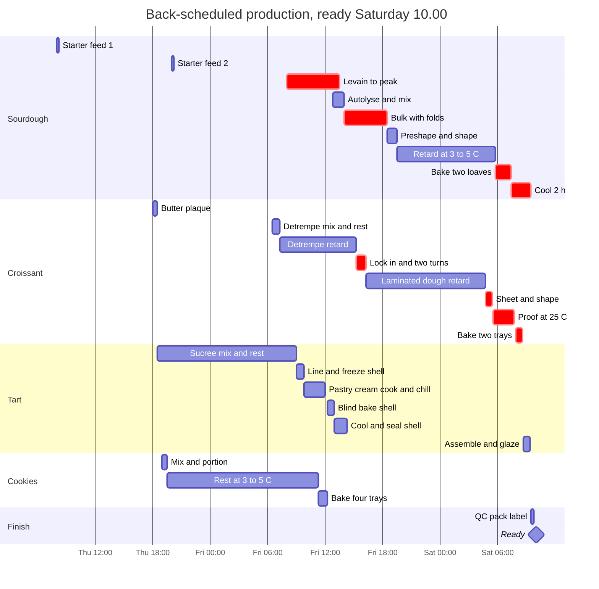
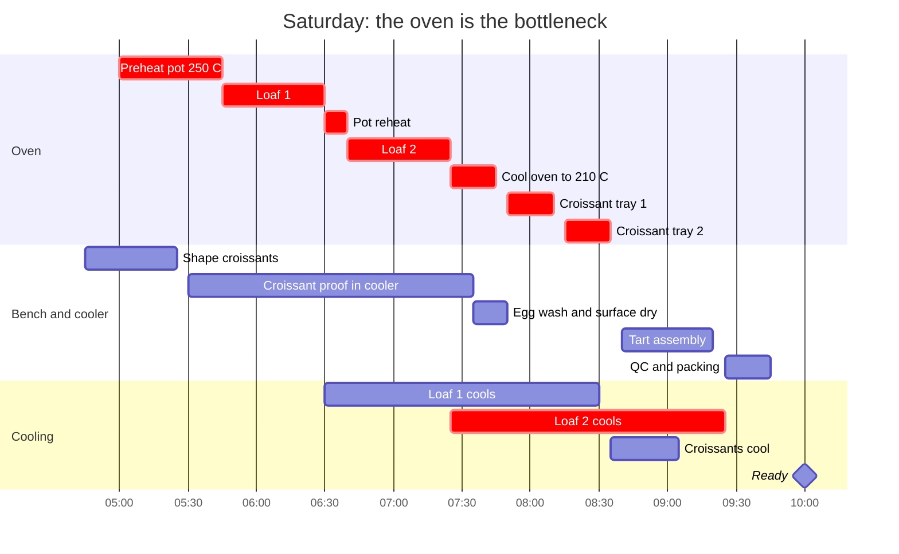

# 18.1 · Production planning: back-scheduling a baking day

**Requires:** [05.4 The sourdough loaf and the bread clinic](stage-1/module-05/lesson-04.md) · [15.3 Croissant: laminated yeast dough](stage-1/module-15/lesson-03.md)
**Science:** none new (uses [SC-08 Microbiology](stage-1/science/sc-08-microbiology.md) and [SC-10 Heat transfer](stage-1/science/sc-10-heat-transfer.md) from earlier lessons)
**Practical:** a planned production day using [R1-06](recipes/R1-06-sourdough-loaf.md), [R1-34](recipes/R1-34-croissant.md), [R1-39](recipes/R1-39-fruit-tart.md) and [R1-11](recipes/R1-11-chocolate-chip-cookie.md) · **Experiment:** [X1-44](experiments/X1-44-batch-consistency.md) (run alongside 18.2)
**Threads:** T11 Workflow  **Time:** 60 min reading + 45 min planning exercise + a 3-day production run

## Why this lesson exists

Up to now you have made one product at a time, and each recipe carried its own schedule. A real order is four products due at the same minute, sharing one oven, one fridge, one bench and one pair of hands. Each recipe can be right and the day can still fail: the croissants over-proof while the bread is in the oven, the pastry cream has no room in the fridge, the loaves are cut hot because the customer is at the door. Production planning turns a set of recipes into a timeline you can execute. It is the same skill a pastry kitchen uses for a service and an R&D kitchen uses for a trial day, and it is the first thing that fails when you scale up.

## You will be able to

1. Back-schedule a multi-product order from a fixed ready time, with every step's duration, dependency and resource written down.
2. Separate fixed-duration steps from flexible ones and use temperature (DDT, retarding at 3–5 °C, freezing) to move the flexible ones where they fit.
3. Identify the critical path and the bottleneck resource (in a home kitchen, usually the oven) and sequence bakes to minimize temperature changes.
4. Write a prep list with par levels, and label, date and store components so that FIFO works.
5. Build a cleaning schedule into the plan instead of leaving it to the end.

## The idea: plan backward, execute forward

**Back-scheduling** means starting at the ready time and working backward through each product's steps until you reach the first action. You then execute forward. It is the only sensible way to plan baking, because the end of a bake is fixed by the customer and the start is set by biology and chemistry you cannot hurry much.

Every step in a plan has four attributes. Write all four; missing any one of them is how plans fail.

| Attribute | Question | Example |
|---|---|---|
| **Duration** | How long, at what temperature? | Sourdough bulk 4–6 h at 25–26 °C |
| **Dependency** | What must be finished first? | Levain must peak before mixing |
| **Resource** | What does it occupy? | Oven at 250 °C with the pot; fridge shelf; bench; your hands |
| **Flexibility** | Can it be stretched or shrunk without harm? | Retard 8–16 h: flexible. Baking 45 min: fixed |

Hands-on time and elapsed time are different. A sourdough loaf needs about 1.5 h of your work spread over 30 h elapsed. The gaps are where the other products go.

## Fixed-duration and flexible steps

Some steps are set by a physical or biological process that you can only shift by changing temperature or formula. Others tolerate a wide window with no loss in quality, or even a gain. Planning is largely the art of putting the fixed steps where they must go and using the flexible ones as buffers.

| Step | Type | Typical window | What moves it |
|---|---|---|---|
| Levain to peak | Fixed at a given temperature | 5–7 h at 25–26 °C (1:2:2) | Temperature, feeding ratio ([X1-14](experiments/X1-14-levain.md)) |
| Bulk fermentation | Fixed at a given temperature | Sourdough 4–6 h at 25–26 °C; yeasted 1.5–2.5 h at 24–25 °C | DDT, yeast dose ([03.3](stage-1/module-03/lesson-03.md)) |
| Final proof, room temperature | Fixed | 45–75 min (lean); 2–3 h (croissant, 24–27 °C, never above 28 °C) | Temperature; cannot be shortened without under-proofing |
| **Retard (proof or dough), 3–5 °C** | **Flexible** | 8–16 h for R1-06; 8–16 h for the R1-34 détrempe; laminated dough overnight | Fridge temperature; yeast dose |
| Baking | Fixed | 40–45 min sourdough; 15–20 min croissant; 10–12 min cookies | Nothing useful: bake to endpoint |
| Cooling | Fixed minimum | Sourdough ≥ 2 h; croissant 20–30 min; tart shell to room temperature | Nothing: cutting early gives a gummy crumb ([04.3](stage-1/module-04/lesson-03.md)) |
| Chilling a cooked cream | Fixed minimum | Below 21 °C in 2 h, then below 5 °C ([00.3](stage-1/module-00/lesson-03.md)) | Shallow tray, ice bath |
| Cookie dough rest | Flexible | 12–72 h at 3–5 °C ([R1-11](recipes/R1-11-chocolate-chip-cookie.md)) | — |
| Short-dough rest | Flexible | 2 h to 3 days refrigerated; 3 months frozen ([R1-21](recipes/R1-21-pate-sucree.md)) | — |
| Pastry cream storage | Flexible within a safety limit | Up to 2–3 days at ≤ 5 °C ([R1-26](recipes/R1-26-creme-patissiere.md)) | Hard limit, never stretched |
| Fruit tart assembly | Fixed **late** | Within a few hours of service | Quality: the shell softens once filled |

Notice the last row. Some steps have slack but you still schedule them **as late as possible** because the product degrades after them: assembly, glazing, filling choux, dusting sugar. Others you schedule **as early as possible** to create a buffer: components that keep, such as doughs that rest and creams that hold for days.

## Temperature is your scheduling tool

You met the rule in [03.3](stage-1/module-03/lesson-03.md): between about 10 and 32 °C, fermentation roughly doubles in rate for every 8–10 °C. That rule is a planning instrument.

| Handle | What it does to the timeline | Typical use |
|---|---|---|
| **DDT ±2–3 °C** | Bulk time changes by roughly ∓20–30 % | Lower the DDT to 23–24 °C to push the end of bulk an hour later when you will be out; raise it to pull bulk earlier |
| **Yeast or levain dose** | Halving yeast lengthens bulk by about 1.5–2× | A 0.3 % instant-yeast dough for a slow day; a lower-PFF levain for a later peak |
| **Warm proof box, 25–27 °C** | Holds proof on its predicted time | A cooler with a jar of warm water and a thermometer. Keeps croissant proof at 24–27 °C, below the ~28 °C at which the butter layers melt ([R1-34](recipes/R1-34-croissant.md)) |
| **Retard at 3–5 °C** | Slows fermentation several-fold but does not stop it | Shaped sourdough overnight; croissant détrempe and laminated dough; a retarded bulk ([03.3](stage-1/module-03/lesson-03.md)) |
| **Freeze unbaked (−18 °C)** | Stops fermentation and staling; adds thaw and longer proof time | Cookie dough balls (bake from frozen, +1–2 min); sucrée discs; shaped croissants frozen before proofing (thaw overnight at 3–5 °C, then proof longer than usual) |
| **Freeze baked** | Moves a bake days earlier | Sliced bread, baked cookies (R1-11: up to 1 month), unfilled baked choux shells |

Two cautions. A dough does not reach fridge temperature at once: a 900 g loaf takes roughly 1.5–3 h in a home fridge, and ferments at a declining rate meanwhile ([03.3](stage-1/module-03/lesson-03.md)). And a crowded fridge warms. Four trays and two bannetons put in at once can lift a domestic fridge from 4 °C to 7–8 °C for hours, and at 7 °C an overnight retard runs roughly 1.5–2× faster. Put a thermometer on the shelf you plan to use the day before you rely on it.

## The critical path and the bottleneck

Draw every step as a bar on a time axis with arrows for the dependencies. The **critical path** is the longest chain of dependent steps from the first action to the ready time. Any delay on it delays the whole order. Every other chain has **float** (slack): the time it can slip without affecting the finish. Cookies that could be baked any time on Friday have hours of float; sourdough that must cool 2 h before 10:00 has almost none.

In a professional bakery the bottleneck is often the mixer or the deck oven's floor space. At home it is almost always the **oven**, followed by the **fridge** and **your hands**.

**One oven.** You can bake at one temperature at a time, and changing temperature costs time:

- Heating a home oven from 180 to 250 °C takes about 10–20 min, and a pot or stone then needs 45–60 min to soak up heat.
- Cooling from 250 to 200 °C with the door ajar takes about 10–20 min. With the door closed a well-insulated oven cools very slowly.
- Measure your own oven. These are typical ranges, and your oven map from [X1-02](experiments/X1-02-calibration.md) shows its real behaviour.

The rules that follow:

1. **Group bakes by temperature** and change temperature as few times as possible.
2. **Go from hot to cool.** Preheat the heavy mass (pot, stone) once, bake the hot products, then let the oven fall to the cooler ones. Going back up means re-soaking the pot or stone.
3. **Bread first, pastry after.** Bread needs a long cooling period anyway and keeps well; croissants, choux and cookies are best eaten within hours of baking.
4. **Move bakes off the critical day.** Anything that keeps (cookies, tart shells, baked choux shells) is baked the day before.
5. **The oven is not a proofing box on bake day.** If you usually proof in the oven with the light on, you need another warm spot the morning the oven is busy.

**Key idea:** Schedule the bottleneck first. On bake day, write down the oven's timeline minute by minute (preheat, each load, each temperature change) and then fit every other task around it. Most home production days fail at the oven, not at the bench.

## Worked example: a Saturday order

**The order:** 2 sourdough loaves, 12 croissants, one 22 cm fruit tart and 24 chocolate chip cookies, ready for collection **Saturday 10:00**. You plan on **Thursday morning**. Kitchen 21–22 °C; one conventional oven with fan option; one cast-iron pot; a domestic fridge; a cooler box for proofing.

### Step 1 — Quantities

| Product | Formula | Batch | Notes |
|---|---|---|---|
| 2 sourdough loaves | [R1-06](recipes/R1-06-sourdough-loaf.md) ×2 | 1760 g dough, 2 × 880 g | Levain build 40 + 130 + 130 g |
| 12 croissants | [R1-34](recipes/R1-34-croissant.md) ×1 | 1156 g laminated dough → 18 croissants of 55–60 g | 12 for the order; the other 6 are shaped and frozen unbaked as par stock |
| 1 fruit tart, 22 cm | [R1-39](recipes/R1-39-fruit-tart.md) | One sucrée disc ([R1-21](recipes/R1-21-pate-sucree.md)), one pastry cream batch ([R1-26](recipes/R1-26-creme-patissiere.md)) | R1-21 makes two discs: freeze the second (a par item, below) |
| 24 cookies | [R1-11](recipes/R1-11-chocolate-chip-cookie.md) ×1.15 | 287.5 g flour → ~1200 g dough → 24 × 48 g + tester | R1-11 ×1 gives 21. 24 × 48 = 1152 g + 10 g loss = 1162 g; ×1.15 gives 1200 g |

### Step 2 — Each product's chain, backward from 10:00

**Sourdough.** Ready 10:00 ← cooled 2 h ← out of the oven by 07:55 at the latest ← bake 45 min ← preheat pot 45 min. From the other end: retard 8–16 h ← shape ← bulk 4–6 h ← mix ← levain 5–7 h ← starter refreshed twice. With only one pot, the two loaves bake one after the other: about 1 h 40 min of oven time including a 10 min pot reheat between them.

**Croissants.** Ready 10:00 ← cooled 20–30 min ← baked 16–20 min per tray at 200 °C (conventional) ← egg wash ← proof 2–3 h at 24–27 °C, never above 28 °C ← sheeted and shaped from cold laminated dough ← laminated dough retarded overnight ← lock-in, double turn, rest, single turn ← détrempe retarded 8–16 h ← détrempe mixed ← butter plaque made. R1-34 runs this over two days; here the laminated dough is held overnight, which moves shaping to Saturday 04:45. (If you would rather not start that early, shape on Friday evening and retard the shaped croissants overnight at 3–5 °C, a common professional option; proof from cold then takes about 30–60 min longer.)

**Fruit tart.** Ready 10:00 ← glazed ← fruit arranged ← pastry cream piped into a **sealed**, fully baked shell (assemble late, [17.2](stage-1/module-17/lesson-02.md), [X1-43](experiments/X1-43-moisture-migration.md)). Components: the shell can be baked Friday and kept airtight; the cream can be made Friday and held at ≤ 5 °C.

**Cookies.** Keep 3 days airtight, so bake Friday. Dough mixed Thursday evening gets its rest (12–72 h) for free.

### Step 3 — Resolve the conflicts

- **Saturday oven.** Bread at 250 °C and croissants at 200–210 °C both want Saturday morning. Hot to cool: bread first (05:45–07:25), then let the oven fall to 210 °C, R1-34's conventional preheat (about 15–20 min, door ajar, checked with the oven thermometer), then croissants, reducing to 200 °C at loading. With the fan, both croissant trays can bake together with the trays swapped halfway (R1-34); the plan below uses one tray at a time, which gives the most even colour.
- **Proofing spot.** The croissants proof 05:30–07:45 while the oven is in use, so they go in the cooler box at 25–26 °C with a bowl of hot water and a thermometer, never on top of the hot stove.
- **Friday oven.** Cookies (180 °C) then the tart shell (165–170 °C): hot to cool again, a 10 °C drop with the door open for 2–3 min.
- **Fridge.** Friday night holds two bannetons, the laminated croissant dough and the pastry cream. Clear a shelf on Thursday, check it reads 3–5 °C, and do not load it with anything warm. The pastry cream goes in only once it is below 21 °C ([R1-26](recipes/R1-26-creme-patissiere.md)).
- **Hands.** Friday afternoon overlaps sourdough folds (every 30 min, 2 min each) with the croissant lamination. The folds are short: move the 15:15 fold to 15:10 so that it does not land in the middle of the double turn, and set a timer.

### Step 4 — The production plan

| Day | Clock | Task | Product | Resource | Type |
|---|---|---|---|---|---|
| Thu | 08:00 | Starter refresh 1:2:2 at 24–26 °C | Sourdough | Warm spot | Fixed interval |
| Thu | 18:00 | Make the butter plaque (R1-34), wrap, refrigerate | Croissant | Bench, fridge | Flexible |
| Thu | 18:30 | Mix sucrée, divide into 2 discs, wrap; one to freezer | Tart | Bench | Flexible |
| Thu | 19:00 | Mix cookie dough ×1.15, portion 24 × 48 g, cover, refrigerate | Cookies | Mixer, fridge | Flexible |
| Thu | 20:00 | Starter refresh 2; clean down; check fridge shelf 3–5 °C | Sourdough | — | Fixed interval |
| Fri | 06:30–07:15 | Mix détrempe to DDT 22–24 °C; 30 min at room temperature; flatten, wrap, refrigerate | Croissant | Mixer, fridge | Fixed |
| Fri | 08:00 | Build levain 40 + 130 + 130 g at 25–26 °C | Sourdough | Warm spot | **Fixed** |
| Fri | 09:00 | Roll and line tart ring, freeze 30 min | Tart | Bench, freezer | Flexible |
| Fri | 09:45 | Cook pastry cream; shallow tray, film on surface, chill fast | Tart | Hob | Flexible |
| Fri | 10:45 | Oven 180 °C, 30 min preheat | Cookies | **Oven** | — |
| Fri | 11:15–12:15 | Bake cookies, 4 trays × 11 min with recovery | Cookies | **Oven** | Fixed |
| Fri | 12:15–12:55 | Oven down to 165–170 °C; blind bake shell per R1-21, egg-wash seal per R1-39 | Tart | **Oven** | Fixed |
| Fri | 12:45 | Autolyse final-dough flours and water | Sourdough | Bowl | Fixed |
| Fri | 13:30 | Add levain (peaked); 13:45 salt and mix to 25–26 °C | Sourdough | Bench | **Fixed** |
| Fri | 13:30 | Cookies cooled: store airtight, label | Cookies | Tin | — |
| Fri | 14:00 | Shell (egg-wash sealed in the bake, R1-39) cooled: brush the cocoa butter barrier, since it will be held; store airtight | Tart | Bench | Flexible |
| Fri | 14:15–15:45 | Four sets of folds (14:15, 14:45, 15:10, 15:45) | Sourdough | Hands (2 min each) | Fixed |
| Fri | 15:15–16:15 | Lock-in and double turn; rest 30 min; single turn; wrap flat; refrigerate overnight | Croissant | Bench, fridge | **Fixed** |
| Fri | ~18:30 | End of bulk **on cues** (+50–75 %); pre-shape, rest, shape | Sourdough | Bench | **Fixed by the dough** |
| Fri | 19:30 | Bannetons into fridge 3–5 °C | Sourdough | Fridge | Flexible (8–16 h) |
| Fri | 19:45 | Clean down; write Saturday list; check fridge thermometer; buy and store fruit | All | — | — |
| Sat | 04:45–05:25 | Sheet to 4 mm, cut, shape 18 croissants: 12 on 2 trays, 6 to the freezer | Croissant | Bench | **Fixed** |
| Sat | 05:00 | Oven 250 °C with pot and lid | Sourdough | **Oven** | Fixed |
| Sat | 05:30 | Croissant trays into cooler box at 25–26 °C | Croissant | Cooler box | Fixed |
| Sat | 05:45–06:30 | Bake loaf 1 (20 min lid on, 20–25 min off at 230 °C) | Sourdough | **Oven** | Fixed |
| Sat | 06:30–06:40 | Pot back in, reheat | Sourdough | **Oven** | Fixed |
| Sat | 06:40–07:25 | Bake loaf 2 | Sourdough | **Oven** | Fixed |
| Sat | 07:25–07:45 | Oven down to 210 °C, door ajar; verify with thermometer | Croissant | **Oven** | Fixed |
| Sat | 07:35 | Proof check (2–2.5× volume, jiggle); trays out of the box; egg wash | Croissant | Bench | Fixed by the dough |
| Sat | 07:50–08:10 | Bake croissant tray 1: load, reduce to 200 °C, 16–20 min | Croissant | **Oven** | Fixed |
| Sat | 08:15–08:35 | Bake croissant tray 2 | Croissant | **Oven** | Fixed |
| Sat | 08:40–09:20 | Re-texture cream, pipe into shell, arrange fruit, glaze, refrigerate | Tart | Bench, fridge | Fixed **late** |
| Sat | 09:25 | Loaf 2 has cooled 2 h | Sourdough | — | Fixed |
| Sat | 09:25–09:45 | QC check (18.2), pack, label with allergens | All | Bench | Fixed |
| Sat | 09:45–10:00 | **Buffer** | — | — | — |
| Sat | 10:00 | Ready | — | — | — |

The same plan as a chart. Critical items are marked. The Saturday section is repeated at a readable scale below it.

Saturday morning, with the oven as its own lane:

### Step 5 — Read the plan

- **Critical path.** On Saturday it runs oven preheat → loaf 1 → pot reheat → loaf 2 → 2 h cooling → packing, with 15 min of buffer. Over the three days, the sourdough chain is the longest (Thursday 08:00 to Saturday 09:25) and its bulk is the least predictable; the croissant chain (Friday 06:30 to Saturday 09:05) has the least tolerance for temperature errors. Those are the two chains to watch.
- **Float.** Cookies and the tart components have most of a day of float, which is why they were moved to Friday.
- **Flexible steps used as buffers.** The sourdough retard (10–11 h, inside 8–16 h) absorbs a late or early end of bulk on Friday. The détrempe retard (8–16 h) lets the lamination move anywhere between about 15:15 and 23:00 on Friday, and the overnight hold of the laminated dough absorbs the timing of the lamination. The pastry cream's 2–3 day life absorbs anything that goes wrong with it on Friday: you have time to remake it.
- **Contingencies.** If the levain is slow on Friday (not doubled at 13:30), wait for it and let the whole sourdough chain slide. The retard still fits up to about 21:30. If the croissants look under-proofed at 07:35, delay them and bake them after 08:00; the tart assembly can move up to fill the gap. If a loaf fails, the order still has one loaf, and the customer should know by 09:30, not at 10:00.

**Professional practice:** Bakeries write two documents from a plan like this. The **production schedule** (who does what, when, on which equipment) and the **prep list** (what must exist by when). They also build in a buffer of 10–20 % of the critical-day time, because something always runs late. A plan with zero buffer is a plan that fails on an ordinary day.

## Prep lists and par levels

A **prep list** turns the plan into a checklist of things that must exist by a deadline.

| Item | Quantity | Due | Stored | Label | Done |
|---|---|---|---|---|---|
| Starter, refreshed twice | 60 g at peak | Fri 08:00 | Jar, warm spot | — | ☐ |
| Butter plaque | 1 × 275 g | Thu 18:30 | Fridge, flat | R1-34 beurrage · Thu 18:00 · milk | ☐ |
| Laminated croissant dough | 1 batch | Fri 16:15 | Fridge, shelf 2, flat | R1-34 laminated · Fri 16:15 · milk, gluten | ☐ |
| Sucrée discs | 2 × 285 g | Thu 19:00 | 1 fridge, 1 freezer | R1-21 · date · egg, milk, gluten (almond if used) | ☐ |
| Cookie dough balls | 24 × 48 g + 1 | Thu 19:45 | Fridge, covered tray | R1-11 ×1.15 · date · egg, milk, gluten, soy (check chocolate) | ☐ |
| Pastry cream | ~450 g | Fri 12:00, < 5 °C | Fridge, shallow tray | R1-26 · Fri 09:45 · use by Sun · egg, milk | ☐ |
| Tart shell, baked and sealed | 1 × 22 cm | Fri 14:15 | Airtight box | R1-21 shell · Fri | ☐ |
| Fruit, washed and dried | ~400 g | Sat 08:30 | Fridge | — | ☐ |
| Boxes, bags, labels | For 4 products | Fri 20:00 | — | — | ☐ |

A **par level** is the quantity of an item you want on hand at the start of a period. Before each plan, count what you have. **Amount to buy or prepare = par − on hand.** At home, pars are useful for ingredients and for prepared items that freeze well.

| Item | Par | Why |
|---|---|---|
| Starter | Fed and able to double in 4–8 h after one refresh | The sourdough chain cannot start without it |
| Butter (82 % fat, for lamination) | 1.5 kg | One R1-34 batch uses 305 g, and supermarkets run out |
| Bread flour, same lot | 5 kg | One lot for a series keeps absorption constant ([18.2](stage-1/module-18/lesson-02.md)) |
| Sucrée discs, frozen | 2 | Saves a day of rest in an unplanned tart |
| Cookie dough balls, frozen | 12 | Bake from frozen, +1–2 min |
| Eggs | 12 | — |
| Parchment, film, labels, marker | 1 roll / pack | Unlabelled components are unusable components |

## Labelling, dating and FIFO

Every stored component carries a label with: **contents (and recipe ID and version), date and time made, use-by, allergens, your initials**. Use ISO dates (2026-10-02) so that they sort. The rules from [00.3](stage-1/module-00/lesson-03.md) apply: **first in, first out**. New stock goes behind old, and the oldest is used first. Nothing is stored without a label, including in a home fridge during a production run. By Friday night you will have five similar white containers in the fridge, and a label is the only way to know which pastry cream is from today.

Use-by dates come from the recipe and from food safety, not from how it looks: pastry cream 2–3 days at ≤ 5 °C; cookie dough 72 h refrigerated or 1 month frozen; sucrée 2–3 days refrigerated or 3 months frozen. Filled pastries such as the fruit tart are refrigerated products: tell the customer.

## Cleaning schedule

Cleaning is scheduled work with its own time, and it competes for your hands like everything else.

| When | What | Why |
|---|---|---|
| Continuously | Clean as you go: bench scraped and wiped between products; bowls into soapy water immediately | Dried dough and cream take 5× longer to clean |
| Between raw and ready-to-eat work | Wash hands, clean and sanitise the bench, fresh cloth | Raw egg and raw flour vs finished cream and fruit ([00.3](stage-1/module-00/lesson-03.md)) |
| Between allergen products | Wash tools with detergent; make allergen-free items first | Nut-free, for example, if the tart has no almond |
| End of each day | Full clean of bench, mixer, scales, probe; sweep; empty bins | Starts the next day clean |
| Before a production run | Clear and wipe the fridge; check its temperature; clear the freezer | Makes room and removes old stock |
| Weekly | Oven interior and racks, fridge seals, container inventory | Burnt spills smoke and taint |
| Monthly | Calibration check of thermometers and scales ([X1-02](experiments/X1-02-calibration.md)) | Your data are only as good as your instruments |

In the plan above, the Thursday and Friday clean-downs are written in as tasks. The 20 min before each is not free time.

## On the bench

1. Take the Saturday order above, or a real order of at least three products, and write your own plan **before** you look at the worked one in detail: quantities, chains, oven timeline, prep list. Then compare.
2. Run a production day of at least three products you have already made, from a written plan. Record the **planned and actual time** for each step.
3. After the day, mark every step that ran more than 15 min off plan, and why. Those numbers are your planning data next time.
4. Use the day's products for the QC exercise in [18.2](stage-1/module-18/lesson-02.md).

## What goes wrong

| Symptom | Likely cause | Correction |
|---|---|---|
| Croissants leak butter and bake flat on bake day | Proofed next to the hot oven or in it, above 28 °C | A separate proof spot with a thermometer; see [butter leaking during baking](troubleshooting/laminated.md?id=butter-leaking-during-baking) |
| Sourdough flat and pale after the overnight retard | Fridge overloaded and warm (7–8 °C), so over-proofed | Check the shelf temperature the day before; load cool items only; see [flat spreading sourdough loaf](troubleshooting/sourdough.md?id=flat-spreading-sourdough-loaf) |
| Bread cut hot, gummy crumb | Cooling time not on the critical path | Treat the 2 h cooling as a fixed step ([gummy crumb](troubleshooting/bread-baking.md?id=gummy-crumb)) |
| Soggy tart base at collection | Assembled Friday night "to save time" | Assemble late; seal the shell ([soggy bottom](troubleshooting/short-pastry.md?id=soggy-bottom)) |
| Everything is on time until one step runs late, then all of it is late | No buffer; durations taken from ideal temperatures | Plan with your measured durations; build in 10–20 % buffer on the critical day |

## Lab notebook

For a production day: the plan (table and chart), the prep list, and a log with **planned vs actual** start and end for each step, dough temperatures, fridge and proof-box temperatures, and oven temperatures measured at each change. Note every conflict you did not foresee. After two or three production days you will have a personal table of real durations (your levain peak time, your oven's cool-down time, your shaping speed) that makes every later plan more accurate.

## Check yourself

1. A customer wants 2 R1-06 loaves at 08:00 on Sunday instead of 10:00 on Saturday, and you have one pot. What is the latest the first loaf can go in, and what happens to the retard?

Answer

Loaf 2 must be out by 06:00 (2 h cooling). Working back: loaf 2 in at 05:15, pot reheat 05:05–05:15, loaf 1 in at 04:20, preheat from 03:35. That is an unpleasant start. Alternatives: bake one loaf the evening before (sourdough keeps well) or shift the whole chain earlier and bake on Saturday evening. The retard itself only needs to be 8–16 h, so a 04:20 bake means shaping between about 12:20 and 20:20 the day before.

2. Why do the croissants bake after the bread, and not before?

Answer

Hot to cool: the pot and oven must be soaked at 250 °C for the bread; dropping to 200 °C afterwards takes about 20 min, while going back up from 200 to 250 °C would need the pot re-soaked (45 min). Quality timing also favours it: the bread needs 2 h to cool anyway, while croissants are best eaten within a few hours.

3. Name two steps in the worked plan that have float, and one that is deliberately scheduled as late as possible.

Answer

Float: cookie baking (any time Friday), tart shell and pastry cream (Friday morning to afternoon), sourdough retard (8–16 h window). As late as possible: tart assembly and glazing, because the shell softens and the fruit weeps once assembled.

4. Friday at 13:30 your levain has only risen 60 %. What do you change in the plan?

Answer

Do not mix with an immature levain. Keep it warm (25–26 °C) and check every 30 min. The sourdough chain slides by the delay: bulk ends later, shaping later, and the retard still has room (you can refrigerate as late as about 21:30 for a 05:45 bake and stay above 8 h). Nothing else in the plan depends on the sourdough until Saturday's oven, so the rest is unaffected. Note the levain timing for your planning data.

5. You have 20 cookie dough balls in the freezer, a par of 24, and an order for 36 cookies. How many do you make?

Answer

You need 36 for the order plus 24 to restore par, 60 in total, minus 20 on hand = 40 new balls. If you do not want to restore par now, make 16 and note that the freezer is empty.

## Where this goes next

**Next:** [18.2](stage-1/module-18/lesson-02.md) makes every product in the plan a **standard recipe** with a specification, so that "done" has a number and the QC check before packing is real. [18.3](stage-1/module-18/lesson-03.md) uses your production log as evidence when something fails. The capstone ([19.2](stage-1/module-19/lesson-02.md)) asks you to plan and run the production of your own product.
**Stage 2:** multi-person production with station assignments, retarder-proofers programmed for overnight cycles, deck-oven loading plans, and par-driven weekly production. **Stage 3:** scale-up trials, where a product developed in 1 kg batches is re-planned for 20 kg batches and the non-linear steps (mixing heat, cooling time, oven load) are measured and re-specified.

## Sources

- [Gisslen] — production planning, mise en place and workflow in bakeshop operation.
- [CIA-BP] — production schedules, prep lists and par stock in professional pastry kitchens.
- [Suas] — retarding, freezing and process scheduling for bread and viennoiserie.
- [Hamelman] — scheduling sourdough and retarded doughs.
- [FDA-FoodCode] — cooling, cold holding and date marking of prepared foods.
- Oven heat-up and cool-down times, proof temperatures and buffer allowances are standard professional practice; measure your own.
