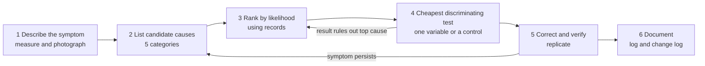
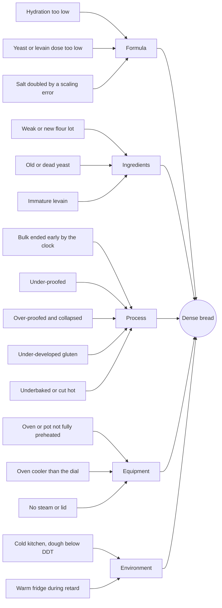

# 18.3 · The diagnostic method: from symptom to root cause

**Requires:** [05.4 The sourdough loaf and the bread clinic](stage-1/module-05/lesson-04.md) · [10.4 Pans, doneness, cooling, syrups and the cake clinic](stage-1/module-10/lesson-04.md)
**Science:** none new; draws on every science unit
**Practical:** the troubleshooting assessment in this lesson (six cases) · your own failed bakes · **Experiment:** design a discriminating test for one of your failures
**Threads:** T12 Experimental method & R&D  **Time:** 60 min reading + 90 min assessment

## Why this lesson exists

You have run four clinics: bread ([05.4](stage-1/module-05/lesson-04.md)), cakes ([10.4](stage-1/module-10/lesson-04.md)), choux ([14.2](stage-1/module-14/lesson-02.md)) and lamination ([15.4](stage-1/module-15/lesson-04.md)). Each used the same moves, adapted to one product family. This lesson makes the method explicit, so you can apply it to any product, including ones this course never covers. Diagnosis is the core skill of R&D: a development project is a long series of "this is not what I wanted, why?", answered with evidence. The method also protects you from the two usual failures: changing five things at once, and fixing the wrong cause because it was the first one that came to mind.

## You will be able to

1. Write a precise, measured symptom statement for a failed product.
2. Generate candidate causes systematically across formula, ingredients, process, equipment and environment, using a fishbone diagram.
3. Rank causes using your records and the troubleshooting database, and design the cheapest test that discriminates between the top two.
4. Recognize the common confounded failures, where two different causes produce similar symptoms, and the evidence that separates them.
5. Correct, verify with replicates, and document the outcome in a troubleshooting log and the recipe's change log.

## The six steps

### 1. Describe the symptom precisely

"The bread was bad" cannot be diagnosed. A useful symptom statement says **what** is wrong, **where** in the product, **how much** compared with the specification, and **when** it was first seen.

| Vague | Precise |
|---|---|
| Dense bread | Loaf 7.5 cm tall (spec 9–11). Crumb tight in the lower two-thirds, 3–4 large holes just under the top crust. Base damp. Crust colour on card: shade 4 (normal) |
| The cake sank | 2 cm dip across the central 8 cm. Grey, wet band 1 cm thick under the dip; edges fine. Seen at 10 min out of the oven |
| Croissants leaked | Pool of butter about 5 mm deep on the tray at 8 min. Croissants 8.5 cm long (normal 13–15). Cross-section: layers merged, bready centre |

Measure with the same tools as your specification ([18.2](stage-1/module-18/lesson-02.md)): weight, dimensions, internal temperature if still possible, colour against your reference card. **Cut and photograph a cross-section** with a ruler in frame, from the same position you use for good products. The cross-section is often the whole diagnosis: the location of a dense band, a tunnel or a gummy streak points to when in the process it formed. Where it helps, check a second piece: is the fault in every piece, or one? One piece suggests position (tray, oven) or handling; every piece suggests formula or process.

### 2. List candidate causes across five categories

Before you judge anything, list **everything** that could produce the symptom. Work through five categories so that you do not stop at the first idea.

| Category | Ask | Examples |
|---|---|---|
| **Formula** | Is the recipe balanced? Was it scaled correctly? | Hydration, sugar, fat, leavener, yeast dose; rounding error |
| **Ingredients** | Were the materials what the formula assumes? | New flour lot, weak flour, old yeast, egg size, butter fat %, starter maturity |
| **Process** | Was each step done to its endpoint? | Mixing, DDT, bulk and proof endpoints, shaping, folding, bake time, cooling |
| **Equipment** | Did the tools do what you think? | Oven temperature, rack position, pan material and size, scale, thermometer |
| **Environment** | What did the kitchen add? | Room temperature, fridge temperature, humidity, a draught, a warm proof spot |

The **fishbone (Ishikawa) diagram** is this list drawn as a picture, with the symptom as the head and each category as a bone. It is a standard quality-management tool. Here it is for dense bread:

The same diagram as a table, which is easier to fill in on paper:

| Formula | Ingredients | Process | Equipment | Environment |
|---|---|---|---|---|
| Hydration too low for the flour | Weak or new flour lot | Bulk ended early (+20–40 %) | Oven or pot not preheated 45 min | Kitchen cold; dough below DDT |
| Yeast or levain dose low | Old or dead yeast | Under-proofed | Oven cooler than dial | Fridge warm (7–8 °C): over-proof in retard |
| Salt doubled | Immature levain | Over-proofed, collapsed | No steam or lid removed early | — |
| — | — | Under-developed gluten | — | — |
| — | — | Underbaked or cut hot | — | — |

### 3. Rank causes using your records

Now use evidence. For each candidate, ask what it would predict, and check the product and the bake record ([03.2](stage-1/module-03/lesson-02.md) lab notebook). Each piece of evidence **promotes** or **eliminates** a cause.

| Evidence in the record | Promotes | Eliminates or weakens |
|---|---|---|
| Dough 22 °C after mixing, bulk ended at +25 % after 2 h | Cold dough, bulk ended early | Over-fermentation |
| Poke test sprang back fast; loaf burst at the side | Under-proof | Over-proof |
| Oven thermometer read 250 °C, pot preheated 50 min | — | Cool oven, poor preheat |
| Internal temperature 97 °C, cut after 2 h | — | Underbaked, cut hot |
| Same flour lot as the last five good loaves | — | New flour lot |

Two further ranking aids: **base rates** (for learners, under-fermentation is far more common than dead yeast; each troubleshooting table lists causes from most to least common) and **what changed** since the last good batch. Ask that question first. If the only thing that changed was the weather, start with temperature.

Finish step 3 with a **most probable cause** and a **second candidate**.

### 4. Design the cheapest discriminating test

A good test is one whose outcome would be **different** depending on which of your top two causes is true. Tests that both causes would pass are wasted bakes. Choose the cheapest one that discriminates, in this order:

| Cost | Test | Example |
|---|---|---|
| Free | Read the record more carefully; look again at the cross-section | Where is the dense band? Base → under-proof or separation; under the top → underbake |
| Minutes | Check an instrument | Oven thermometer at the rack you use; fridge thermometer on the shelf; ice-bath check of the probe ([X1-02](experiments/X1-02-calibration.md)) |
| An hour | A small side test | Yeast foam test; a gluten windowpane; bake one cookie ball as a tester |
| A split batch | Divide one batch and change **one** variable in one half, keeping the other half as a **control** | Two loaves from one dough: one proofed 45 min, one 75 min |
| A full re-bake | Change one variable next time and compare with the record | Only when a split is impossible |

A split batch with a control is the strongest home test, because both halves share the same ingredients, mixing and day. A re-bake on another day changes many things at once (see the day-to-day variation you measure in [X1-44](experiments/X1-44-batch-consistency.md)).

### 5. Correct and verify

Make the correction, then confirm two things: the symptom is **gone**, and **nothing else broke** (a longer proof that fixes density can produce a flatter loaf). One good result is not proof: the variation you measured in X1-44 means a single batch can look fixed by chance. Repeat at least once. If the symptom persists, go back to step 2 with the new evidence.

### 6. Document

Write it down in two places:

- **Troubleshooting log** in your notebook: date, product, batch ID, symptom statement, candidates, evidence, test, result, root cause, correction, verified (yes/no, which batches).
- **The recipe's change log** ([18.2](stage-1/module-18/lesson-02.md)) if the fix changes the standard: a new version with the reason.

If your case was not in the troubleshooting database, write your own entry in its format (Symptom → likely causes → how to test → correction). That is how professional troubleshooting references are built.

## Five whys: from cause to root cause

The first cause you find is often a **proximate** cause. Asking "why?" repeatedly (usually 3–5 times) finds the **root cause**: the one whose correction stops the fault recurring. The technique comes from manufacturing quality practice. Example from a production day like the one in [18.1](stage-1/module-18/lesson-01.md):

| Why? | Answer |
|---|---|
| Why were the croissants flat, bready and sitting in butter? | The butter layers melted before the croissants went into the oven |
| Why did the butter melt? | The croissants proofed at about 30 °C instead of 25–26 °C |
| Why were they at 30 °C? | They proofed on the hob, above the oven that was preheating for the bread |
| Why were they on the hob? | The usual proofing place is the oven with its light on, and the oven was busy |
| Why was there no other place? | The production plan listed the oven for baking but not its second job as a proof box |

**Root cause:** the plan did not account for the oven's two roles. **Correction:** a cooler box with a jar of warm water and a thermometer, and a "proof location" column in the plan. Correcting only the proximate cause ("proof cooler next time") would fail the next busy morning.

Two warnings: stop when you reach a cause you can act on (the chain can always go further), and base each "why" on evidence, not a plausible story.

## Using the troubleshooting database

The course's troubleshooting database is organized by product category. The index and method page is [troubleshooting/README.md](troubleshooting/README.md).

| Category | File |
|---|---|
| Lean bread: dough and fermentation | [bread-lean.md](troubleshooting/bread-lean.md) |
| Bread: baking, crust and staling | [bread-baking.md](troubleshooting/bread-baking.md) |
| Sourdough and preferments | [sourdough.md](troubleshooting/sourdough.md) |
| Enriched doughs | [enriched-dough.md](troubleshooting/enriched-dough.md) |
| Cookies and caramel | [cookies.md](troubleshooting/cookies.md) |
| Muffins, quick breads, scones | [quick-breads.md](troubleshooting/quick-breads.md) |
| Eggs, foams, emulsions | [eggs-foams-emulsions.md](troubleshooting/eggs-foams-emulsions.md) |
| Cakes | [cakes.md](troubleshooting/cakes.md) |
| Short pastry, pies, tarts | [short-pastry.md](troubleshooting/short-pastry.md) |
| Custards and creams | [custards-creams.md](troubleshooting/custards-creams.md) |
| Syrups, meringues, buttercreams | [meringues-buttercreams.md](troubleshooting/meringues-buttercreams.md) |
| Choux | [choux.md](troubleshooting/choux.md) |
| Laminated doughs | [laminated.md](troubleshooting/laminated.md) |
| Chocolate and ganache | [chocolate.md](troubleshooting/chocolate.md) |
| Assembled pastries | [assembled-pastries.md](troubleshooting/assembled-pastries.md) |

How to use it inside the method:

1. **Step 2:** open the category for the product and find the symptom in the index at the top. Copy all the listed causes into your fishbone; add any from other categories that apply (a pale crust appears in both bread files; an assembled tart may need the short-pastry, custard and assembled-pastry files).
2. **Step 3:** causes are listed from most to least common for a learner. Use the "How to test" column as your checklist of evidence to look for in the record.
3. **Step 4:** the "How to test" column often *is* the cheapest discriminating test.
4. **Step 5:** the "Correction" column, applied one change at a time.
5. The short reasoning under each table usually tells you which feature of the product separates the causes (for example, *where* a gummy band sits in a cake).

## Confounded failures: when two causes look alike

Some faults have two or three common causes that produce almost the same symptom. Fixing the wrong one makes things worse. Learn the discriminating evidence for these pairs.

| Symptom | Cause A | Cause B | Evidence that separates them | Cheapest discriminating test |
|---|---|---|---|---|
| Low loaf volume, poor spring | **Under-proofed** | **Oven too cool or not fully preheated** | A: fast poke spring-back, burst side, dense base, normal crust colour. B: loaf spread before setting, score sealed or barely opened, pale and thick crust, long bake needed | Oven thermometer on the rack plus a pot-preheat check: free. If the oven is right, split the next dough: two proof times |
| Gummy crumb in bread | **Underbaked** | **Cut hot** | A: internal < 96 °C, pale crust, gummy in the centre and base even the next day. B: internal was ≥ 96 °C, gumminess on the knife-compressed face, next-day slice fine | Probe at pull; cut one loaf at 2 h and hold a second until next day |
| Gummy band in bread (third cause) | Underbaked or cut hot | **Over-proofed** | Over-proof: flat loaf, collapsed or coarse crumb, dense compressed layer along the base, pale crust, lasting poke dent | Record check: proof time, fridge temperature, poke test |
| Gummy streak in cake | **Underbaked** | **Batter separated or curdled** | Location: under the top or split = underbake; parallel to the base = separation (fat, flour or undissolved sugar sank) ([gummy layer or streak](troubleshooting/cakes.md?id=gummy-layer-or-streak)) | Probe at 93–99 °C; record of egg and butter temperatures |
| Butter pool under croissants | **Proofed too warm** (butter melted in proof) | **Under-proofed** (layers too tight; butter escapes before the dough sets) | A: proof temperature above about 28 °C, greasy surface before baking, merged layers, bready interior. B: proof at 25 °C but short, croissants small and tight, no jiggle, distinct but compressed layers | Next batch: proof at a measured 25–26 °C and bake half at the usual time, half when they jiggle |
| Choux collapses after baking | **Underbaked** (walls still wet) | **Too much egg** (batter too slack) | A: shells rose well and held their piped shape, then fell once out; pale; moist web inside. B: piped shapes spread flat before baking, rose little | Cut a shell open; compare piped shape at 0 min with the plan ([14.2](stage-1/module-14/lesson-02.md)) |
| Cookies spread too much | **Dough too warm** | **Oven too cool** | A: dough above 24 °C at scooping, greasy look. B: oven thermometer low, pale cookies that spread slowly and evenly | Bake one cold ball and one room-temperature ball on the same tray; check the oven thermometer |
| Soggy tart base | **Shell underbaked** | **Moisture migration from the filling** | A: base pale and soft at the centre even when first filled. B: shell was crisp at filling, soft hours later; no seal ([X1-43](experiments/X1-43-moisture-migration.md)) | Break a piece of an unfilled shell from the same bake; note the time between filling and serving |

**Key idea:** When two causes predict different evidence, find that evidence before you change anything. When they predict the same evidence, split a batch. The difference between a good diagnostician and a lucky one is that the good one knows which of those two situations they are in.

## Troubleshooting assessment

Six failed products from across the course. Each case gives the symptoms and the baker's record, as a colleague would. For each case, write in your notebook before opening the answer:

1. A precise symptom statement.
2. Candidate causes in the five categories (at least four).
3. Your most probable cause and a second candidate, with the evidence for each.
4. The cheapest test that would discriminate between them.
5. The correction.

Allow about 15 min per case. Use the troubleshooting files.

### Case 1 — Bread: the loaf that would not spring

[R1-06](recipes/R1-06-sourdough-loaf.md). Starter refreshed twice; levain doubled in 6 h. Dough 25.5 °C; bulk 5 h to +60 %, domed, convex edges. Retarded 12 h at 4 °C (measured). Poke test in the morning: slow partial spring-back, as usual. The baker was in a hurry: the oven was switched on "about 25 min" before loading, and the loaf went into the pot at 250 °C on the dial. Result: 7 cm tall (usual 10 cm), 23 cm wide, score barely opened and sealed at the edges, crust thick and pale-golden after the full 45 min, crumb reasonably open but with no ear. Internal temperature 97 °C.

Answer

**Symptom:** low volume (7 vs 10 cm), spread (23 vs 20–22 cm), score sealed, crust pale and thick despite a full-length bake; crumb open.

**Most probable cause: pot and oven not preheated (equipment/process).** 25 min is well short of the 45 min the pot needs; a home oven's dial also reaches "temperature" before the walls and pot are soaked. A cool pot sets the loaf slowly: it spreads before it sets, the surface dries before the score can open, and the crust colours slowly and thickens during the long bake. **Second candidate: under-proof.** Eliminated by the evidence: the bulk and proof cues were normal, and an under-proofed loaf would have a dense crumb, a burst side and a normal crust colour. Over-proof is also unlikely: poke test normal, fridge measured at 4 °C.

**Test:** free. Put an oven thermometer inside the pot during a 25 min and a 45 min preheat, or an IR thermometer on the pot base. **Correction:** preheat the pot 45 min at 250 °C and put preheating on the plan's critical path. See [poor oven spring](troubleshooting/bread-lean.md?id=poor-oven-spring) and [pale crust](troubleshooting/bread-baking.md?id=pale-crust).

### Case 2 — Cake: the streak

[R1-17](recipes/R1-17-pound-cake.md) pound cake. Eggs straight from the fridge (7 °C). The batter "looked a bit curdled after the fourth egg addition" but went smooth when the flour was added. Oven thermometer 165 °C. Baked 60 min; probe 96 °C under the split; skewer clean. Cooled 1.5 h. The cake has a normal height and a clean split, but when sliced there is a dense, moist, slightly greasy band about 1 cm thick running parallel to the **base** along its whole length. The crumb above it is fine.

Answer

**Symptom:** a 1 cm dense, moist, greasy band parallel to the base, full length; normal height, split and upper crumb.

**Most probable cause: the creamed emulsion broke (process/ingredients: cold eggs), and fat and liquid separated to the bottom of the pan.** Evidence: eggs at 7 °C against a spec of 18–22 °C; visible curdling; the band is at the **base**, not under the split; the internal temperature (96 °C) and a clean skewer rule out underbaking, which would give a band under the top or split. **Second candidate: under-creamed batter** (too little air to hold the structure evenly), which gives a similar streak; the record does not show the creaming time or batter temperature, so it cannot be excluded.

**Test:** next bake, eggs at 18–22 °C, same everything else, and record the creaming time and the batter temperature and SG. If the band disappears, the emulsion was the cause. **Correction:** temper eggs (10 min in 35 °C water), add in 6–8 parts, fix the temperature before continuing if the batter curdles. See [gummy layer or streak](troubleshooting/cakes.md?id=gummy-layer-or-streak) and [curdled creamed batter](troubleshooting/cakes.md?id=curdled-creamed-batter).

### Case 3 — Pastry: the tart that went soft

[R1-39](recipes/R1-39-fruit-tart.md) fruit tart for a Sunday lunch. The shell was blind-baked on Saturday afternoon "until the rim was golden"; the base was "a little pale in the middle but dry to the touch". Not sealed. The pastry cream was piped in and the fruit arranged at 21:00 on Saturday to save time in the morning; refrigerated overnight. At 13:00 on Sunday the rim is crisp, but the base under the cream is soft, bends when a slice is lifted, and is visibly wet and pale at the centre. The cream is fine.

Answer

**Symptom:** base soft, pale and wet at the centre 16 h after filling; rim crisp; cream normal.

**Two causes stacked:** (1) **Moisture migration** from the pastry cream into an unsealed shell over 16 h (process/planning); (2) an **underbaked base** (pale in the centre; the rim is not a good doneness guide for the base). Evidence: the time between filling and serving; no seal; the pale centre at blind-bake time. Both are consistent; the record does not tell you which dominated.

**Test (discriminating):** next time, bake the shell until the base is evenly golden and matt, then split the job: seal half the base area with melted cocoa butter or chocolate and leave half unsealed, fill, and taste both halves at 2 h and 16 h. Or run [X1-43](experiments/X1-43-moisture-migration.md). **Correction:** fully bake the base, seal it, and assemble within a few hours of serving: assembly is an "as late as possible" step ([18.1](stage-1/module-18/lesson-01.md)). See [soggy bottom](troubleshooting/short-pastry.md?id=soggy-bottom) and [pale, underbaked base](troubleshooting/short-pastry.md?id=pale-underbaked-base).

### Case 4 — Custard: the grainy brûlée

[R1-25](recipes/R1-25-creme-brulee.md). Six ramekins. No roasting tin big enough, so the baker skipped the water bath and baked them on a tray at 150 °C (dial; no oven thermometer used). Baked 40 min "until firm in the middle". After chilling: the custard is set but grainy on the tongue, especially near the edge; there is a thin layer of watery liquid on the surface and small holes near the sides. One ramekin probed at the end read 89 °C in the centre.

Answer

**Symptom:** grainy texture, worse at the edges; syneresis (weeping); small holes near the sides; centre 89 °C at pull.

**Most probable cause: over-coagulation from overheating: no water bath (equipment/process) and baked to "firm" instead of to 78–82 °C with a wobble (process).** Without a bath the edges heat far above the centre; the proteins over-coagulate, contract and squeeze out water (weeping), and water turning to steam leaves holes. The 89 °C centre confirms the whole custard was overcooked. **Second candidate:** an oven running hotter than its dial, which would add to the same effect; untested because no oven thermometer was used.

**Test:** oven thermometer (free), and a split batch: three ramekins in a water bath (or in a 100–110 °C fan oven, R1-25's alternative) and three without, all pulled at 80 °C centre. **Correction:** water bath at half to two-thirds height with 60–70 °C water, pull at 78–82 °C. See [baked custard weeping, grainy or full of holes](troubleshooting/custards-creams.md?id=baked-custard-weeping-grainy-or-full-of-holes).

### Case 5 — Choux: the éclairs that fell

[R1-32](recipes/R1-32-eclairs-profiteroles.md) éclairs from an [R1-31](recipes/R1-31-pate-a-choux.md) batter. Panade dried until a film formed on the pan base. Egg added until the batter formed a "V" that held and slowly folded; piped 12 cm lines held their shape well on the tray. Baked in a fan oven: they rose well and looked golden at 22 min. The baker opened the door at 22 min "to check", took them out at 25 min when they looked done, and put them on a rack. Within 5 min they had wrinkled and sunk to about half their height. The outside is golden but soft; cut open, the inside is moist, with a wet web of dough across the cavity.

Answer

**Symptom:** good rise, then collapse to half height within 5 min of leaving the oven; soft golden shell; wet internal web.

**Most probable cause: underbaked shells (process): walls not dried enough to hold their shape once the steam pressure dropped.** Evidence: the batter consistency was right (a holding "V"; piped lines did not spread), the rise was good, the collapse came *after* removal, and the interior was wet. Opening the door at 22 min also dropped the oven temperature before the walls had set. **Second candidate: too much egg**, eliminated because the piped shapes held and rose well; a slack batter spreads and rises poorly from the start.

**Test:** cut one shell at the "looks done" point next time; if the walls are wet, bake longer. **Correction:** do not open the door for the first two-thirds of the bake; bake until deep golden and the sides feel firm; then vent (a small hole in each shell or the door ajar for the last 5–10 min at a lower temperature) to dry the walls ([14.2](stage-1/module-14/lesson-02.md), [X1-38](experiments/X1-38-choux-oven.md)). See [choux collapsed after baking](troubleshooting/choux.md?id=choux-collapsed-after-baking).

### Case 6 — Laminated: the butter pool

[R1-34](recipes/R1-34-croissant.md). Lamination went well: the baker saw clean, even layers when the dough was cut. The 12 shaped croissants were proofed "somewhere warm to speed things up", on a tray on top of the fridge next to a radiator. A thermometer placed beside them afterwards read 31 °C. After 1 h 20 min they had "roughly doubled" and looked shiny and slightly greasy on the surface, with the layers at the cut edges looking smeared. Oven 200 °C, measured. In the oven, butter ran out onto the tray within 8 min. The baked croissants are small (9 cm long; usually 13–15 cm), with a dense, bready, uniform interior and a greasy base; very few distinct layers.

Answer

**Symptom:** butter leaked within 8 min; small (9 cm long vs 13–15 cm); bready interior with few layers; greasy base; the unbaked croissants were shiny and greasy with smeared edges.

**Most probable cause: proofed too warm (environment/process): at 31 °C the butter layers softened and partly melted into the dough before baking.** Evidence: proof temperature well above 27 °C; a greasy, shiny surface and smeared layers *before* the oven; merged layers and a bready crumb (no separate butter layers to make steam and lift). Lamination was good (clean layers at cutting), and the oven was measured, which removes those causes. **Second candidate: under-proofed**, which also makes small croissants that leak butter. Only "roughly doubled" in 1 h 20 min, so they may also have been short of full proof, but under-proof alone would leave distinct, tight layers, not smeared ones.

**Test:** next batch, proof in a cooler box at a measured 25–26 °C; bake half at the first sign of a jiggle and half at full proof (about 2–2.5×, wobbling). **Correction:** proof at 24–27 °C, never above 28 °C, and judge by jiggle and volume, not time ([15.3](stage-1/module-15/lesson-03.md), [X1-40](experiments/X1-40-croissant-temperature.md)). See [butter leaking during baking](troubleshooting/laminated.md?id=butter-leaking-during-baking), [bready, dense interior](troubleshooting/laminated.md?id=bready-dense-interior) and [underproofed croissants, tight and leaking](troubleshooting/laminated.md?id=underproofed-croissants-tight-and-leaking).

## On the bench

1. Complete the six-case assessment above and score yourself: one point each for the correct most probable cause, a sensible second candidate, a discriminating test, and a correction (24 points). 18 or more is a pass.
2. Take your last two failed products from any module. Run the full six-step method on each, draw the fishbone, and design the discriminating test. Run at least one of the tests.
3. Start a troubleshooting log in your notebook if you do not have one.

## What goes wrong

| Symptom of poor diagnosis | Why it happens | Correction |
|---|---|---|
| Several things changed, the product improved, and you do not know why | Impatience | One change per bake, or a split batch with a control |
| The fix works once, then the fault returns | Single-batch verification; a proximate cause fixed | Replicate; ask "why" again |
| Every failure is blamed on the recipe | Not checking process and equipment evidence | Work all five fishbone categories; check instruments first |
| Cannot diagnose at all | No record | Record CCP values every bake; they are the evidence |
| The first plausible cause is always accepted | Confirmation bias | Always name a second candidate and a test that could prove you wrong |

## Lab notebook

A troubleshooting log with one entry per failure:

| Field | Content |
|---|---|
| Date, product, recipe version, batch ID | |
| Symptom statement | What, where, how much vs spec, when; photo reference |
| Candidate causes | Fishbone by category |
| Evidence | From the record and the product: promotes / eliminates |
| Most probable and second cause | |
| Test | What, and what result would favour each cause |
| Result | |
| Root cause (after 5 whys) | |
| Correction and verification | Batches that confirmed it |
| Change log entry | Recipe version created, if any |

## Check yourself

1. A loaf is dense. The record shows dough at 25 °C, bulk +65 %, proof 60 min, oven verified. What should you look at next, and why?

Answer

The cross-section and the bake end: where is the density, and what was the internal temperature and cooling time? With fermentation and oven apparently fine, underbaking or cutting hot, shaping (trapped flour, degassing) or a flour change become more likely. Also check the proof cue (poke test) and the fridge if retarded. The location of the dense area points to the stage.

2. Why is a split batch a stronger test than baking again next week with one change?

Answer

Both halves share ingredients, mixing, dough temperature and day, so the only difference is the variable you changed. A bake next week changes many things at once (flour, kitchen temperature, your handling), and day-to-day variation (X1-44) can be as large as the effect you are testing.

3. Cookies spread more than usual. Name the cheapest test that separates "dough too warm" from "oven too cool".

Answer

Check the oven thermometer (free), and bake one ball straight from the fridge next to one at room temperature on the same tray. If both spread equally and the oven reads low, the oven is the cause; if only the warm one spreads, it is dough temperature.

4. In a 5-whys chain, when do you stop?

Answer

When you reach a cause you can act on and whose correction would prevent the fault from recurring, usually a process, plan or specification gap rather than a single mistake. Each step must be supported by evidence, not by a plausible story.

## Where this goes next

**Next:** [19.1 Designing experiments and sensory tests](stage-1/module-19/lesson-01.md) turns the discriminating test into a full experimental design with replicates and blind tasting, and the [capstone](stage-1/capstone/README.md) requires a documented diagnosis of at least one failure during development.
**Stage 2:** diagnosis in production, where faults show up across a batch of 200 pieces and the record includes mixer, retarder-proofer and deck-oven logs; supplier and ingredient-lot faults. **Stage 3:** formal root-cause analysis (fishbone with weighted causes, fault trees), designed follow-up experiments with statistical analysis, and failure-mode and effects analysis (FMEA) used *before* a product launches to predict what could go wrong.

## Sources

- [Cauvain-BPS] — symptom-cause structure of bakery troubleshooting; the model for the troubleshooting database.
- [Corriher] — cause-and-effect diagnosis of cakes, pastry and bread.
- [Figoni] — ingredient functions used to reason from symptom to cause.
- [Suas] · [Hamelman] — bread and viennoiserie faults and their process causes.
- [Gisslen] — common faults and their causes across product families.
- Fishbone (Ishikawa) diagrams and the five-whys technique are standard quality-management practice.
