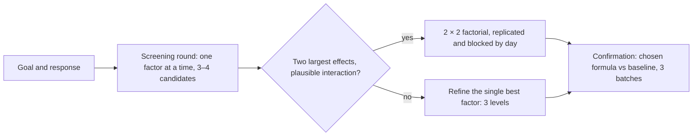

# 19.1 · Designing experiments and sensory tests

**Requires:** [18.3 The diagnostic method: from symptom to root cause](stage-1/module-18/lesson-03.md) · [18.2 Standardization, batch consistency, costing and quality control](stage-1/module-18/lesson-02.md)

**Science:** [SC-14 Measurement, sensory evaluation and variability](stage-1/science/sc-14-measurement-sensory.md)

**Practical:** a baseline bake of the product you are considering for the [capstone](stage-1/capstone/README.md) · **Experiments (review):** [X1-44 Batch consistency](experiments/X1-44-batch-consistency.md) · [X1-20 Butter state and dough rest](experiments/X1-20-cookie-spread.md) (your first 2 × 2) · [X1-14 Levain](experiments/X1-14-levain.md)

**Threads:** T12 Experimental method & R&D · T1 Measurement & formulation math  **Time:** 90 min reading + one 2 h practice session (sensory test and a noise check)

## Why this lesson exists

You have run 44 experiments that someone else designed. In the capstone you design your own, and the design decides whether your conclusions mean anything. Most failed development projects do not fail at the bench. They fail because the variable was confounded with bake order, because one loaf per variant was treated as proof, or because the person who made the new version also judged it. This lesson turns what you learned in [SC-14](stage-1/science/sc-14-measurement-sensory.md) and [X1-44](experiments/X1-44-batch-consistency.md) into a working method: a question becomes a testable hypothesis, the hypothesis gets a measurable response, the design protects that response from noise and bias, and a small factorial design shows you what one-variable-at-a-time testing cannot.

## You will be able to

- Turn a product goal into a hypothesis with a direction, a mechanism and a measurable response variable.
- Choose instrumental proxies and sensory tests that a home kitchen can run, and say what each one can and cannot tell you.
- Design a 2 × 2 factorial experiment and calculate the two main effects and the interaction from four cell means.
- Build replicates, randomization, blocking and blinding into a bake plan, and use your measured batch-to-batch noise to decide whether a difference is real.
- Run a triangle test or paired comparison with coded samples and read the result against the critical-value table, with a panel you have briefed on allergens and safety.

## From question to hypothesis

A development project starts with a goal, usually vague: "softer", "less sweet", "crisper for longer". Before you bake anything, push it through four steps.

| Step | What you write | Weak example | Strong example |
|---|---|---|---|
| 1. Goal | What the product must do better, for whom | "Better cookies" | "A cookie with 25 % less sugar that is still chewy in the centre on day 2" |
| 2. Response | The measurable attribute(s) that define "better", with a target | "Chewier" | "Centre snap force on day 2 within ±15 % of baseline; spread ratio 6–8; blind paired test: not less chewy" |
| 3. Mechanism | Why a change should move the response ([18.3](stage-1/module-18/lesson-03.md) asks the same question backwards) | — | "Less sucrose means less syrup to plasticize the centre and faster drying; brown sugar's invert and molasses hold water" |
| 4. Hypothesis | "If I change X from a to b, Y will move in direction d by roughly m, because M." | "Brown sugar will help" | "Replacing half the white sugar with brown sugar in the −25 % formula will reduce day-2 centre snap force by at least 20 %, because invert sugar keeps the centre more hydrated and amorphous" |

The strong hypothesis can be wrong, and you will know if it is. That is the point. A prediction of magnitude ("by at least 20 %") is optional at Stage 1, but writing one forces you to think about whether the effect you expect is larger than your noise (see below). If it is not, you need more replicates or a bigger step in the variable.

**Key idea:** A hypothesis is only useful if you have decided, before the bake, which result would count against it. Write the decision rule in your notebook next to the hypothesis: "If the difference in day-3 compression is less than 3 percentage points, I will treat tangzhong 10 % as no better than 7 %."

## Choosing response variables

Pick a small set of responses: one or two **primary** responses that define success, and a few **guard** responses that must not get worse (a softer loaf that collapses is not a success). Prefer measurements over impressions, and measure the same way every time.

### Instrumental proxies you can run at home

| Response | Method | Resolution you can expect | Used before in |
|---|---|---|---|
| Weight, bake loss | Scale, 1 g; bake loss % = (dough − baked) ÷ dough × 100 | ±0.5 g | [X1-11](experiments/X1-11-bake-time.md), [R1-11](recipes/R1-11-chocolate-chip-cookie.md) |
| Height, dome, thickness | Ruler or caliper at the geometric centre; for loaves, the tallest point and the centre of a slice | ±0.5 mm with a caliper | [X1-04](experiments/X1-04-hydration-series.md) |
| Diameter and **spread ratio** | Two diameters at right angles, averaged; spread ratio = diameter ÷ centre thickness | ±1 mm | [X1-18](experiments/X1-18-cookie-sugar-level.md), [X1-20](experiments/X1-20-cookie-spread.md) |
| Volume and **specific volume** | Seed displacement (rapeseed or millet in a box, levelled with a straightedge, 3 readings averaged); specific volume = volume ÷ weight, cm³/g | ±2–3 % of volume if you level carefully | [SC-14](stage-1/science/sc-14-measurement-sensory.md) |
| Colour | Photograph with a white or grey card in frame under fixed light; compare to a printed colour card of numbered shades (pale to dark), or read the average RGB of a fixed area in image software | ±1 shade on a 10-shade card | [X1-11](experiments/X1-11-bake-time.md) |
| Softness, staling | Compression test: 2.0 cm slice, 200 g load on a 6 cm lid for 30 s; compression % and recovery % | ±1 percentage point | [X1-16](experiments/X1-16-tangzhong.md), [X1-12](experiments/X1-12-staling.md) |
| Crispness, snap | Three-point bend: bridge the biscuit or shell across two supports 5 cm apart, hang a cup at the centre and add water slowly from a jug until it breaks; weigh cup + water = break load | ±5–10 % | New here |
| Crumb structure | Scan or photograph the centre slice at fixed distance and light; in free image software such as ImageJ/Fiji, crop a fixed central square, convert to 8-bit grey, apply the same automatic threshold to every image, and run particle analysis: cell count, mean cell area, % area of cells | Good for comparing images taken the same way; meaningless across different set-ups | [X1-04](experiments/X1-04-hydration-series.md) |
| Rise | Marked straight-sided container, % increase at fixed times | ±5 % | [X1-07](experiments/X1-07-fermentation-temperature.md) |
| Acidity | pH strips or meter | ±0.2–0.5 pH (strips) | [X1-14](experiments/X1-14-levain.md) |

Two rules for all of them. First, fix the **measurement protocol** in advance (which slice, which point, how long after baking) and write it into your plan; the same loaf can give very different compression values at hour 2 and hour 6. Second, run a **measurement repeat**: measure one item three times. If the measurement itself varies by more than a small fraction of the differences you are looking for, improve the method before you bake anything else.

### Sensory responses

People detect things instruments at home cannot (flavour, aftertaste, "gumminess"), and in the end the product is judged by people. Use the sensory test that matches the question ([SC-14](stage-1/science/sc-14-measurement-sensory.md), [Lawless]).

| Question | Test | What you get | Panel you need |
|---|---|---|---|
| Can anyone tell the new version from the old one at all? | **Triangle test** (two identical, one different; pick the odd one) | Yes/no against a critical number correct | 12 or more for moderate differences; 6 only finds large ones |
| Is the new version more (softer, sweeter, crisper) than the old on one attribute you predicted in advance? | **Paired comparison**, directional | Count choosing each; compare to the table below | 10–20 |
| How do 3–6 variants order on one attribute? | **Ranking** | Rank sums (lowest sum = ranked first most often) | 6–12; good for screening |
| How does it differ, attribute by attribute? | **Descriptive profile** on 0–10 lines | A profile per sample | 3–6 people who have agreed the attribute definitions and anchors on a practice sample |
| Do people like it? | 9-point hedonic scale | Mean liking | Many (50+) to be meaningful; mostly a Stage 3 tool |

For a directional paired comparison the chance level is 1/2. The minimum number of tasters who must pick the predicted sample, from the binomial distribution with p = 1/2 and α = 0.05, one-sided (the direction was stated before tasting):

| Tasters (n) | Minimum choosing the predicted sample | Probability of reaching it by chance |
|---|---|---|
| 6 | 6 | 1.6 % |
| 8 | 7 | 3.5 % |
| 10 | 9 | 1.1 % |
| 12 | 10 | 1.9 % |
| 15 | 12 | 1.8 % |
| 20 | 15 | 2.1 % |

For the triangle test use the table in [SC-14](stage-1/science/sc-14-measurement-sensory.md): with 12 tasters you need 8 correct; with 9, 6 correct; with 6, 5 correct.

## One factor at a time vs a 2 × 2 factorial

Every X1 experiment except [X1-14](experiments/X1-14-levain.md) and [X1-20](experiments/X1-20-cookie-spread.md) changed one factor and held the rest. That is the right way to learn what a single variable does. It is the wrong way to optimize a product, because ingredients and process variables interact: the effect of one depends on the level of another.

### Worked example: sugar × bake temperature in cookies

Take the [R1-11](recipes/R1-11-chocolate-chip-cookie.md) cookie. Two factors, two levels each:

- **Sugar (S):** total sugar 80 % or 120 % of flour (same brown : white ratio).
- **Oven (T):** 170 °C or 190 °C.

Four cells, each baked as two separate doughs on two days, six cookies per dough; the response is mean diameter in mm. The numbers below are an illustration chosen to be realistic for this cookie, not measured results.

| | 170 °C | 190 °C | Row mean |
|---|---|---|---|
| **Sugar 80 %** | 84 | 78 | 81 |
| **Sugar 120 %** | 102 | 88 | 95 |
| **Column mean** | 93 | 83 | 88 |

**Main effect of sugar** = mean of the high-sugar cells − mean of the low-sugar cells = (102 + 88) ÷ 2 − (84 + 78) ÷ 2 = 95 − 81 = **+14 mm**.

**Main effect of oven temperature** = (78 + 88) ÷ 2 − (84 + 102) ÷ 2 = 83 − 93 = **−10 mm**.

**Interaction.** Look at the temperature effect separately at each sugar level:
- at 80 % sugar: 78 − 84 = −6 mm;
- at 120 % sugar: 88 − 102 = −14 mm.

The interaction contrast is the difference of these differences: −14 − (−6) = **−8 mm**. (Design-of-experiments texts usually report half of this, −4 mm, as the "interaction effect" so that it sits on the same scale as the main effects. Either convention works if you state which one you use; this course uses the difference of differences, as in [X1-20](experiments/X1-20-cookie-spread.md).)

**What it means.** A hotter oven cuts spread much more in a high-sugar dough. Mechanism: more sugar dissolves into a larger volume of syrup as the butter melts, which keeps the dough fluid longer and delays the set; that dough has more spreading "left to do", so an oven that sets the edges sooner removes more of it ([07.3](stage-1/module-07/lesson-03.md)). The low-sugar dough sets early whatever the oven, so temperature matters less.

**What one-factor-at-a-time would have told you.** Starting from 80 % sugar at 170 °C (84 mm), you would test sugar at 170 °C (+18 mm) and temperature at 80 % sugar (−6 mm), and predict that 120 % sugar at 190 °C gives 84 + 18 − 6 = 96 mm. The real cell is 88 mm: an 8 mm error, about the width of the spread tolerance in the R1-11 specification. Adding the separate effects fails exactly when the factors interact, and that is where the interesting product decisions are.

The factorial is also more efficient. Each main effect is estimated from all four cells (half of the doughs against the other half), so with 8 doughs you estimate two effects and an interaction, each with the precision of a 4-vs-4 comparison. The same precision for two separate one-factor experiments would need 16 doughs, and would still not give you the interaction.

**Professional practice:** Development teams screen many candidate variables cheaply, then spend their replicates on the two or three that matter, in a factorial. Beyond three factors a full factorial becomes too large for a home kitchen (2³ = 8 cells, 2⁴ = 16); Stage 3 introduces fractional designs that estimate the main effects with fewer runs.

## Replicates, randomization, blocking and blinding

### What counts as a replicate

A **replicate** is an independent repetition of the whole process that produces the variation you care about. For a loaf, that is a separately mixed, fermented and baked dough. Six cookies from one dough on one tray are **sub-samples**: they tell you about the within-tray spread, but they share every error of that one dough (its temperature, its mixing, that oven load). Averaging them gives one good number for that dough. Treating them as six replicates makes a single lucky dough look like a proven effect. This mistake has a name in statistics, **pseudo-replication**, and it is the most common error in home experiments.

Practical minimum for the capstone: 2 replicate batches per cell in a factorial, 3 for the final confirmation against the baseline.

### Randomization

Anything that changes during a session (oven recovery, dough waiting time, your fatigue, kitchen temperature) will line up with your variable if you always work in the same order. Randomize:

- **Bake order.** Number the variants and roll a die or draw slips for each session; record the order.
- **Tray and rack position.** In a home oven, back corners run hotter ([X1-02](experiments/X1-02-calibration.md)). Either bake one tray at a time in the same position, or rotate positions between replicates so every variant occupies every position once.
- **Mixing staggers.** Keep the fixed offsets you used in every X1 experiment (e.g. 15 min between doughs), so every dough gets the same time from mixing to oven, but randomize which variant goes first.

### Blocking

A **block** is a group of runs made under conditions you expect to be similar: one day, one bag of flour, one oven session. If you cannot run every cell on the same day, run *every cell once on each day*. Day 1 and day 2 are then two blocks. Differences between days (humidity, kitchen temperature, a new egg carton) affect all cells equally and drop out when you compare cells within a day. The worst design puts all low-sugar doughs on Saturday and all high-sugar doughs on Sunday: sugar and day are then perfectly confounded and you cannot separate them.

### Blinding

You are biased toward the version you believe in, in how you shape it and how you judge it. Protect the data:

- Someone else labels samples with **random three-digit codes** (e.g. 418, 736, 205) and keeps the key; tasters, including you, see only codes.
- Measure instrumental responses from coded samples where you can (crumb photos, compression slices).
- Balance presentation orders across tasters (for triangle tests, the six orders AAB, ABA, BAA, BBA, BAB, ABB equally often).
- Serve identical portions at the same temperature on identical plates; taste individually and write before anyone talks.

## Noise vs signal

In [X1-44](experiments/X1-44-batch-consistency.md) you baked the same product three times and measured its batch-to-batch standard deviation (SD). That number is your noise floor. Every capstone conclusion is a comparison against it.

The [SC-14](stage-1/science/sc-14-measurement-sensory.md) rule of thumb: treat a difference smaller than about 2 SD as unproven. When you compare *means* of several batches, the noise shrinks and you can make that rule sharper. If one batch has SD σ:

| Quantity | Noise (SD) | With σ = 2 mm and 2 batches per cell |
|---|---|---|
| One cell mean from n batches | σ ÷ √n | 2 ÷ √2 = 1.4 mm |
| Main effect in a 2 × 2 (4 batches vs 4 batches) | σ × √(1/4 + 1/4) = σ × 0.71 | 1.4 mm |
| Interaction contrast (difference of differences of the four cell means) | 2 × σ ÷ √n | 2.8 mm |

Apply it to the cookie example, assuming X1-44 gave a batch-to-batch SD of 2 mm for mean diameter. The sugar effect (+14 mm) is 10 times its noise, the temperature effect (−10 mm) 7 times: both real. The interaction (−8 mm) is about 2.8 times its noise: probably real, and worth confirming, especially if the direction is the same on both days. Check that: if the temperature effect was larger at high sugar on day 1 *and* day 2, you have more confidence than the arithmetic alone gives you.

**Warning:** If you have not measured your noise, you cannot interpret your results. Bake the capstone baseline at least three times before you change anything ([19.2](stage-1/module-19/lesson-02.md), step 2). A baseline CV above about 5 % on your primary response means your process is not yet under control; fix that first ([18.2](stage-1/module-18/lesson-02.md)), because no formula change will show through it.

## Small batches that still behave like the product

Small batches save ingredients and let you bake all cells in one session, but some responses change with size. Before you shrink, ask whether the response depends on **geometry, mass or time**.

| Product type | Safe to shrink? | Keep constant | Minimum sensible batch |
|---|---|---|---|
| Cookies, scones, muffins | Yes, by number of pieces | Portion weight, tray, spacing | One tray of 6 per dough |
| Pan breads | Partly: small pans bake and stale faster | Pan depth and fill ratio; rank variants in small pans, confirm at full size | 150 g flour per small pan ([X1-16](experiments/X1-16-tangzhong.md)) |
| Hearth loaves | Partly: crust-to-crumb ratio changes | Piece weight | 200–250 g flour |
| Cakes | No, if the response is dome, set or moistness | Pan diameter and depth (heat path) | The smallest pan you will actually sell or serve in; 15 cm is the practical minimum |
| Laminated doughs | No below a size you can laminate evenly | Butter : dough ratio, fold sequence, final thickness | About 250 g flour ([X1-40](experiments/X1-40-croissant-temperature.md)) |
| Custards, creams | Yes for set; heating rate changes in small pans | Heating rate (log °C/min) | 200–250 g liquid |
| Chocolate tempering | No: small masses cool too fast to hold temper | Mass | 300–500 g chocolate |

Weigh anything under about 10 g on a 0.01–0.1 g scale, or use a premix ([SC-14](stage-1/science/sc-14-measurement-sensory.md)).

## Safety and ethics of tasting panels

A tasting panel is a small human study. Treat it with the same care as a customer.

**Safety:** Before anyone tastes, give each taster a written list of every ingredient and allergen in every sample (gluten, egg, milk, nuts including almond flour and praline, soy lecithin in chocolate, sesame, and any new ingredient you are testing), and ask about allergies and dietary restrictions. People with an allergy to anything in the set do not taste that set. Never serve raw dough, raw batter or raw-egg preparations; raw flour and raw egg carry pathogens ([FDA-flour], [FDA-eggs]). Keep creams, custards and filled pastries at 5 °C or below until serving and discard them after 2 h at room temperature ([FDA-FoodCode]). Label alcohol, and do not serve it to minors. Children taste only with a parent's agreement.

Ethics beyond safety: tell tasters what the session is for, that they can stop at any time and do not have to finish a sample, and that their scores are anonymous. Do not pressure anyone toward an answer ("the new one is better, isn't it?"): apart from being unfair, it destroys the data.

## On the bench

Run a 2 h practice session before the capstone starts:

1. **Noise check.** Take your X1-44 data (or bake the candidate capstone product twice). Calculate the SD of your primary response and write your "real difference" threshold next to it.
2. **Measurement repeat.** Measure one item three times with the method you plan to use (seed displacement, compression, snap). If the spread of those three is more than a third of your threshold, improve the method.
3. **Mini triangle test.** Two versions that differ slightly (the same cookie at 1.6 % and 1.0 % salt, or two brands of butter in a shortbread). Have someone code the samples, balance the six orders over 6–12 tasters, run the allergen briefing, and read the result against the SC-14 table. Then run a paired comparison ("which is saltier?") with the same people and compare the two tests.

## What goes wrong

| Failure | What it looks like | Fix |
|---|---|---|
| Confounded variable | Every "new" dough was mixed second, or baked on the back rack, or on a different day | Randomize order and position; block by day with every cell in each block |
| Pseudo-replication | "Six cookies all spread more" from one dough | Replicate the dough, not the cookie; average sub-samples within a dough |
| Effect smaller than noise | Result reverses when you repeat it | Measure noise first; take a larger step in the variable or add replicates |
| Unblinded judging | You always prefer the variant you designed | Coded samples, someone else holds the key |
| Moving target | The response or the success criterion changes after you see the data | Write responses, protocol and decision rules before round 1 |
| Shrunk past representative | Tiny cake shows no doming problem that the real one has | Confirm at full size before you standardize |

See also the [troubleshooting method](troubleshooting/README.md) and the diagnostic method in [18.3](stage-1/module-18/lesson-03.md).

## Lab notebook

- Goal, primary and guard responses with targets, and the decision rule for each hypothesis, dated before round 1.
- Measurement protocols (what, when, where on the product, which tool) and your measurement-repeat result.
- Noise: batch-to-batch SD and CV of each primary response, and the "real difference" threshold.
- For every session: randomized bake order and positions, block (day), codes and the key (kept by someone else until analysis).
- Sensory: panel size, allergen briefing done, test type, counts, and the critical value you compared them with.

## Check yourself

1. A friend tests whether 5 % rye flour improves the flavour of a lean loaf. She bakes the control on Saturday and the rye loaf on Sunday, tastes both on Sunday evening and prefers the rye. List three reasons her result means little.

Answer

(1) Rye is confounded with day (kitchen temperature, fermentation, oven) and with loaf age: the control was a day older when tasted, so it was staler. (2) One loaf per variant: no replicate, no idea of noise. (3) Not blind: she knew which was the rye loaf and wanted it to win. A better design bakes both on each of two days with randomized order, tastes both at the same age, coded, with several tasters.

2. Cell means for tart-shell snap load (g at break) are: pâte sucrée rested 0 h, baked 160 °C: 620; rested 0 h, 175 °C: 700; rested 24 h, 160 °C: 640; rested 24 h, 175 °C: 820. Calculate both main effects and the interaction contrast.

Answer

Temperature: (700 + 820) ÷ 2 − (620 + 640) ÷ 2 = 760 − 630 = **+130 g**. Rest: (640 + 820) ÷ 2 − (620 + 700) ÷ 2 = 730 − 660 = **+70 g**. Interaction contrast: temperature effect at 24 h rest (820 − 640 = 180) minus at 0 h (700 − 620 = 80) = **+100 g**. The hotter bake makes the shell much stronger only after resting. Whether that is real depends on the batch-to-batch SD of snap load; with 2 batches per cell the interaction noise is 2σ ÷ √2 ≈ 1.4σ.

3. You run a triangle test with 9 tasters and 5 pick the odd sample. What do you conclude, and what do you do next if the decision matters?

Answer

With 9 tasters you need 6 correct (SC-14 table). Five is not significant: you have not shown a perceptible difference, but a 9-person panel only detects fairly large differences. If the decision matters (for example, a cheaper ingredient you want to be sure nobody notices), repeat with more tasters, aiming for 18–24.

4. Why are six cookies from one dough not six replicates, and what should you do with their measurements?

Answer

They share the same dough (its temperature, mixing, rest, weighing errors) and usually the same oven load, so they do not show batch-to-batch variation, which is the noise you must beat. Average them into one value for that dough, report their spread as within-batch variation, and make separate doughs as replicates.

5. A chiffon cake project wants to test a new flavour in the smallest possible batch. Why should the tests not be run in 10 cm ramekins if the final cake is a 20 cm tube pan?

Answer

Foam cakes depend on geometry: rise, set time, collapse and moistness all change with the heat path through the batter and the support from the tube and walls. A ramekin sets faster and differently, so a formula that works there may collapse or be dry in the 20 cm tube. Screen in small pans if you must, but run the decisive comparisons and the confirmation in the real pan (or the smallest tube pan, 15–17 cm).

## Where this goes next

**Next:** [19.2 The capstone project](stage-1/module-19/lesson-02.md) applies every tool in this lesson to one product over 3–6 weeks. **Stage 2** runs two-factor experiments as the default in every module and trains a small descriptive panel for the Stage 2 capstone product line. **Stage 3** extends this lesson directly: S3-M01 *Formulation methodology and design of experiments* (fractional factorials, response surfaces, t-tests and ANOVA instead of the 2 SD rule) and S3-M02 *Sensory and consumer science* (trained panels, consumer acceptance tests, statistical power), with S3-M03 replacing seed displacement and coin loads with a laser volumeter and a texture analyser ([extension architecture](extension/stage-2-3-architecture.md)).

## Sources

[Lawless] (sensory test design, triangle and paired tests, bias control) · [Figoni] (evaluating baked goods) · [Cauvain-BPS] and [Cauvain-TB] (quality assessment and loaf volume) · [FDA-flour] · [FDA-eggs] · [FDA-FoodCode]. Paired-comparison critical values are computed here from the binomial distribution (p = 1/2, α = 0.05, one-sided) and match the standard published tables. Factorial effect calculations and the replicate, randomization and blocking rules are standard statistical practice.
