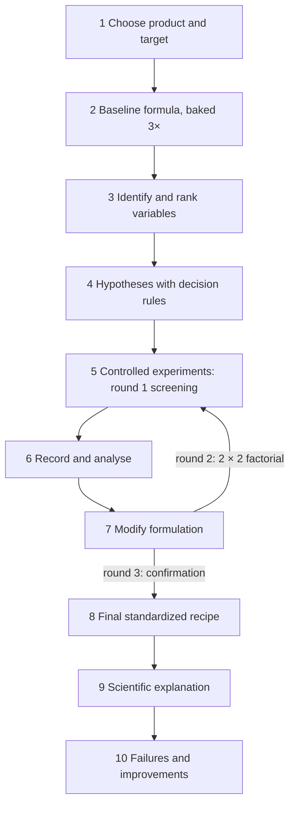

# 19.2 · The capstone project

**Requires:** [19.1 Designing experiments and sensory tests](stage-1/module-19/lesson-01.md)

**Science:** [SC-14 Measurement, sensory evaluation and variability](stage-1/science/sc-14-measurement-sensory.md), plus the units your product depends on

**Practical:** your own product · **Brief:** [Capstone brief and rubric](stage-1/capstone/README.md) · **Report:** [Report template](stage-1/capstone/report-template.md) · **Recipe format:** [Standardized recipe template](templates/recipe-template.md)

**Threads:** T12 Experimental method & R&D, and every thread your product touches  **Time:** 60 min reading + 3–6 weeks of project work (about 25–40 h in total)

## Why this lesson exists

Up to now every recipe and experiment in the course was designed for you. The capstone reverses that. You choose a product, define what "better" means in numbers, find the variables that move it, test them under control, and end with a standardized recipe you can reproduce and defend. This is the bridge between learning baking and formulation work: the same ten steps, with better instruments and statistics, are what an R&D pastry chef does in Stage 3. The [capstone brief](stage-1/capstone/README.md) holds the rules, the rubric and a fully worked example; this lesson walks you through the steps and the judgement each one needs.

## You will be able to

- Choose a product and a development target that are feasible in 3–6 weeks with Stage 1 systems and home equipment.
- Establish a replicated baseline and measure its noise.
- Rank candidate variables, write testable hypotheses, and run at least three rounds of controlled experiments including one two-factor design.
- Produce a final standardized recipe, validated against a specification, with the scientific reasoning behind each formulation choice.
- Document failures and what they taught you, and write down what you would investigate next with professional equipment.

## The ten steps

Steps 5–7 are a loop. You go round it at least three times.

### Step 1 · Choose a product and a target

A good capstone product meets three criteria:

1. **Inside Stage 1 systems.** You already understand its mechanism: lean or sourdough bread, enriched dough, cookies, quick breads, cakes, short or laminated pastry, choux, custards and creams, meringues, ganache. A product that depends on things Stage 1 does not teach (hydrocolloid gels, stabilized frozen desserts, gluten-free systems) turns into a research project with no foundation.
2. **Measurable attributes.** The target can be expressed as at least one instrumental response from [19.1](stage-1/module-19/lesson-01.md) plus a sensory test. "Tastes nicer" is not a target; "blind paired test: preferred for flavour, with specific volume ≥ 3.8 cm³/g" is.
3. **Feasible in 3–6 weeks.** One bake gives one data point per cell. A product that takes 3 days per bake (laminated dough with long retarding, a sourdough with a 2-day schedule) needs a smaller plan or parallel batches.

Example capstone topics:

| Product | Target (what "better" means) | Base recipe | Likely variables |
|---|---|---|---|
| Sourdough country loaf | Specific volume ≥ 3.5 cm³/g with milder acidity (pH ≥ 4.1) | [R1-06](recipes/R1-06-sourdough-loaf.md) | Levain %, levain ripeness, bulk temperature, hydration |
| Croissant variation (e.g. part whole-wheat) | Honeycomb crumb and layer definition equal to baseline with 20 % whole-wheat flour | [R1-34](recipes/R1-34-croissant.md) | Whole-wheat %, hydration, butter temperature, number of folds |
| Reduced-sugar cookie | −25 % sugar, spread ratio 6–8 and day-2 chewiness not worse than baseline | [R1-11](recipes/R1-11-chocolate-chip-cookie.md) | Sugar level, brown : white ratio, butter state, rest |
| Tart with a crisp-stable base | Snap load of the base at 24 h ≥ 80 % of the empty shell | [R1-21](recipes/R1-21-pate-sucree.md), [R1-39](recipes/R1-39-fruit-tart.md) | Barrier (cocoa butter, egg wash, frangipane), bake temperature and colour, filling aw |
| Chiffon cake with a new flavour (matcha, citrus zest, brown butter) | Height within 5 % of baseline, no dense layer, flavour detected in a triangle test | [R1-19](recipes/R1-19-chiffon-cake.md) | Flavouring dose, liquid adjustment, meringue stiffness, bake temperature |
| Brioche that is soft on day 3 | Day-3 compression ≥ 1.2 × baseline, volume not lower | [R1-09](recipes/R1-09-brioche.md) | Butter %, egg vs milk, scald or tangzhong, sugar |

Write the goal as a **specification**: a short table of responses, targets and tolerances. It is the yardstick for every round and for the final recipe.

### Step 2 · Establish the baseline

Start from a course recipe, exactly as written, at the batch size you will use for experiments. Bake it **three times, on three different days**, measuring every response in your specification with the protocols you have fixed. This gives you:

- the **baseline values** that every change is compared with;
- the **noise**: batch-to-batch SD and CV for each response ([X1-44](experiments/X1-44-batch-consistency.md)), and so the threshold for a real difference;
- practice with the measurements before they matter.

If the baseline CV of a primary response is above about 5 %, find out why before you move on (DDT, proof endpoint, oven position, weighing small ingredients) using [18.2](stage-1/module-18/lesson-02.md) and [18.3](stage-1/module-18/lesson-03.md).

### Step 3 · Identify and rank variables

List every variable that could plausibly move your primary response: ingredients (type, level), process (mixing, temperatures, times) and baking. Then rank them. For each, estimate:

| Variable | Mechanism (one line) | Expected effect size vs noise | Cost of testing (time, ingredients) | Risk to guard responses | Rank |
|---|---|---|---|---|---|

The top of the list is variables with a clear mechanism, an expected effect several times your noise, and a low cost. Use the "Variables you can change" table in your base recipe, the relevant X1 experiments (you already know the approximate size of many effects), and the troubleshooting database. Keep 3–4 candidates for screening; park the rest in the report as "not tested, because...".

### Step 4 · Form hypotheses

For each candidate write the full hypothesis from [19.1](stage-1/module-19/lesson-01.md): change, direction, rough magnitude, mechanism, and the decision rule. Date it. You are not allowed to rewrite it after seeing the data; you are allowed, and expected, to write a new one.

### Step 5 · Run controlled experiments (at least three rounds)

| Round | Purpose | Typical design | Batches |
|---|---|---|---|
| 1 · Screening | Find which candidates matter | Baseline + 3 one-factor variants, one step each, in one session; repeat on a second day if the effects are near the noise | 4–8 |
| 2 · Interaction | Test the two strongest factors together | **2 × 2 factorial**, 2 replicates per cell, blocked by day, randomized order and position | 8 |
| 3 · Confirmation | Prove the chosen formula beats the baseline at full size | Final formula vs baseline, 3 batches each on 3 days, plus a blind sensory test | 6 |

This is the minimum. Most projects need an extra round between 2 and 3: a third level of the winning factor, a fix for a guard response that got worse, or a replacement for a variant that failed. Every round uses the [experiment template](templates/experiment-template.md) and a written plan (bake order, positions, codes) made before you start.

Keep one rule from every X1 experiment: **a control baked in the same session**. The baseline recipe appears in every round, so that a change in the kitchen or the flour does not masquerade as an effect.

### Step 6 · Record results

Record during the bake, not afterwards: the [lab notebook](templates/lab-notebook.md) sheet per batch, plus a summary table per round with every response for every batch. Photograph every cross-section with a ruler and a colour reference. Keep failed and discarded batches in the record with the reason; they are data about your process.

For each round, calculate cell means, effects and, for a factorial, the interaction contrast, and compare each with its noise ([19.1](stage-1/module-19/lesson-01.md)). State for every hypothesis: supported, not supported, or inconclusive, and why.

### Step 7 · Modify the formulation

Decide what to carry forward. Three things to check every time you change a level:

1. **Formula balance.** Changing one ingredient changes the others' proportions. Recalculate true hydration, sugar in the water phase, or the tougheners/tenderizers balance ([10.1](stage-1/module-10/lesson-01.md)), and compensate deliberately (for example, reduce milk when a larger tangzhong adds water) so you know exactly what changed.
2. **Guard responses.** An improvement that pushes another response out of specification is a trade-off, not a win. Choose a level that meets the whole specification, even if it is not the maximum of the primary response.
3. **Mechanism.** If you cannot explain why the change worked, run the experiment that would tell you. Unexplained improvements tend not to survive a new flour or a different oven.

### Step 8 · Produce the final standardized recipe

Write the recipe in the [recipe template](templates/recipe-template.md) with the tag Experimental formulation and a revision history that starts at the baseline. It must contain the full formula (baker's % and grams that add up), procedures with measurable endpoints, critical control points, the specification with tolerances, and scaling. Then **validate** it: three batches, made from the written recipe alone, each meeting the specification. Report the mean, SD and CV of the primary responses across those three batches.

### Step 9 · Explain the science

For each formulation and process choice in the final recipe, explain the mechanism at the depth of the science units: what the ingredient or step does, why the level you chose is the right one, and what would happen if it moved up or down. Link your explanation to your data (for example, "the interaction in round 2 shows the tangzhong effect shrinks at higher butter; both slow the firming of the crumb, so their benefits overlap").

### Step 10 · Document failures and improvements

List every failure, surprise and wrong hypothesis, with what you learned from each and what you changed. A capstone with no documented failures is either very lucky or not honest; graders read this section closely. End with the next questions you would test, including those that need professional equipment (the Stage 2 bridge in the [report template](stage-1/capstone/report-template.md)).

## Timeline

| Week | Work | Output |
|---|---|---|
| 0 (before) | Choose product, write the specification, fix measurement protocols, practice the measurements | Specification table, protocols |
| 1 | Baseline × 3 on three days; noise; rank variables; hypotheses | Baseline data, noise thresholds, ranked variable table, dated hypotheses |
| 2 | Round 1 screening (1–2 sessions) | Round 1 summary and decisions |
| 3 | Round 2: 2 × 2 factorial over two days | Effects and interaction vs noise |
| 4 | Extra round if needed (third level, fix a guard response) | Candidate final formula |
| 5 | Round 3: confirmation vs baseline at full size, sensory test; write and validate the standardized recipe | Confirmation data, sensory result, final recipe v1 |
| 6 | Write the report; final photos | Report + recipe in the notebook |

A compressed plan in 3 weeks is possible for fast products (cookies, scones, custards): baseline and round 1 in week 1, rounds 2 and 3 in week 2, validation and report in week 3. Slow products (sourdough, laminated doughs) need the full 6 weeks, or fewer factors.

## Deliverables and grading

You submit two things, both kept in your lab notebook:

1. **The capstone report**, using the [report template](stage-1/capstone/report-template.md): all ten steps, the experiment records, data tables and photos, the analysis, and the Stage 2 bridge.
2. **The final standardized recipe**, in the course recipe format, validated in three batches.

The rubric (criteria and levels) is in the [capstone brief](stage-1/capstone/README.md?id=grading-rubric). Its short form:

| Criterion | Competent (pass) | Distinction |
|---|---|---|
| Product and specification | Clear target with measurable responses and tolerances | Target justified by a real use; guard responses chosen with care |
| Baseline and noise | Baseline baked 3×, SD/CV reported | Noise used explicitly to set thresholds and batch numbers |
| Variables and hypotheses | Ranked variables; dated hypotheses with mechanisms | Magnitude predicted; decision rules written in advance |
| Experimental design | 3 rounds, one 2 × 2, controls, replicates | Randomized, blocked and blinded throughout; representative batch sizes justified |
| Records and analysis | Complete records; effects calculated and compared with noise | Interaction interpreted mechanistically; inconclusive results handled honestly |
| Final recipe | Complete standardized recipe; validated 3× within spec | CV of primary responses at or below baseline CV |
| Science | Correct mechanism for each choice | Mechanism tied to own data, with predictions for further change |
| Failures and next steps | Failures listed with lessons | Failures turned into tests; concrete Stage 2 questions |
| Sensory | One blind test with coded samples and allergen briefing | Test choice matched to the question; correct use of critical values |

Pass requires at least Competent in every row.

## What goes wrong

| Problem | Why it happens | Correction |
|---|---|---|
| Too ambitious a product | Many systems at once (e.g. a full entremet) | Develop one component, measured in its real context |
| Target changes halfway | The data were disappointing | Keep the original target in the report; add a revised one with reasons |
| No usable data from round 1 | Steps too small to beat noise | Take bigger steps in screening; refine later |
| Great small-batch result, poor full-size loaf | Geometry changed the response | Confirmation round at full size is mandatory |
| Final recipe does not reproduce | Recipe written from memory, missing endpoints | Validate from the written recipe alone; ideally someone else bakes one batch |

## Lab notebook

Everything in the [report template](stage-1/capstone/report-template.md) starts in the notebook: dated specification, protocols, hypotheses, bake plans with randomized order and codes, raw data, photos, and a short reflection after each session (what surprised you, what you would change).

## Check yourself

1. Your round 1 screening shows that adding 2 % milk powder increased specific volume by 0.1 cm³/g, and your baseline SD of specific volume is 0.15 cm³/g. What do you do with milk powder?

Answer

The difference is less than one SD, far below the 2 SD threshold: no evidence of an effect. Either drop milk powder (record "not supported at this step size") or, if the mechanism predicts a real effect at a higher dose, test a larger step once. Do not carry it into the factorial on this evidence.

2. Why must the baseline recipe be baked in every round, not only at the start?

Answer

Conditions drift between weeks (flour lot, kitchen temperature, starter activity, your skill). A same-session control lets you compare each variant with the baseline under the same conditions, so drift does not appear as an effect of your variable.

3. In your 2 × 2, the best cell for the primary response pushes a guard response out of specification. What are your options?

Answer

Choose an intermediate level (test it in an extra round), compensate with another variable whose mechanism fixes the guard response (and test that), or accept the second-best cell that meets the whole specification. Never report the best cell as the final recipe while it fails the specification.

## Stage 1 completion

When your capstone passes, you have finished Stage 1. Look back at what you can now do:

- **Bake the core repertoire consistently:** lean, preferment and sourdough breads; enriched doughs; cookies, quick breads and cakes; short, laminated and choux pastries; custards, creams, meringues and buttercreams; ganache and tempered chocolate; assembled tarts and cakes.
- **Explain it:** predict what happens when you change flour, water, salt, yeast, sugar, fat, egg, temperature or time, using the mechanisms of the science track.
- **Control it:** work to temperatures, times and measured endpoints; standardize, scale and cost a formula; plan a production day.
- **Diagnose it:** go from symptom to root cause with the troubleshooting database and the diagnostic method.
- **Develop it:** design controlled and factorial experiments, run blind sensory tests, separate signal from noise, and produce a validated standardized recipe of your own.

Two things remain. Take the [Stage 1 final exam](stage-1/assessments/final-exam.md), which tests all four dimensions of the course across modules. Then read the [Stage 2/3 extension architecture](extension/stage-2-3-architecture.md): it shows where each concept you learned in Stage 1 continues, and which Stage 2 modules extend the product family you chose for your capstone.

## Where this goes next

**Next:** The [final exam](stage-1/assessments/final-exam.md). In **Stage 2**, the capstone becomes a professional product line, costed and produced to specification with tolerance bands (S2-Capstone), and the two-factor design you used once here becomes routine in every module. In **Stage 3**, the capstone becomes a portfolio of R&D projects (S3-M11 *Innovation process and R&D portfolio*), supported by S3-M01 *Formulation methodology and design of experiments*, S3-M02 *Sensory and consumer science* and S3-M03 *Instrumental analysis*. The "what I would investigate with professional equipment" section of your report is your first Stage 3 project list.

## Sources

[Lawless] (sensory methods) · [Figoni] (formula balance and ingredient functions) · [Gisslen] and [CIA-BP] (standardized recipes and quality standards) · [Cauvain-BPS] (diagnosing quality problems in development). The ten-step structure follows the course brief; the round structure, validation in three batches and grading rubric are this course's design, based on standard product-development practice.
